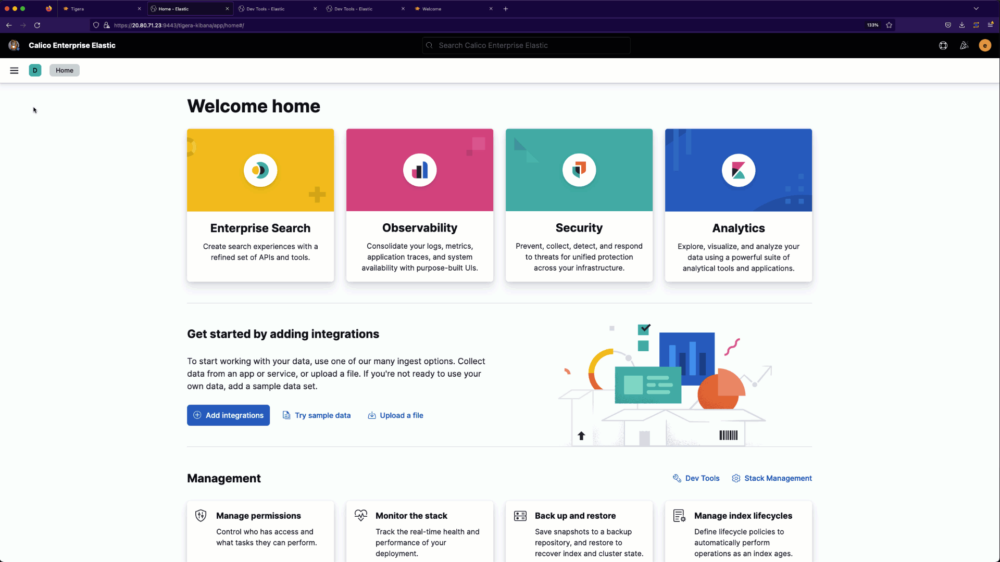

# Analyze Traffic to External Services using Service Graph and Kibana

# Analyze Traffic to External Services using the Service Graph

> Public services in the Service Graph

# Analyze Traffic to External Services using Kibana

Use the `Top 10 External Domains` visualization to identify the external services the `hipstershop`, `yaobank` and `bookinfo` namespaces communicate to. 

> Kibana DNS external domains

