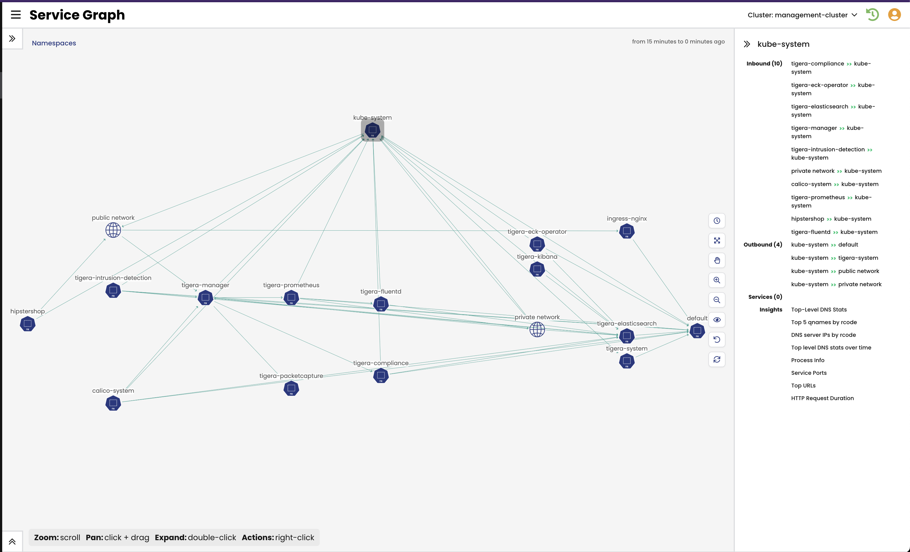

# Analyze Traffic to and from `kube-dns`

The `kube-dns` service provides DNS for all cluster workloads. Understanding the traffic flow to `kube-dns` helps in developing a security policy for DNS traffic. 

Click on the `kube-system` namespace in the Service Graph global view to obtain a summary of traffic in and out the namespace. 

> Traffic to `kube-system` namespace

> Traffic to `kube-dns`

> **Note**
> For more information regarding the traffic pattern for `kube-dns` refer to 
[cluster-dns-allow-all](https://github.com/tigera-cs/quickstart-self-service/blob/main/modules/platform-tier.md) security policy in the `platform tier`.

#### 
  [Next: Lesson 5 - Analyze Traffic to External Services using Service Graph and Kibana](https://github.com/tigera-cs/quickstart-self-service/blob/main/modules/analyze-external-services.md) 
