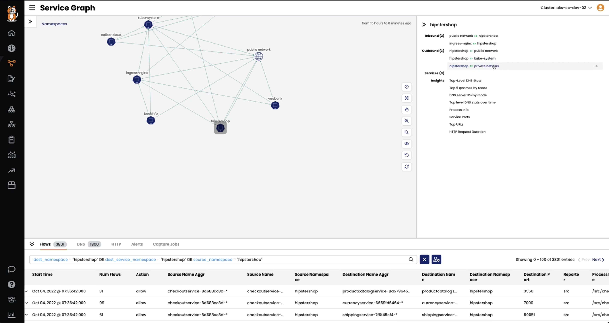
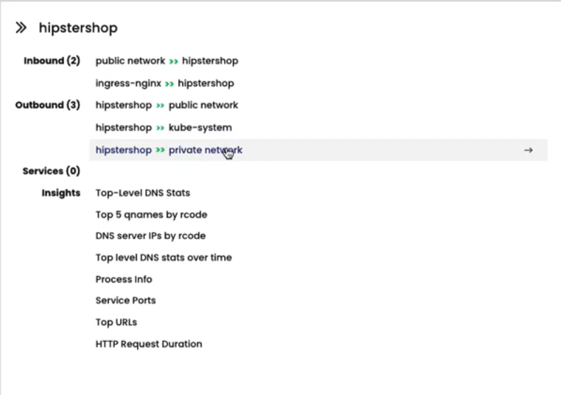
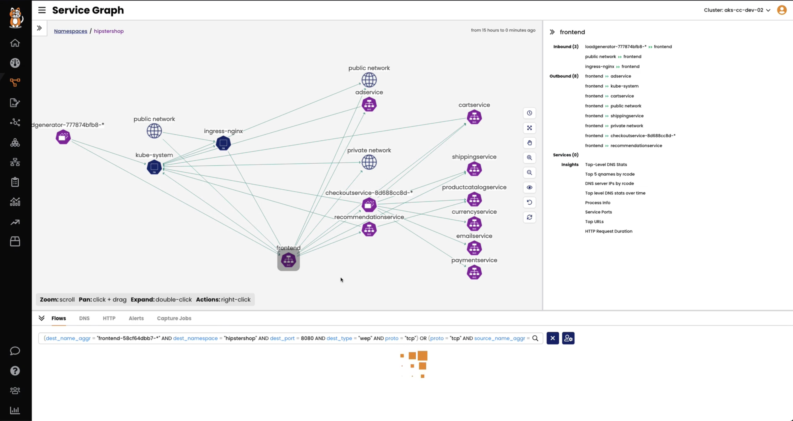
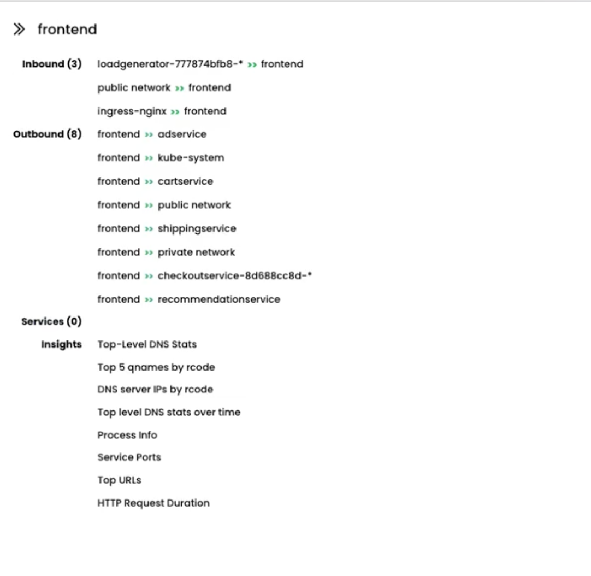
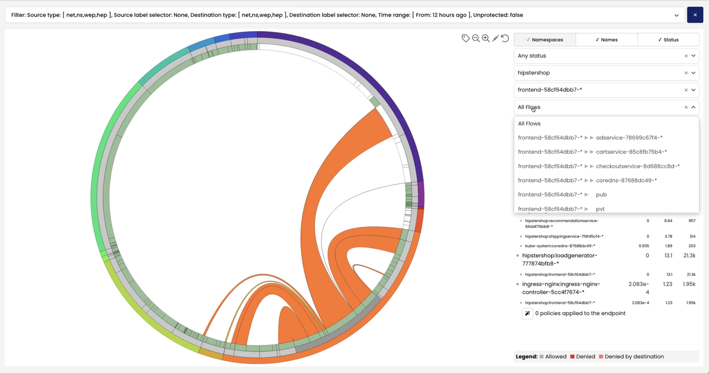
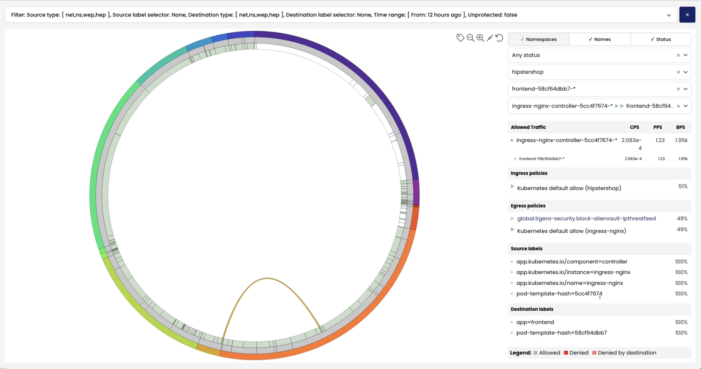
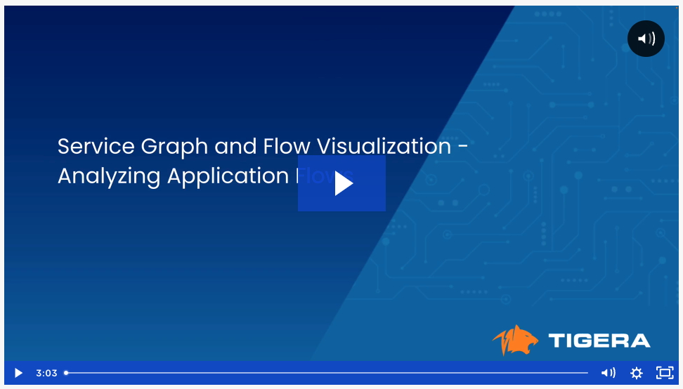

# Service Graph and Flow Visualization - Analysing Application Flows

## Analyze Traffic to and from a Namespace

Navigate to the global view of the Service Graph and click on a namespace. The right pane will provide a summarized view of the traffic flows in and out of the namespace. 

> Service Graph - Global View

> Traffic Summary for the `hipstershop` namespace

## Analyze Traffic to and from a Deployment

Navigate to the `hipstershop` namespace and click on the `frontend` deployment. The right pane will provide a summarized view of the traffic flows in and out of the deployment. 

> Service Graph - Namespace View

> Traffic Summary for the `frontend` deployment

## Using the Flow Visualization to Analyze Flows for a Deployment

Flow Visualization provides the ability to filter flows per namespace and deployment. Select a namespace and deployment to retrieve a list of summarized flows. 

> Traffic Summary for the `frontend` deployment in Flow Visualization

Click on a flow to retrieve detailed information on security policy evaluation, source and destination labels, and traffic summary. 

> Detailed flow information

---
## Lesson Video

#### 
  [Click Next -> Lesson 4 - Anayze Flows to kube-dns](https://github.com/tigera-cs/quickstart-self-service/blob/main/modules/analyze-kube-dns.md) 
