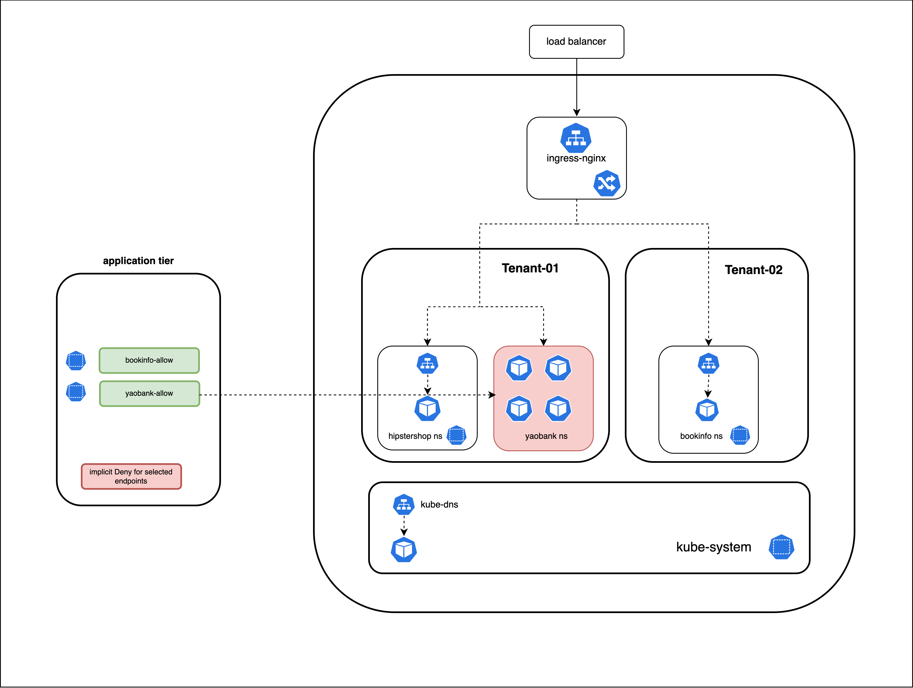
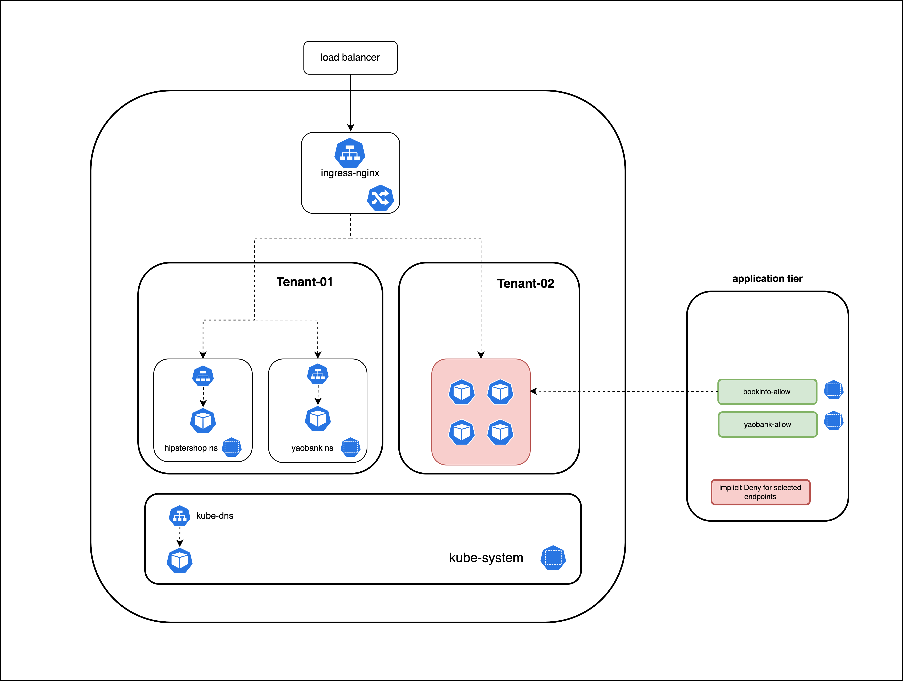

# The Application Tier

## `yaobank-allow` Security Policy

The `yaobank-allow` security policy will have rules to permit ingress and egress traffic flows to and from the endpoints in the namespace. All endpoints in the yaobank namespace will be able to send and receive traffic from all other endpoints in the same namespace. Traffic flows entering and leaving the namespace must be explicitly permitted using policy rules. The security policy will have an ingress rule to permit traffic from the ingress controller.   

> yaobank-allow security policy

> bookinfo-allow security policy

## `bookinfo-allow` Security Policy

The `bookinfo-allow` security policy will have rules to permit ingress and egress traffic flows to and from the endpoints in the namespace. All endpoints in the bookinfo namespace will be able to send and receive traffic from all other endpoints in the same namespace. Traffic flows entering and leaving the namespace must be explicitly permitted using policy rules. The security policy will have an ingress rule to allow traffic from the ingress controller. 

## Implicit Deny

The application tier will have an implicit deny for traffic flows not explicitly permitted for endpoints matched/selected by security policies in the tier. Although the implicit deny is logically represented to be in the bottom of the tier, the behavior is enforced by the last security policy in the tier that matches a particular endpoint. 

#### 
  [Click Next -> Lesson 5 - The Application Tier](https://github.com/tigera-cs/quickstart-self-service/blob/main/modules/appsec-tier.md) 
