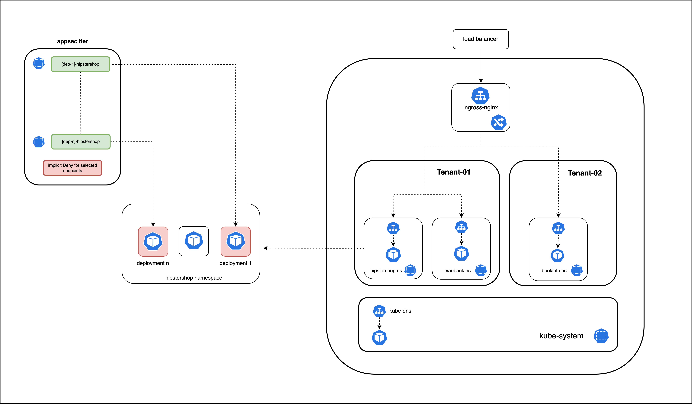

# The Appsec Tier

The `appsec` tier will be used to deploy fine-grained [networkpolicy](https://docs.tigera.io/v3.14/reference/resources/networkpolicy) using policy label selectors to match specific endpoints/deployments.   

## `deployment(hipstershop)` Security Policies

The `appsec` tier will have a security policy for each deployment in the `hipstershop` namespace. Each security policy will have granualar ingress and egress rules permitting traffic flows to and from each deployment. 

## Implicit Deny

Similar to the `application` tier, the `appsec` tier will also have an implicit deny for traffic flows not explicitly permitted for endpoints matched/selected by security policies in the tier. Note that, although the implicit deny is logically represented to be in the bottom of the tier, the behavior is enforced by the last security policy in the tier that matches a particular endpoint.   

#### 
  [Click Next -> Lesson 6 - The Default Tier](https://github.com/tigera-cs/quickstart-self-service/blob/main/modules/default-tier.md) 
