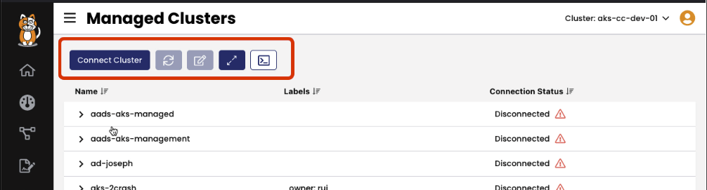
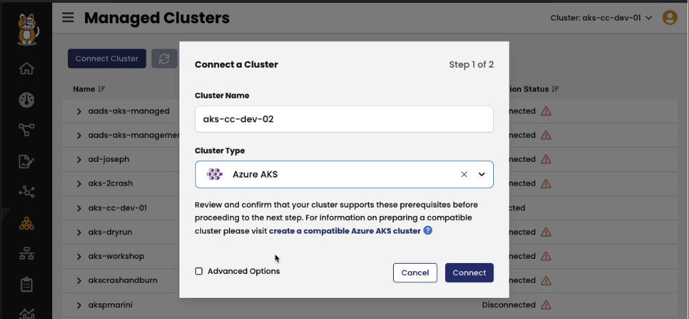
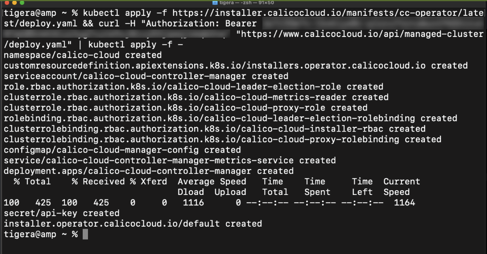
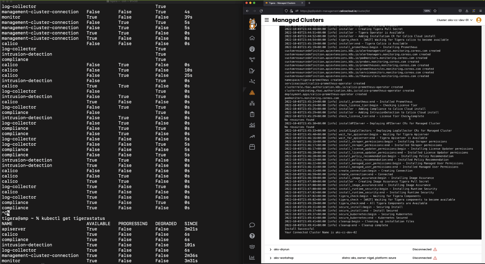
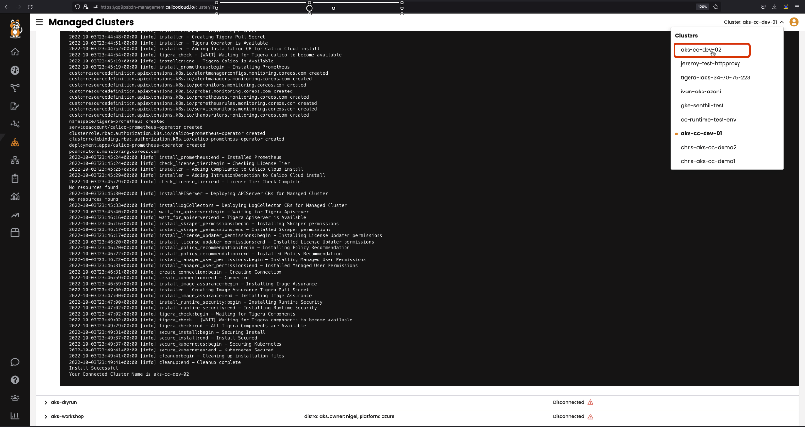
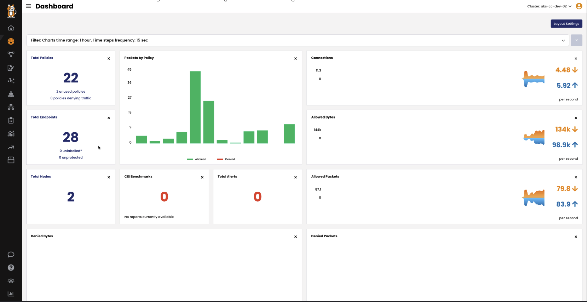
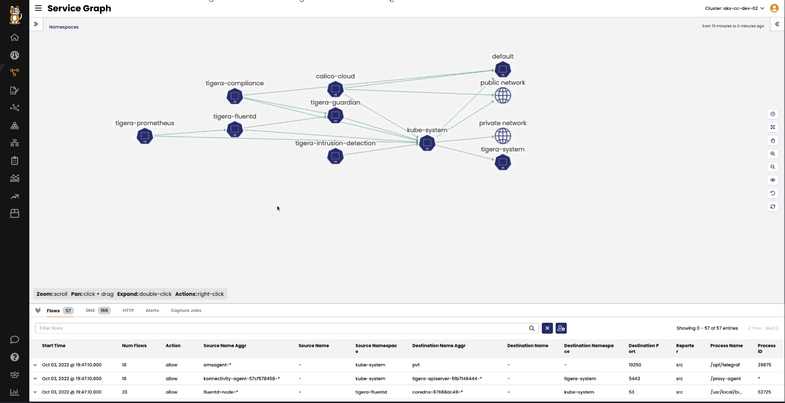

# Connect Cluster to Calico Cloud

> ### Quick Access - [Lesson Lab Tasks](#Lesson-Lab-Tasks) [Lesson Video](#Lesson-Video) 

In this lesson, the lab cluster will be connected to Calico Cloud. Follow the instructions in the lesson video to connect the cluster to Calico Cloud. Make sure you have a Calico Cloud account or a trial account before starting the module. Many Kubernetes distributions can be connected to Calico Cloud. In this lesson, an AKS cluster will be connected to Calico Cloud to demonstrate the steps involved in connecting a cluster. 

## Calico Cloud Managed Clusters

Login to your Calico Cloud portal and select managed clusters

## Connect Cluster Settings

Click on connect a cluster. Enter the name of the cluster and select the type of cluster. In this case the name of the cluster is `aks-cc-dev-02` and its an AKS cluster. Confirm the details, and once done, click connect. 

## Apply Script to Kubernetes Cluster

Copy the install script and paste the script in the Kubernetes cluster. The script will install and operator that will deploy the rest of the Calico Cloud components. 

## Managed Cluster Connection Status

The status of the installation can be monitored using the `kubectl get tigerastatus` command. The status can also be monitored using the Calico Cloud portal. 

## View Cluster in Calico Cloud

Navigate to the cluster by clicking on the cluster connect drop-down. Select the cluster and navigate to the dashboard to confirm that metrics from the cluster are visible in Calico Cloud.

Navigate to the `Service Graph` to confirm that flow logs from the cluster are visible in Calico Cloud.

# Lesson Lab Tasks

Follow the lesson video to complete the lab tasks. 

# Lesson Video
