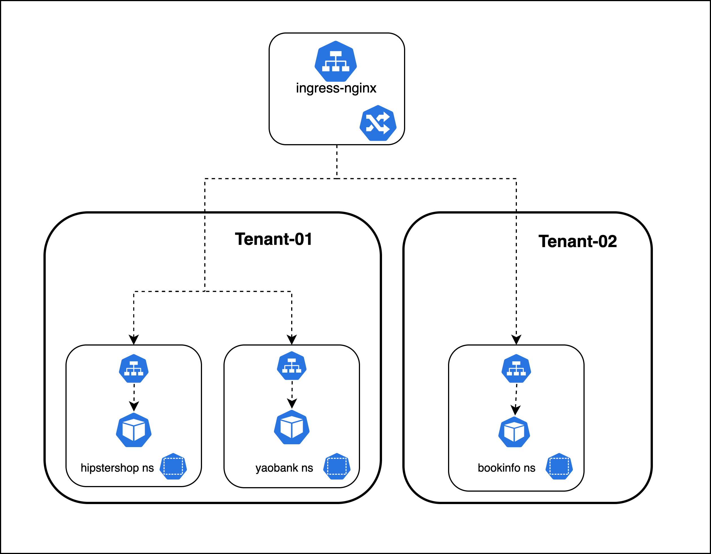
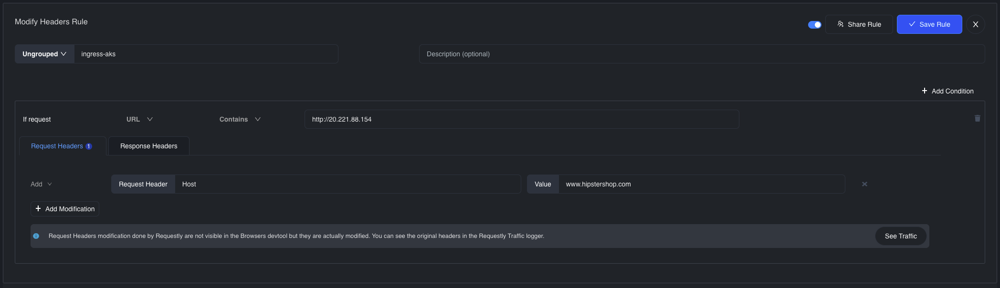
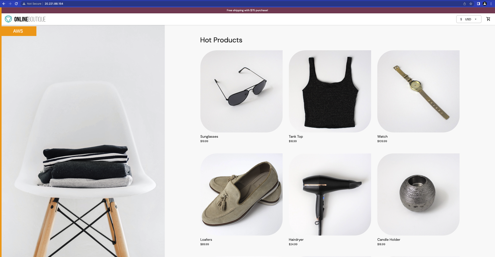
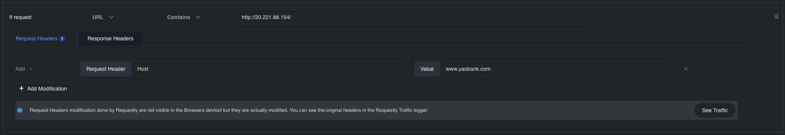
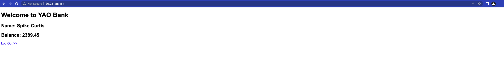
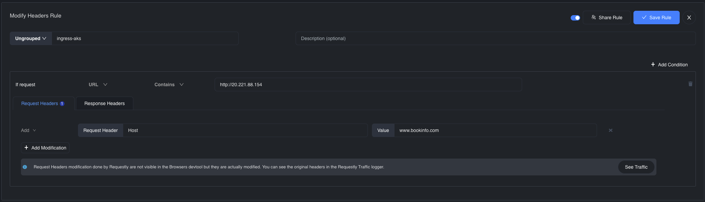
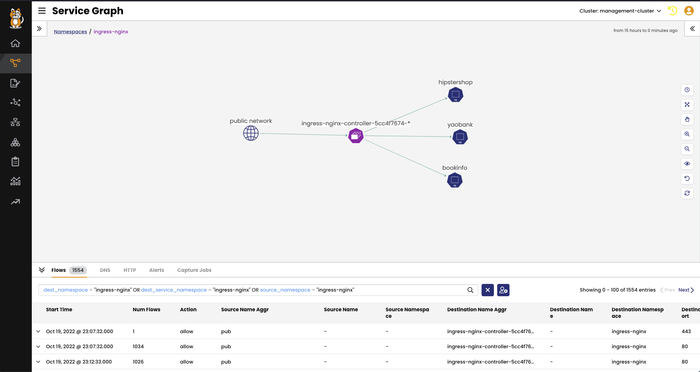

# Create Ingress Resources for Application

> ### Quick Access - [Lesson Lab Tasks](#Lesson-Lab-Tasks) 



## Create ingress for `hipstershop`

The following manifest will create an ingress resource for the `frontend` deployment in the `hipstershop` namespace. 

> ingress-frontend manifest

```yaml
  apiVersion: networking.k8s.io/v1
  kind: Ingress
  metadata:
    name: ingress-frontend
    namespace: hipstershop
  spec:
    ingressClassName: nginx
    rules:
      - host: www.hipstershop.com
        http:
          paths:
            - pathType: Prefix
              backend:
                service:
                  name: frontend
                  port:
                    number: 80
              path: /
```

```bash
tigera@amp ~ % kubectl get ingress -n hipstershop
NAME               CLASS   HOSTS                 ADDRESS         PORTS   AGE
ingress-frontend   nginx   www.hipstershop.com   20.221.88.154   80      29d
```

> Modify header for `www.hipstershop.com`



> Browse to `www.hipstershop.com`




## Create ingress for `yaobank`

> ingress-customer manifest

```yaml
  apiVersion: networking.k8s.io/v1
  kind: Ingress
  metadata:
    name: ingress-customer
    namespace: yaobank
  spec:
    ingressClassName: nginx
    rules:
      - host: www.yaobank.com
        http:
          paths:
            - pathType: Prefix
              backend:
                service:
                  name: customer
                  port:
                    number: 80
              path: /
```

> ingress for `www.yaobank.com`

```bash
tigera@amp ~ % kubectl get ingress -n yaobank    
NAME              CLASS   HOSTS             ADDRESS         PORTS   AGE
ingress-yaobank   nginx   www.yaobank.com   20.221.88.154   80      29d
```

> Modify header for `www.yaobank.com`



> Browse to `www.yaobank.com`



## Create ingress for `bookinfo`

```yaml
  apiVersion: networking.k8s.io/v1
  kind: Ingress
  metadata:
    name: ingress-productpage
    namespace: bookinfo
  spec:
    ingressClassName: nginx
    rules:
      - host: www.bookinfo.com
        http:
          paths:
            - pathType: Prefix
              backend:
                service:
                  name: productpage
                  port:
                    number: 9080
              path: /
```

```bash
tigera@amp ~ % kubectl get ingress -n bookinfo
NAME                  CLASS   HOSTS              ADDRESS         PORTS   AGE
ingress-productpage   nginx   www.bookinfo.com   20.221.88.154   80      29d
```
> Modify header for `www.bookinfo.com`



> Browse to `www.bookfino.com`


## Create ingress for `bookinfo`

> Service Graph - Ingress Namespace



# Lesson Lab Tasks

### Deploy and validate ingress resources

```bash
kubectl apply -f ingress/hipstershop.yaml
kubectl apply -f ingress/yaobank.yaml
kubectl apply -f ingress/bookinfo.yaml
```

```bash
kubectl get ingress -n hipstershop 
kubectl get ingress -n yaobank 
kubectl get ingress -n bookinfo
```

### `curl` to the ingress

CURL to the ingress to generate flow logs. Flow logs are required to analyze the applications in the Service Graph and Flow Visualization.

> **Note**
> Ensure that you are running a CURL to the ingress

```bash
while sleep 1;
do 
curl http://20.221.88.154/ -H "Host: www.hipstershop.com"
curl http://20.221.88.154/ -H "Host: www.bookinfo.com"
curl http://20.221.88.154/ -H "Host: www.yaobank.com"
done
```

<span style="background-color: #FF8900">**Note that your IPs will be different**</span>

# Lesson Video


#### <div align="right">  [Click Next -> Module 2 - Calico Policy Constructs](https://github.com/tigera-cs/quickstart-self-service/blob/main/modules/module-2-introduction.md) </div>