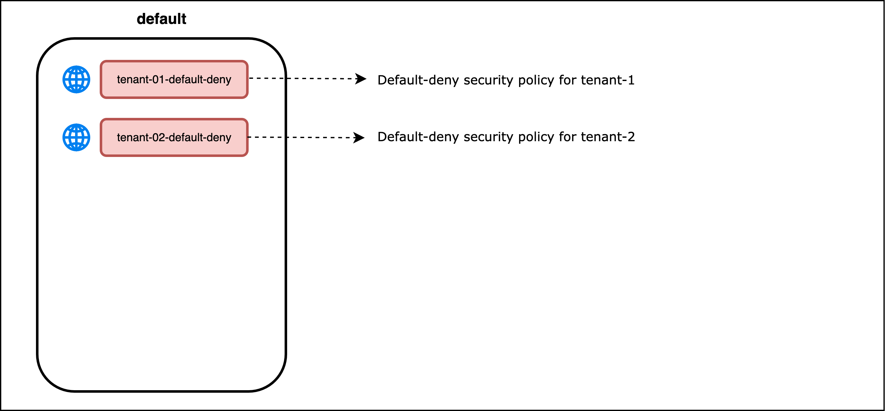

# The Default Tier

The `default` tier implements `default-deny` security policies. The `tier` will also be used to implement `fail-safe` security policies prior to implementing `default-deny` security policies for `tenant-1` and `tenant-2` namespaces. 

Refer to [Module 4 - Methodology for Implementing Zero-Trust Microsegmentation](https://github.com/tigera-cs/quickstart-self-service/blob/main/modules/module-4-introduction.md) for more information on how `fail-safe` policies are used to develop all policies for `tenant-1` and `tenant-2` namespaces and monitor the policies before transitioning to a `default-deny` posture for the tenants.  

> Security Policies in the `default tier`

## `tenant-01-default-deny` Security Policy

The `tenant-01-default-deny` security policy will have rules to deny all ingress and egress traffic flows to and from tenant-1 workloads. The security policy is the final gatekeeper for endpoints in the `hipstershop` and `yaobank` namespaces. It will ensure that only traffic flows allowed by security policy rules in preceding tiers are accepted. A separate default-deny security policy for tenant-01 workloads enables the implementation of zero-trust micro-segmentation for those workloads, irrespective of other workloads in the cluster. The `tenant-1-default-deny` security policy will be [globalnetworkpolicy](https://docs.tigera.io/reference/resources/globalnetworkpolicy), which matches the tenant-01 namespaces.

## `tenant-02-default-deny` Security Policy

The `tenant-02-default-deny` security policy will have rules to deny all ingress and egress traffic flows to and from tenant-2 workloads. The security policy is the final gatekeeper for endpoints in the `bookfinfo` namespace and will ensure that only traffic flows allowed by security policy rules in preceding tiers are accepted. Like tenant-01, having a separate default-deny security policy for tenant-02 workloads enables the implementation of zero-trust micro-segmentation for those workloads irrespective of other workloads in the cluster. The `tenant-2-default-deny` security policy will be [globalnetworkpolicy](https://docs.tigera.io/reference/resources/globalnetworkpolicy) that matches the tenant-01 namespaces.

#### 
  [Next: Module 4 - Methodology for Implementing Zero-Trust Microsegmentation](https://github.com/tigera-cs/quickstart-self-service/blob/main/modules/module-4-introduction.md) 

