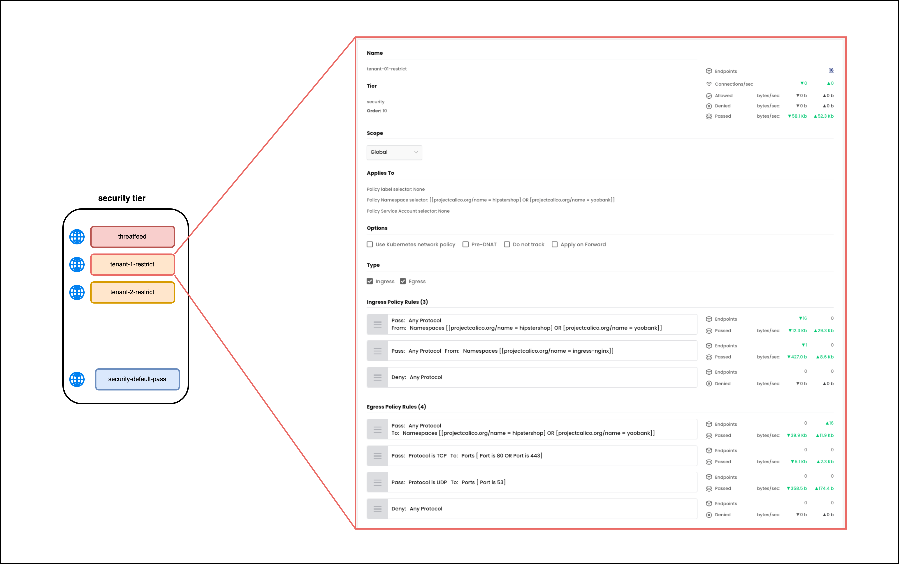
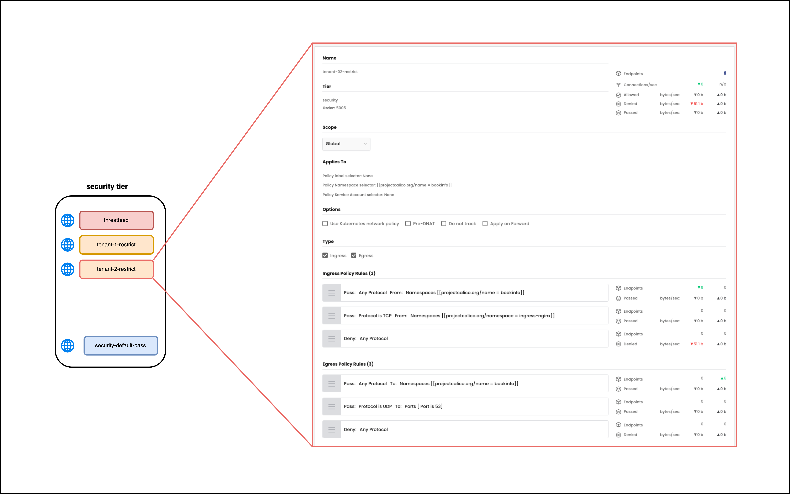
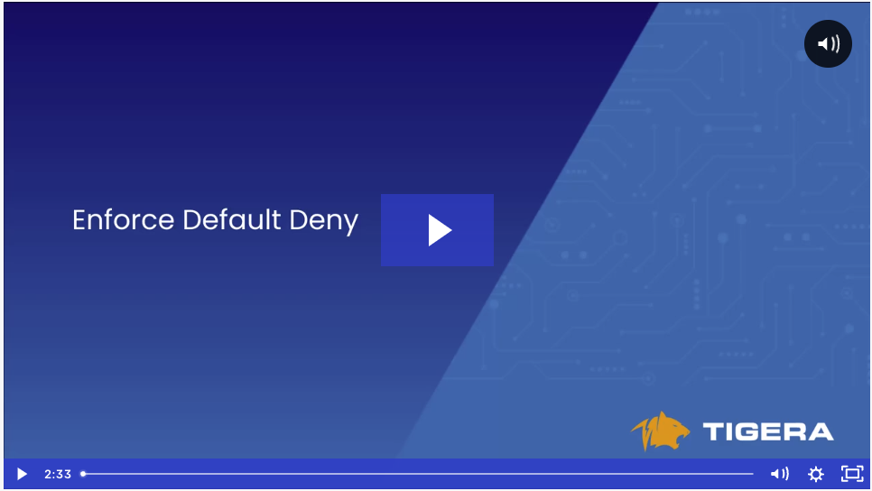

## `tenant-1-pass-all` to `tenant-1-restrict` Security Policy


### Egress Rules

Make the below change to the security policy. 

01. **Rule 3** - For endpoints in tenant-1, deny all other egress traffic.

### Security Policy - UI View
> `tenant-1-restrict` security policy - UI view



### Security Policy - Manifest
> `tenant-1-restrict` security policy - yaml

```yaml
apiVersion: projectcalico.org/v3
kind: GlobalNetworkPolicy
metadata:
  name: security.tenant-01-restrict
spec:
  tier: security
  order: 2
  selector: ''
  namespaceSelector: >-
    projectcalico.org/name == "hipstershop" || projectcalico.org/name ==
    "yaobank"
  serviceAccountSelector: ''
  ingress:
    - action: Pass
      source:
        namespaceSelector: >-
          projectcalico.org/name == "hipstershop" || projectcalico.org/name ==
          "yaobank"
      destination: {}
    - action: Pass
      source:
        namespaceSelector: projectcalico.org/name == "ingress-nginx"
      destination: {}
    - action: Deny
      source: {}
      destination: {}
  egress:
    - action: Pass
      source: {}
      destination:
        namespaceSelector: >-
          projectcalico.org/name == "hipstershop" || projectcalico.org/name ==
          "yaobank"
    - action: Pass
      protocol: TCP
      source: {}
      destination:
        ports:
          - '80'
          - '443'
    - action: Pass
      protocol: UDP
      source: {}
      destination:
        ports:
          - '53'
    - action: Deny
      source: {}
      destination: {}
  doNotTrack: false
  applyOnForward: false
  preDNAT: false
  types:
    - Ingress
    - Egress
```

## `tenant-2-pass-all` to `tenant-2-restrict` Security Policy

### Egress

Make the below change to the security policy. 

01. **Rule 3** - For endpoints in tenant-2, deny all other egress traffic.

### Security Policy - UI View
> `tenant-2-restrict` security policy - UI view



### Security Policy - Manifest

> `tenant-2-restrict` security policy - yaml

```yaml
apiVersion: projectcalico.org/v3
kind: GlobalNetworkPolicy
metadata:
  name: security.tenant-02-restrict
spec:
  tier: security
  order: 3
  selector: ''
  namespaceSelector: projectcalico.org/name == "bookinfo"
  serviceAccountSelector: ''
  ingress:
    - action: Pass
      source:
        namespaceSelector: projectcalico.org/name == "bookinfo"
      destination: {}
    - action: Pass
      source:
        namespaceSelector: projectcalico.org/name == "ingress-nginx"
      destination: {}
    - action: Deny
      source: {}
      destination: {}
  egress:
    - action: Pass
      source: {}
      destination:
        namespaceSelector: projectcalico.org/name == "bookinfo"
    - action: Pass
      protocol: UDP
      source: {}
      destination:
        ports:
          - '53'
    - action: Pass
      protocol: TCP
      source: {}
      destination:
        ports:
          - '443'
          - '80'
    - action: Deny
      source: {}
      destination: {}
  doNotTrack: false
  applyOnForward: false
  preDNAT: false
  types:
    - Ingress
    - Egress
```

# Lesson Video

[](https://tigera.wistia.com/medias/nyvmnpsbu1)
