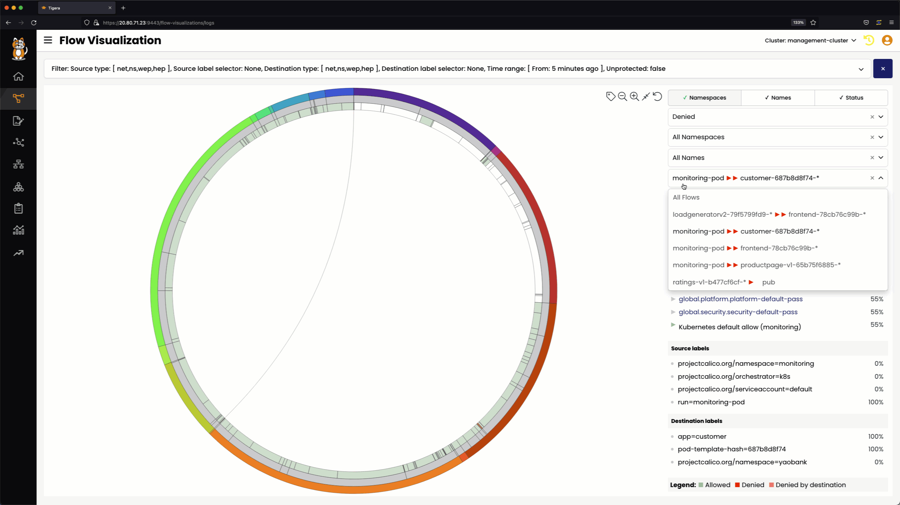
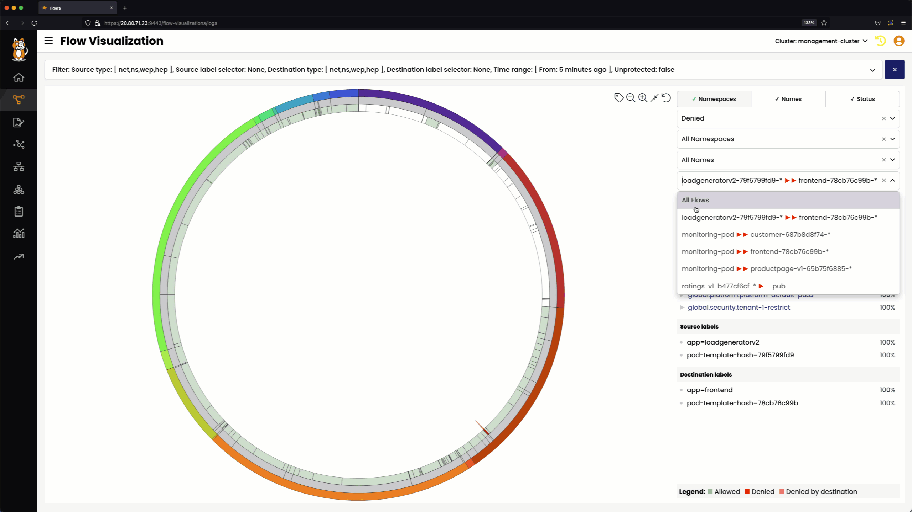
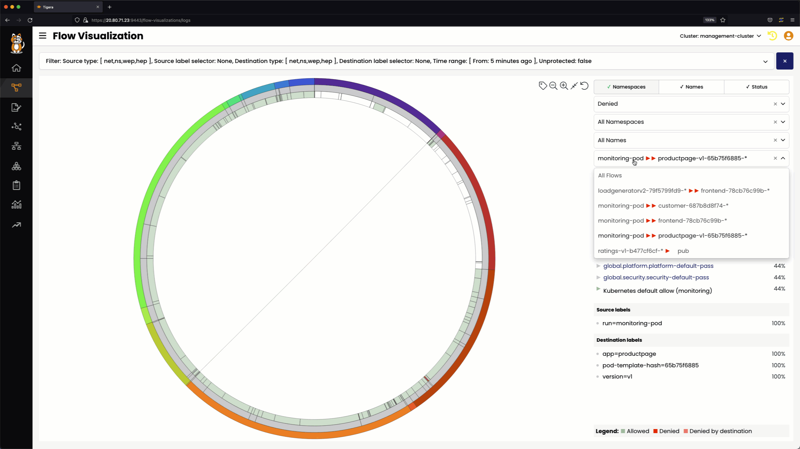

# Using Flow Visualization to Identify Denied Flows

## Denied flow from `monitoring-pod`

### `monitoring` to `hipstershop`

### `monitoring` to `yaobank`

### `monitoring` to `bookfino`

## Denied flow from `loadgeneratorv2`

## Denied flow from `ratings`

# Lesson Video
