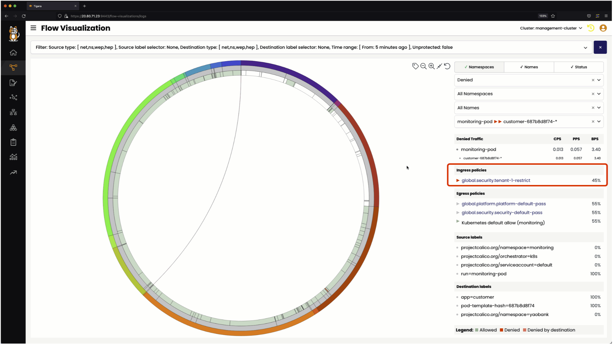
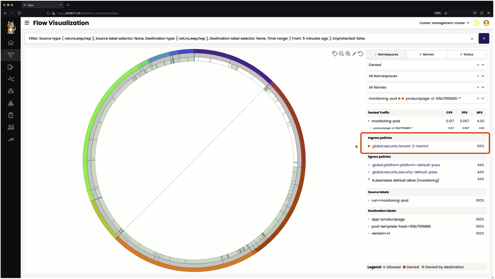
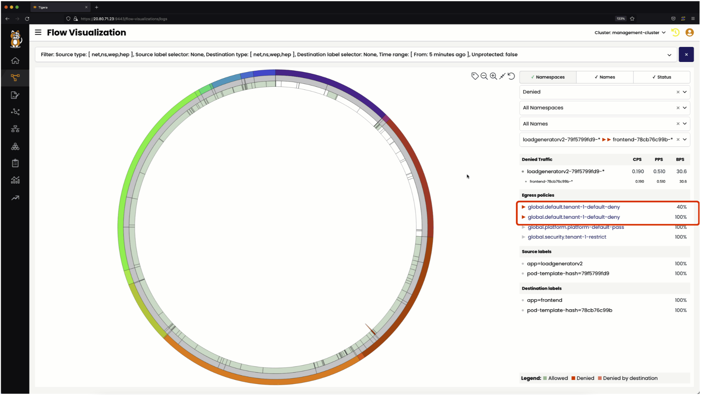
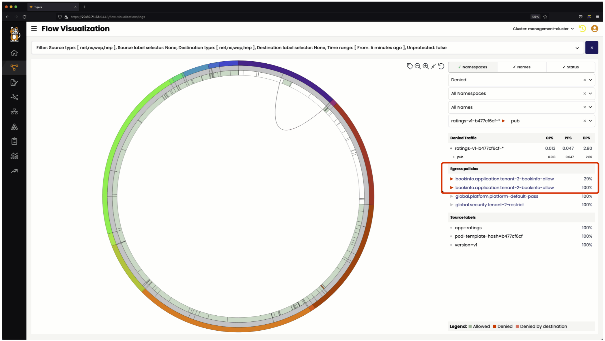

# Using Flow Visualization to Identify Denied Flows

> ### Quick Access - [Lesson Lab Tasks](#Lesson-Lab-Tasks) 

## Denied flow from `monitoring-pod`

### `monitoring` to `hipstershop`

The `monitoring` to `hipstershop` flow is denied by the below security policy.

#### Ingress

- The `tenant-1-restrict` security policy in the `security` tier.

#### Flow Visualization View

> Denied `monitoring` to `hipstershop` Flow Visualization

### `monitoring` to `yaobank`

The `monitoring` to `yaobank` flow is denied by the below security policy.

#### Ingress

- The `tenant-1-restrict` security policy in the `security` tier.

#### Flow Visualization View

> Denied `monitoring` to `yaobank` Flow Visualization

### `monitoring` to `bookfino`

The `monitoring` to `bookinfo` flow is denied by the below security policy.

#### Ingress

- The `tenant-2-restrict` security policy in the `security` tier.

#### Flow Visualization View

> Denied `monitoring` to `bookinfo` Flow Visualization

## Denied flow from `loadgeneratorv2`

The `loadgeneratorv2` to `frontend` flow in the `hipstershop` namespace is denied by the below security policy.

#### Egress

- The `tenant-1-default-deny` security policy in the `default` tier. 

#### Flow Visualization View

> Denied `loadgeneratorv2` to `frontend` Flow Visualization

## Denied flow from `ratings`

The `ratings` to `www.github.com` flow is denied by the below security.

#### Egress

- The `tenant-2-bookinfo-allow` security policy in the `application` tier. 

#### Flow Visualization View

> Denied `ratings`  to `www.github.com` Service Graph

# Lesson Lab Tasks

# Lesson Video

#### 
  [Click Next -> Lesson 18 - Using Kibana to Identify Denied Flows](https://github.com/tigera-cs/quickstart-self-service/blob/main/modules/kibana-denied-flows.md) 
