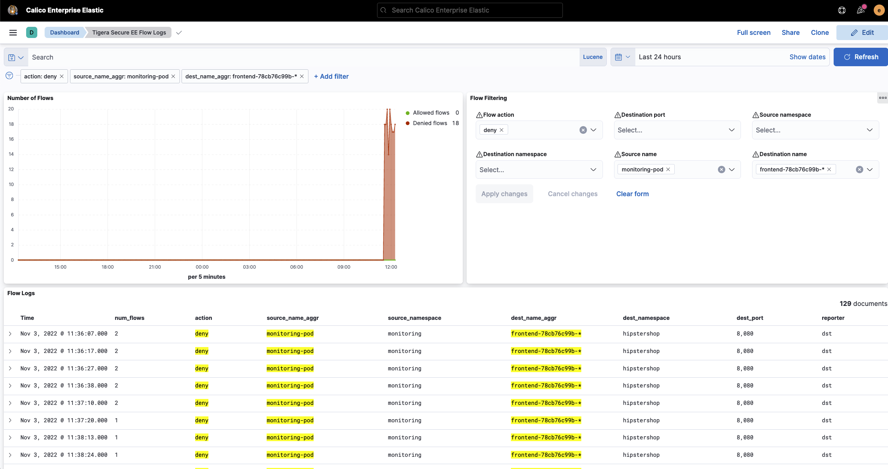
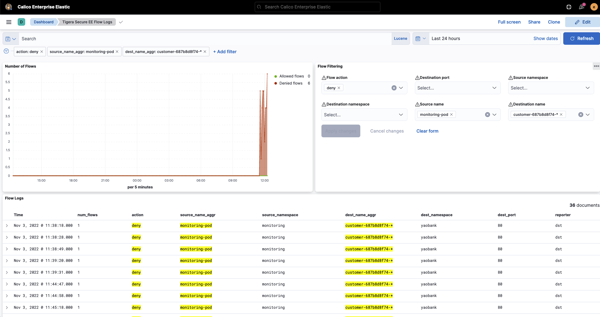
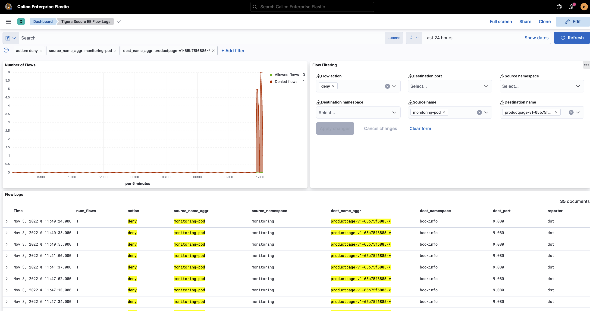
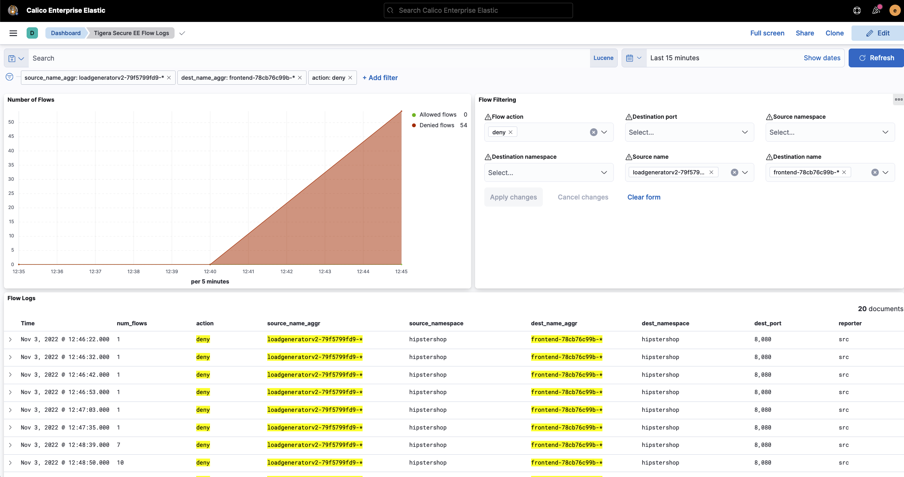
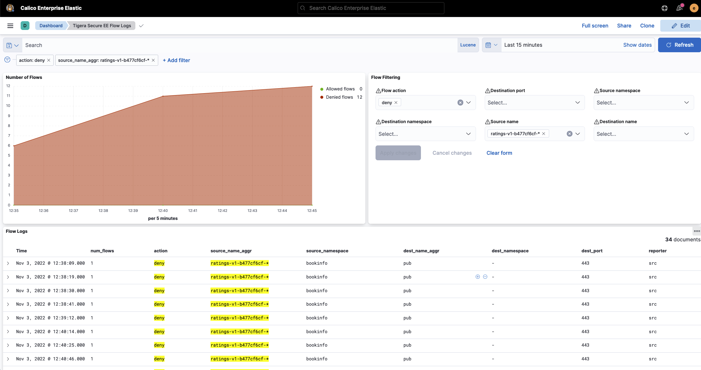

# Using Kibana to Identify Denied Flows

The `Tigera Secure EE Flow Logs` dashboard can be used to filter denied flow logs in Kibana. The flow filtering options can be used to narrow down specifi flows. 

## Denied flows from `monitoring-pod`

### `monitoring` to `hipstershop`

### `monitoring` to `yaobank`

### `monitoring` to `bookfino`

## Denied flows from `loadgeneratorv2`

## Denied flows from `ratings`

