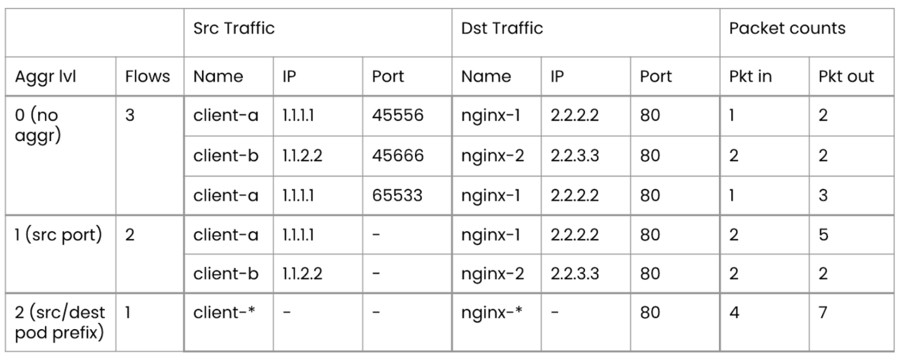
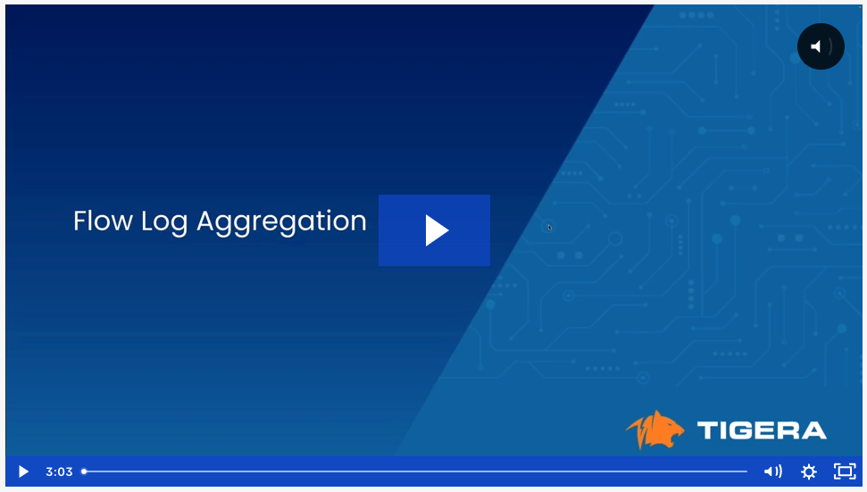

# Flow Log Aggregation

Calico Enterprise enables flow log aggregation for pod/workload endpoints by default, and uses an aggressive aggregation level to reduce log volume. The level assumes that most users do not need to see pod IP information (due to the ephemeral nature of pod IP address allocation). However, at times, pod or destination IP information can be useful when analyzing traffic flows.  

The table below summarizes the aggregation levels. 
>  - Aggregation 0 - no aggregation
>  - Aggregation 1 - source port
>  - Aggregation 2 - source port, source IP, destination IP, source pod prefix, and destination pod prefix

# Lesson Video

  

---
