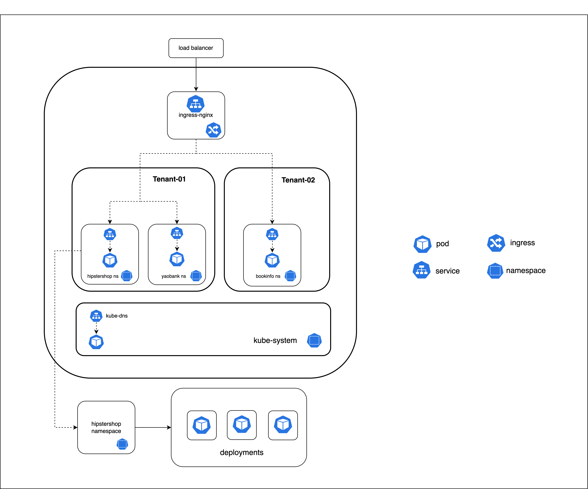

# Module 1 - Introduction

## Workshop Lab

The following lab will be used in this course. The lab has three namespaces: `hipstershop`, `yaobank`, and `bookinfo`. The applications in those namespaces belong to `tenant-1` and `tenant-2`. The `ingress-nginx` namespace hosts an ingress controller which will be used to connect to the applications through the respective frontend microservice for each application. The `ingress-nginx` and `kube-system` namespaces are owned by the platform and are managed independent of the tenant namespaces. 

### `tenant-1`

The below namespaces are for `tenant-1`
> `hipstershop`
> `yaobank`

### `tenant-2`

The below namespace is for `tenant-2`
> `bookinfo`

