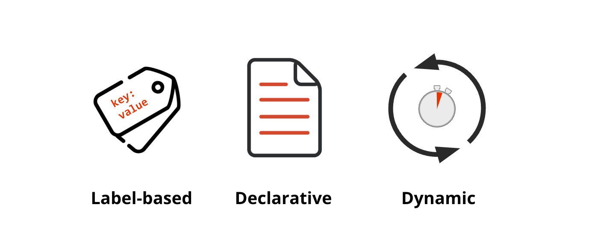

# Module 2 - Introduction

## Security Policy Characteristics

Calico security policies are:
- Declarative - Offers a powerful policy language to define security intentions
- Label based - Maps security policies to endpoints based on workload identity 
- Dynamic - Security policies are tightly-coupled with workloads

> Security Policy Characteristics

## The Anatomy of a Security Policy

