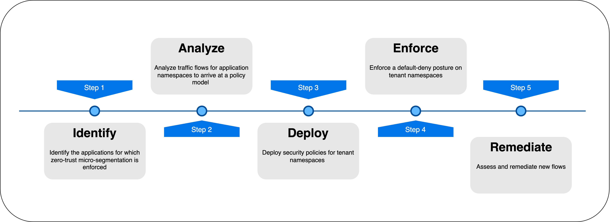
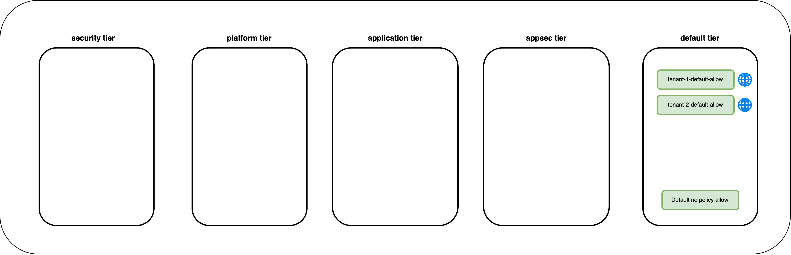
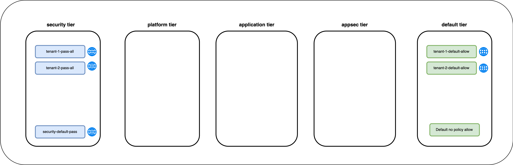
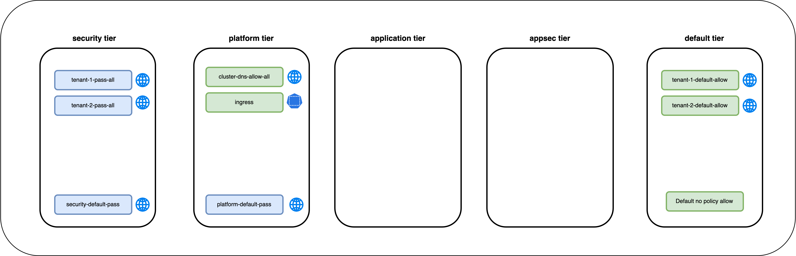
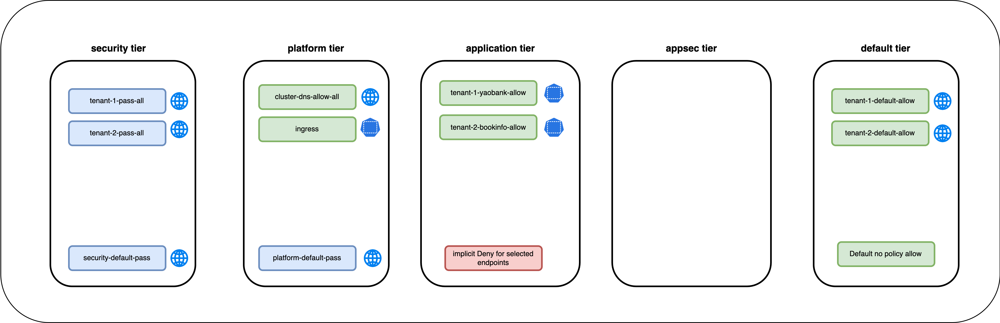
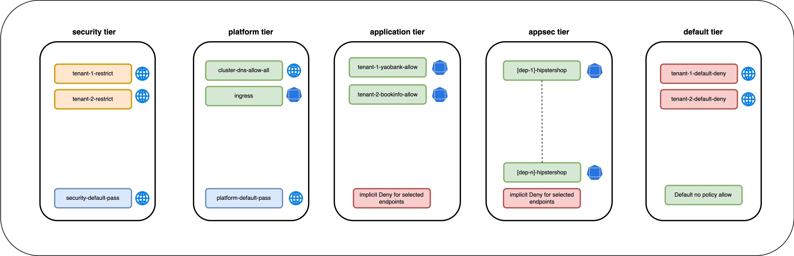

# Module 4 - Introduction

This module will present methodologies for implementing zero-trust micro-segmentation. The workshop assumes that micro-segmentation is performed for a live Kubernetes cluster. The methodology ensures minimal disruption to workloads in the cluster. However, you may skip or tweak any steps to best suit your requirement. 

## Methodology for Zero-Trust Micro-segmentation

The following step-by-step approach is used to identify, analyze, deploy, enforce, and remediate security policies for workloads in the lab cluster. The steps can be replicated in any environment undergoing zero-trust micro-segmentation. 

> Methodology for Zero-Trust Micro-segmentation

### Step 1 : Identify 

Identify the applications for which zero-trust micro-segmentation must be enforced. 

### Step 2 : Analyze 

Analyze traffic flows in application namespaces to arrive at a security policy model. 

### Step 3 : Deploy

Security policies will be deployed in the following sequence to ensure that applications are not impacted during the process. In this step of the methodology, policies are deployed with fail-safe rules in the `security` and `default` tiers. The objective is to monitor the fail-safe rules and remediate any missed rules before enforce a `default-deny` posture in the next step. 

#### 1 - Security Policies in the `default` tier

Start by deploying fail-safe security policies in the default tier. 

> Security Policies in the `default tier`

#### 2 - Security Policies in the `security` tier

Deploy fail-safe security policies in the `security tier`

> Security Policies in the `security tier`

#### 3 - Security Policies in the `platform` tier

Deploy security policies in the `platform tier` for cluster DNS and ingress.

> Security Policies in the `platform tier`

#### 4 - Security Policies in the `application` tier

Deploy security policies in the `application tier` for the `yaobank` and `bookinfo` namespaces. 

> Security Policies in the `application tier`

#### 5 - Security Policies in the `appsec` tier

Deploy security policies in the `appsec tier` for the deployments in the `hipstershop` namespace.

> Security Policies in the `appsec tier`

### Step 4 : Enforce

In this step, a defaul-deny security posture is enforced for the application namespaces. 

### Step 5 : Assess and Remediate

In the final step, new traffic flows are introduced to the application workloads to assess the impact and remediate security policies. 

#### 
  [Click Next -> Lesson 1 - Service Graph - Views and Layers](https://github.com/tigera-cs/quickstart-self-service/blob/main/modules/views-and-layers-sg.md) 

