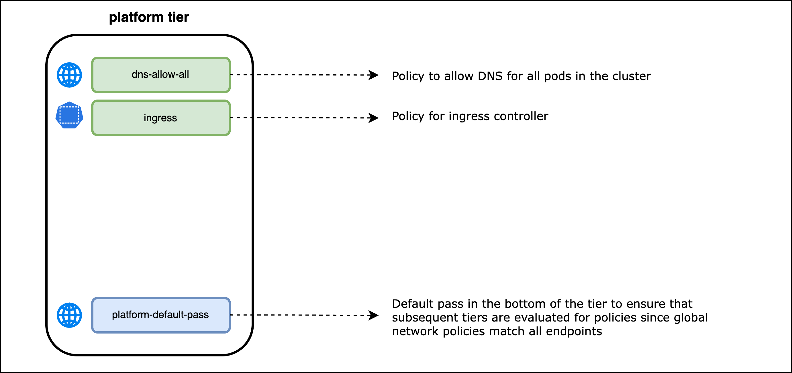
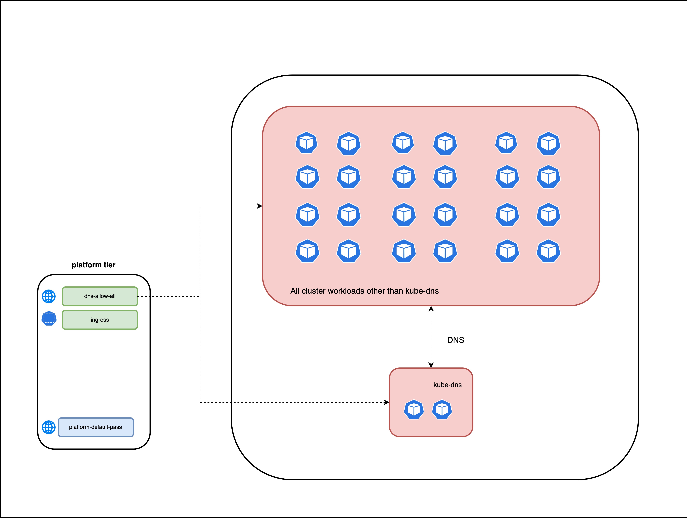
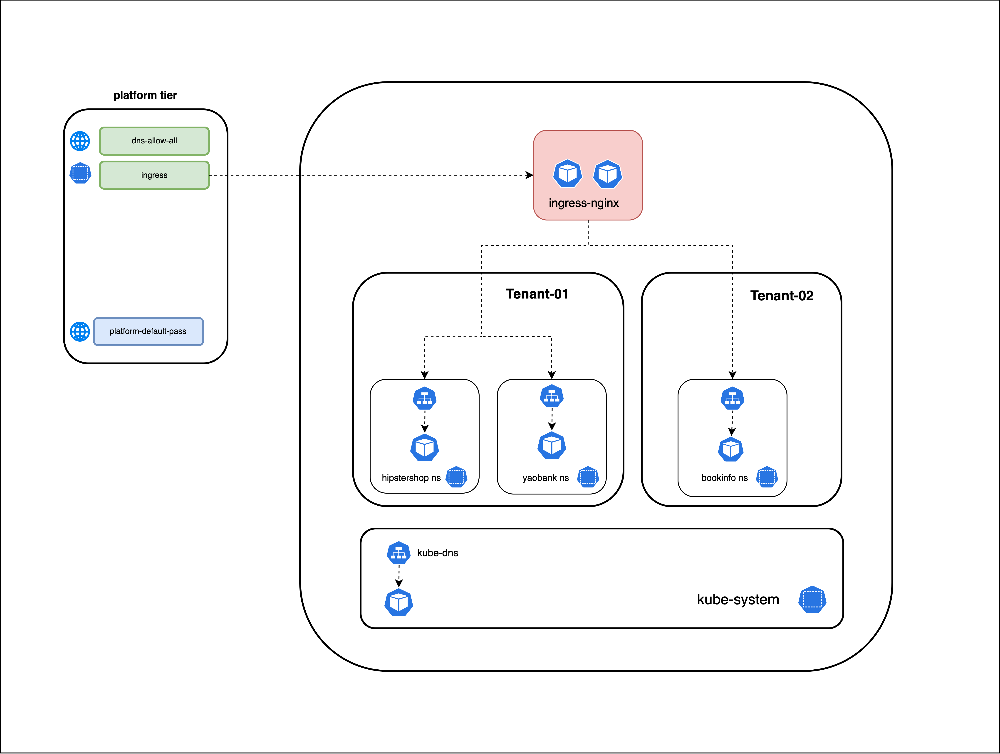
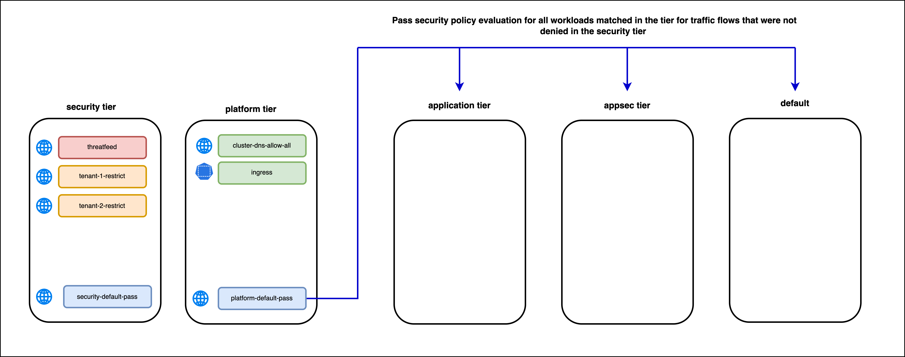

# The Platform Tier

The `platform` tier implements security policies for platform components such as `kube-dns` and `ingress`. All workloads use platform components in the cluster, and policies are typically under the purview of the platform team. 

> Security Policies in the `platform tier`

## `cluster-dns-allow-all` Security Policy

The `cluster-dns-allow-all` security policy will have rules to permit ingress DNS traffic to the `kube-dns` endpoints on TCP and UDP port 53 from all endpoints in the cluster. The security policy will also have egress rules to permit all endpoints in the cluster to send DNS traffic to the `kube-dns` endpoints on the same ports. The security policy is a [globalnetworkpolicy](https://docs.tigera.io/reference/resources/globalnetworkpolicy) that applies to all cluster workloads/pods. The policy rules will have endpoint selectors to match the kube-dns endpoints. 

> `cluster-dns-allow-all` Security Policy

## `ingress` Security Policy

The `ingress` security policy has rules to permit inbound traffic to the ingress controller from public and private networks on TCP ports 80 and 443. The security policy also has egress rules permitting traffic to namespaces that host externally accessible services, which are exposed as ingress resources. 

> `ingress` Security Policy

## `platform-default-pass` Security Policy

The `platform-default-pass` security policy has the lowest precedence in the platform tier.  It is deployed to ensure that a `pass` action is applied to all endpoints matched in the tier and for flows not denied in a previous tier. It is required since the `cluster-dns-allow-all` security policy matched all cluster workloads. Note that if a security policy matches a workload in a tier, any traffic flow that **does not** match an `allow` rule for the workload, either in that security policy or a subsequent security policy that matches the workloads in the **same tier**, will have an implicit `deny` behavior. Deploying a security policy for all cluster workloads with `pass` rules for all ingress and egress traffic will circumvent this behavior. The platform-default-pass security policy will be a [globalnetworkpolicy](https://docs.tigera.io/reference/resources/globalnetworkpolicy) that applies to all cluster workloads/pods.
 
> `platform-default-pass` security policy

#### 
  [Click Next: Lesson 4 - The Application Tier](https://github.com/tigera-cs/quickstart-self-service/blob/main/modules/application-tier.md) 
