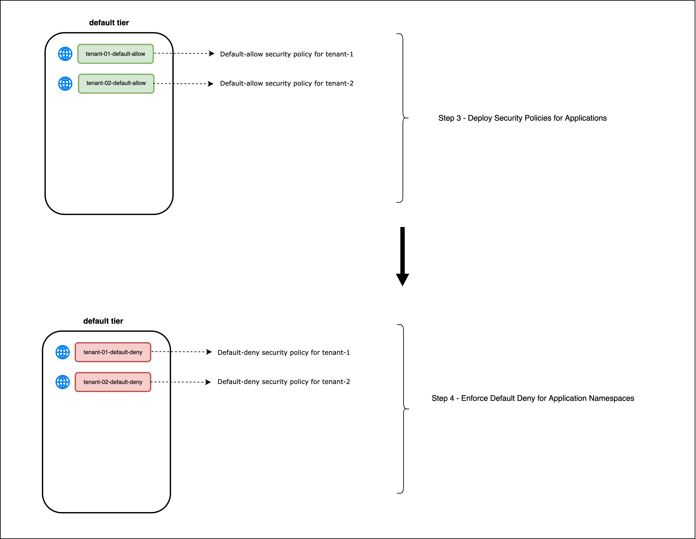
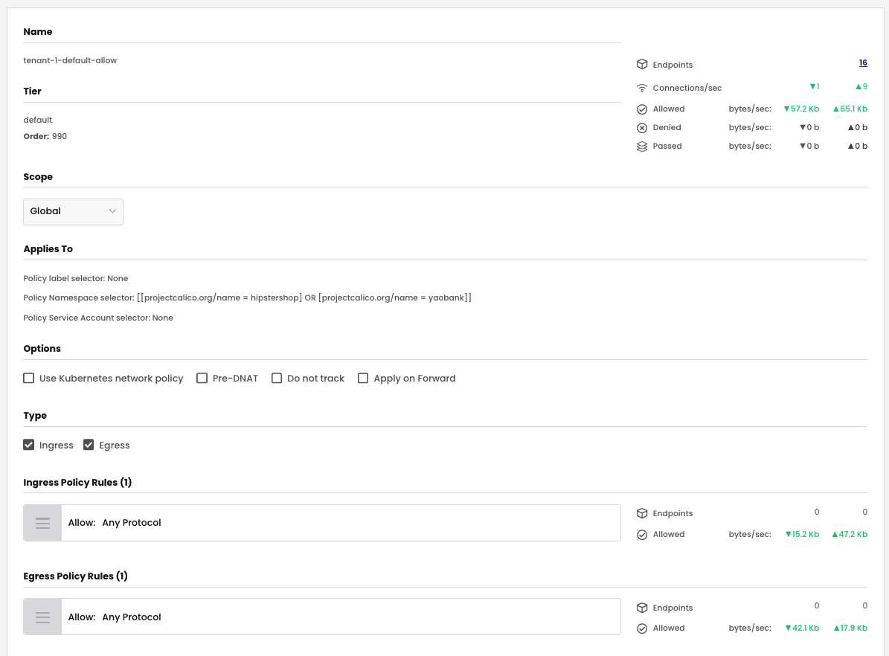
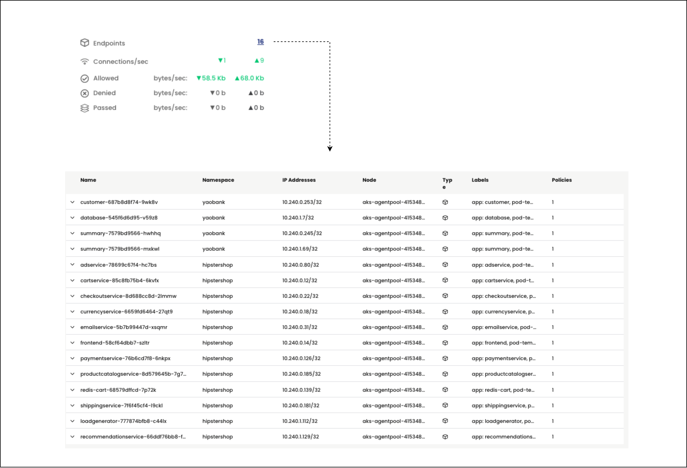
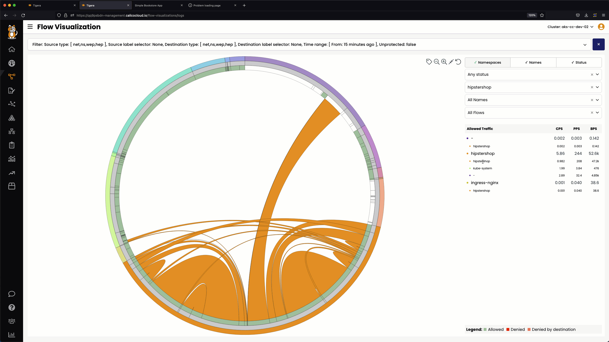
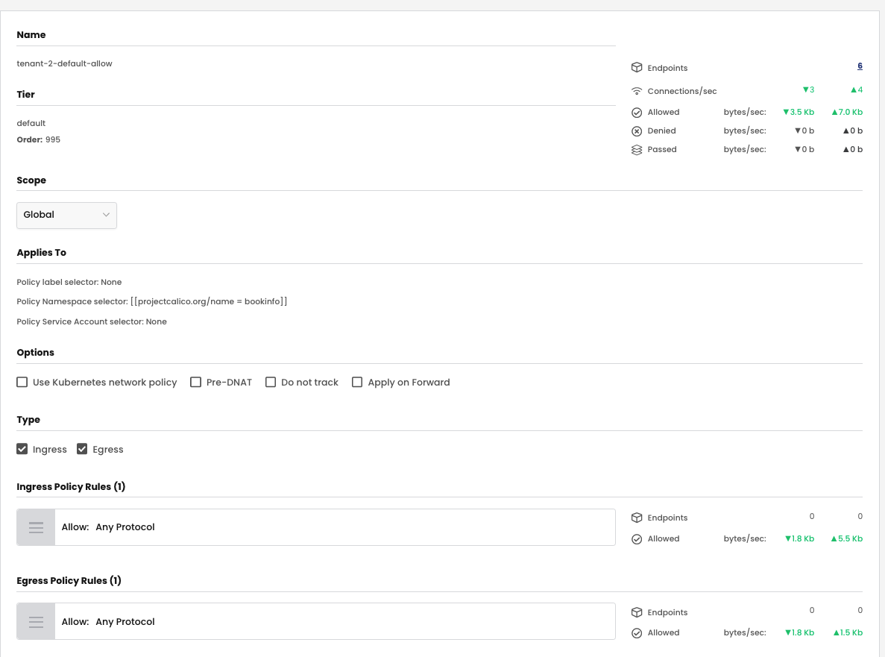
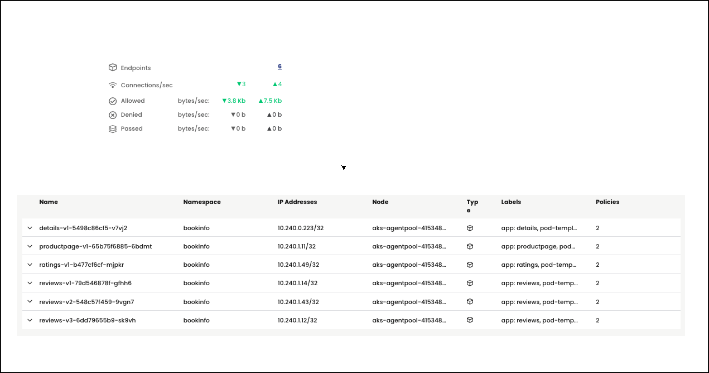
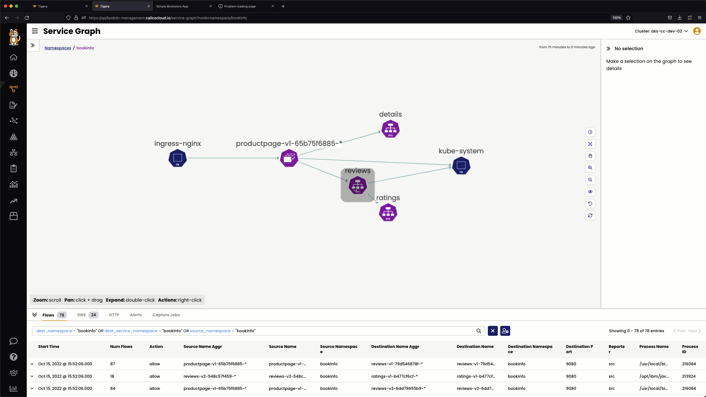
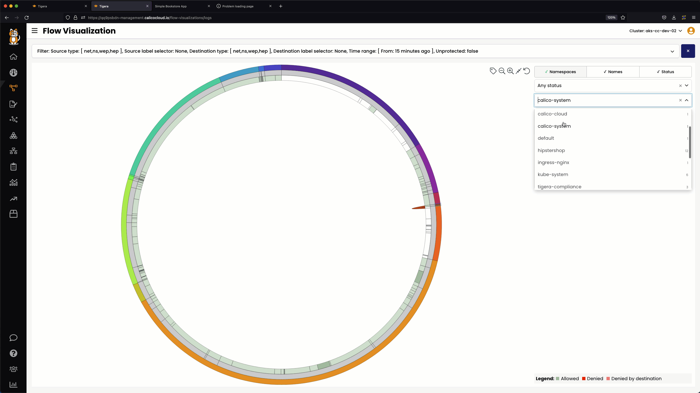

# Security Policies in the Default Tier

> ### Quick Access - [Lesson Lab Tasks](#Lesson-Lab-Tasks)

In step 3 of the methodology for implementing zero-trust micro-segmentation, default-allow security policies called `tenant-01-default-allow` and `tenant-02-default-allow` will be deployed for tenant-01 and tenant-02 respectively. The objective is to develop all security policies for the tenant workloads and ensure that no traffic flows match the default-allow security policy before enforcing default-deny security policy for the tenants in [step 4](https://github.com/tigera-cs/quickstart-self-service/blob/main/modules/enforce-default-deny.md). The workshops assumes that security policies are developed for a live environment and this approach ensures that workloads are not impacted due to missing or misconfigured security policies. 

> Security policies in the `default` tier - Step 3 and Step 4




## `tenant-01-default-allow` Security Policy

### Policy lable and Namespace Selector

There are no policy label selectors for the `tenant-1-default-allow` security policy. Namespace label selectors are used to select all endpoints in the `hipstershop` and `yaobank` namespaces. The [projectcalico.org/name](https://docs.tigera.io/v3.14/reference/resources/globalnetworkpolicy) label is used to select the namespaces. 

### Ingress Rules

The `tenant-1-default-allow` security policy has the following ingress rules.

01. **Rule 0** For endpoints in tenant-1, allow all ingress traffic. 

### Egress Rules

The `tenant-1-default-allow` security policy has the following egress rules.

01. **Rule 0** For endpoints in tenant-1, allow all engress traffic. 

### Security Policy - UI View

> `tenant-1-default-allow` security policy - UI view



### Security Policy - Manifest
> `tenant-1-default-allow` security policy - yaml

```yaml
apiVersion: projectcalico.org/v3
kind: GlobalNetworkPolicy
metadata:
  name: default.tenant-1-default-allow
spec:
  tier: default
  order: 1
  selector: ''
  namespaceSelector: >-
    projectcalico.org/name == "hipstershop" || projectcalico.org/name ==
    "yaobank"
  serviceAccountSelector: ''
  ingress:
    - action: Allow
      source: {}
      destination: {}
  egress:
    - action: Allow
      source: {}
      destination: {}
  doNotTrack: false
  applyOnForward: false
  preDNAT: false
  types:
    - Ingress
    - Egress
```

### Validate Endpoints

Validate the endpoints selected by the `tenant-1-default-allow` security policy by clicking on the number of endpoints in UI view. In the output below, all endpoints belong to the `hipstershop` and `yaobank` namespaces.



### Validate Service Graph Security Policy Evaluation


### Validate Flow Visualization Security Policy Evaluation




## `tenant-02-default-allow` Security Policy

### Policy lable and Namespace Selector

There are no policy label selectors for the `tenant-2-default-allow` security policy. Namespace label selectors are used to select all endpoints in the `bookinfo` namespace. The [projectcalico.org/name](https://docs.tigera.io/v3.14/reference/resources/globalnetworkpolicy) label is used to select the namespace.   

### Ingress Rules

The `tenant-2-default-allow` security policy has the following ingress rules.

01. **Rule 0** For endpoints in tenant-2, allow all ingress traffic. 

### Egress Rules

The `tenant-2-default-allow` security policy has the following egress rules.

01. **Rule 0** For endpoints in tenant-2, allow all engress traffic. 

### Security Policy - UI View

> `tenant-2-default-allow` security policy - UI view



### Security Policy - Manifest

> `tenant-2-default-allow` security policy - yaml

```yaml
apiVersion: projectcalico.org/v3
kind: GlobalNetworkPolicy
metadata:
  name: default.tenant-2-default-allow
spec:
  tier: default
  order: 2
  selector: ''
  namespaceSelector: projectcalico.org/name == "bookinfo"
  serviceAccountSelector: ''
  ingress:
    - action: Allow
      source: {}
      destination: {}
  egress:
    - action: Allow
      source: {}
      destination: {}
  doNotTrack: false
  applyOnForward: false
  preDNAT: false
  types:
    - Ingress
    - Egress
```

### Validate Endpoints

Validate the endpoints selected by the `tenant-2-default-allow` security policy by clicking on the number of endpoints in UI view. In the output below, all endpoints belong to the `bookinfo` namespace. 



### Validate Service Graph Security Policy Evaluation



### Validate Flow Visualization Security Policy Evaluation



# Lesson Lab Tasks

# Lesson Video