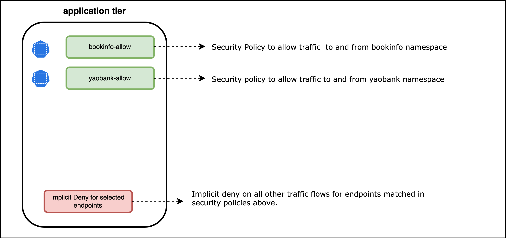
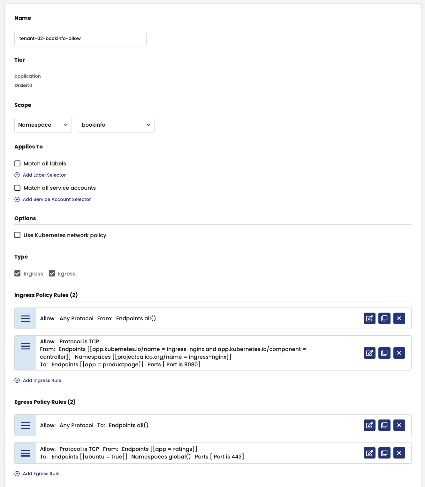
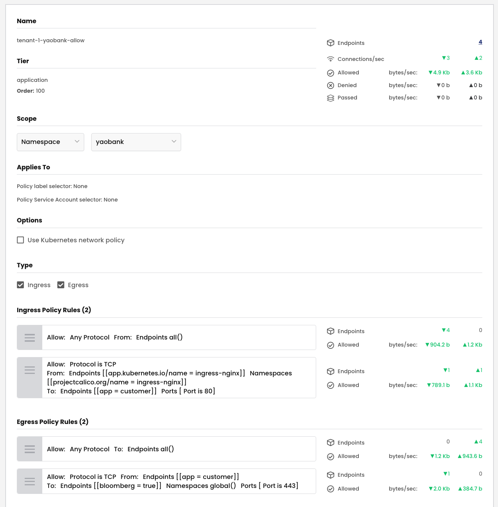

# Security Policies in the Application Tier



## `tenant-02-bookinfo-allow` Security Policy

### Policy label selector

Policy label selectors are not specified for the `tenant-02-bookinfo-allow` security policy. All endpoints in the `bookinfo` namespace are selected for the security policy.

### Ingress Rules

The `tenant-02-bookinfo-allow` security policy has the following ingress rules.

01. **Rule 0** - For all endpoints in the `bookinfo` namespace, allow all ingress traffic from all other endpoints in the same (`bookinfo`) namespace.

02. **Rule 1** - For the `productpage` endpoints, allow ingress traffic from the `ingress-nginx` endpoints on TCP port 9080. The ` projectcalico.org/name == ingress-nginx` namespace selector is used to specify the source namespace and the `app.kubernetes.io/name == ingress-nginx && pp.kubernetes.io/component == controller` endpoint selector is used in the rule to specify the source workload.

### Egress Rules

The `tenant-02-bookinfo-allow` security policy has the following egress rules.

01. **Rule 0** - For all endpoints in the `bookinfo` namespaces, allow all egress traffic to all other endpoints in the same (`bookinfo`) namespace. 

02. **Rule 1** - For the `ratings` endpoints, allow egress traffic to the `ubuntu` `globalnetworkset` on TCP port 443. The `app == ratings` endpoint selector is used to specify the source workload and the `ubuntu == true` endpoint selector is used in the rule to specify the destination `globalnetworkset`. Note that the destination  namespace selector is specified as `global()` since the desitnation is a `globalnetworkset`. 

 
### Security Policy - UI View



### Security Policy - Manifest

```yaml
apiVersion: projectcalico.org/v3
kind: NetworkPolicy
metadata:
  name: application.tenant-02-bookinfo-allow
  namespace: bookinfo
spec:
  tier: application
  order: 0
  selector: ''
  serviceAccountSelector: ''
  ingress:
    - action: Allow
      source:
        selector: all()
      destination: {}
    - action: Allow
      protocol: TCP
      source:
        selector: >-
          (app.kubernetes.io/name == "ingress-nginx" &&
          app.kubernetes.io/component == "controller")
        namespaceSelector: projectcalico.org/name == "ingress-nginx"
      destination:
        selector: app == "productpage"
        ports:
          - '9080'
  egress:
    - action: Allow
      source: {}
      destination:
        selector: all()
    - action: Allow
      protocol: TCP
      source:
        selector: app == "ratings"
      destination:
        selector: ubuntu == "true"
        namespaceSelector: global()
        ports:
          - '443'
  types:
    - Ingress
    - Egress
```

### Validate Endpoints

## `tenant-1-yaobank-allow` Security Policy

### Policy label selectors

Policy label selectors are not specified for the `tenant-1-yaobank-allow` security policy. All endpoints in the `yaobank` namespace are selected for the security policy.

### Ingress Rules

The `tenant-1-yaobank-allow` security policy has the following ingress rules.

01. **Rule 0** - For all endpoints in the `yaobank` namespace, allow all ingress traffic from all other endpoints in the same (`yaobank`) namespace.

02. **Rule 1** - For the `customer` endpoints, allow ingress traffic from the `ingress-nginx` endpoints on TCP port 80. The ` projectcalico.org/name == ingress-nginx` namespace selector is used to specify the source namespace and the `app.kubernetes.io/name == ingress-nginx && pp.kubernetes.io/component == controller` endpoint selector is used in the rule to specify the source workload.


### Egress Rules

The `tenant-1-yaobank-allow` security policy has the following egress rules.


01. **Rule 0** - For all endpoints in the `yaobank` namespaces, allow all egress traffic to all other endpoints in the same (`yaobank`) namespace. 

02. **Rule 1** - For the `customer` endpoints, allow egress traffic to the `bloomberg` `globalnetworkset` on TCP port 443. The `app == customer` endpoint selector is used to specify the source workload and the `bloomberg == true` endpoint selector is used in the rule to specify the destination `globalnetworkset`. Note that the destination  namespace selector is specified as `global()` since the desitnation is a `globalnetworkset`. 

### Security Policy - UI View



### Security Policy - Manifest

```yaml
apiVersion: projectcalico.org/v3
kind: NetworkPolicy
metadata:
  name: application.tenant-1-yaobank-allow
  namespace: yaobank
spec:
  tier: application
  order: 100
  selector: ''
  serviceAccountSelector: ''
  ingress:
    - action: Allow
      source:
        selector: all()
      destination: {}
    - action: Allow
      protocol: TCP
      source:
        selector: app.kubernetes.io/name == "ingress-nginx"
        namespaceSelector: projectcalico.org/name == "ingress-nginx"
      destination:
        selector: app == "customer"
        ports:
          - '80'
  egress:
    - action: Allow
      source: {}
      destination:
        selector: all()
    - action: Allow
      protocol: TCP
      source:
        selector: app == "customer"
      destination:
        selector: bloomberg == "true"
        namespaceSelector: global()
        ports:
          - '443'
  types:
    - Ingress
    - Egress
```

### Validate Endpoints