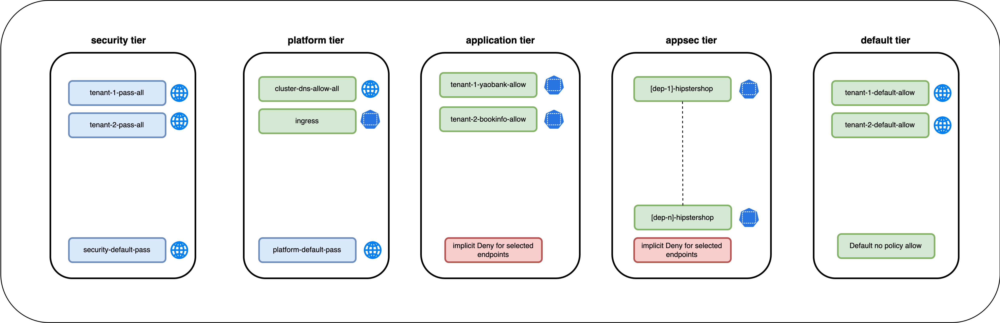

# Security Policies in the Appsec Tier




## `frontend` Security Policy

### Policy label selector

The `app == frontned` policy label selector is used in the `frontend` security policy; this ensures that the security policy is only applied to the `frontend` workload. 

### Ingress Rules

The `frontend` security policy has the following ingress rules.

01. **Rule 0** - For the `frontend` endpoints, allow ingress traffic from the `loadgenerator` endpoints on TCP port 8080. The `app == loadgenerator` endpoint selector is used in the rule to specify the source workloads.

02. **Rule 1** - For the `frontend` endpoints, allow ingress traffic from the `ingress-nginx controller` endpoints on TCP port 8080. The `app.kubernetes.io/component == "controller" && app.kubernetes.io/name == "ingress-nginx` endpoint selector is used in the rule to specify the source workloads. The rule also has a namespace selector specified using [projectcalico.org/name](https://docs.tigera.io/v3.14/reference/resources/globalnetworkpolicy) label since the `ingress-nginx controller` is not in the same namespace as the `frontend` workload.

### Egress Rules

The `frontend` security policy has the following egress rules.

01. **Rule 0** - For the `frontend` endpoints, allow egress on TCP port 80 to any destination

02. **Rule 1** - For the `frontend` endpoints, allow egress on TCP port 9555 to the `adservice` endpoints. The `app == adservice` endpoint selector is used to specify the destination workloads.  

03. **Rule 2** - For the `frontend` endpoints, allow egress on TCP port 7070 to the `cartservice` endpoints. The `app == cartservice` endpoint selector is used to specify the destination workloads.  

04. **Rule 3** - For the `frontend` endpoints, allow egress on TCP port 5050 to the `checkoutservice` endpoints. The  `app == checkoutservice` endpoint selector is used to specify the destination workloads.  

05. **Rule 4** - For the `frontend` endpoints, allow egress on TCP port 7000 to the `currencyservice` endpoints. The  `app == currencyservice` endpoint selector is used to specify the destination workloads.  

06. **Rule 5** - For the `frontend` endpoints, allow egress on TCP port 3550 to the `productcatalogservice` endpoints. The  `app == productcatalogservice` endpoint selector is used to specify the destination workloads.  

07. **Rule 6** - For the `frontend` endpoints, allow egress on TCP port 8080 to the `recommendationservice` endpoints. The   `app == recommendationservice` endpoint selector is used to specify the destination workloads.  

08. **Rule 7** - For the `frontend` endpoints, allow egress on TCP port 50051 to the `shippingservice` endpoints. The   `app == shippingservice` endpoint selector is used to specify the destination workloads.  

### Security Policy - UI View

> `frontend` security policy - UI view


### Security Policy - Manifest

> `frontend` security policy - yaml

```yaml
apiVersion: projectcalico.org/v3
kind: NetworkPolicy
metadata:
  name: appsec.frontend
  namespace: hipstershop
spec:
  tier: appsec
  order: 0
  selector: app == "frontend"
  serviceAccountSelector: ''
  ingress:
    - action: Allow
      protocol: TCP
      source:
        selector: app == "loadgenerator"
      destination:
        ports:
          - '8080'
    - action: Allow
      protocol: TCP
      source:
        selector: >-
          (app.kubernetes.io/component == "controller" && app.kubernetes.io/name
          == "ingress-nginx")
        namespaceSelector: projectcalico.org/name == "ingress-nginx"
      destination:
        ports:
          - '8080'
  egress:
    - action: Allow
      protocol: TCP
      source: {}
      destination:
        ports:
          - '80'
    - action: Allow
      protocol: TCP
      source: {}
      destination:
        selector: app == "adservice"
        ports:
          - '9555'
    - action: Allow
      protocol: TCP
      source: {}
      destination:
        selector: app == "cartservice"
        ports:
          - '7070'
    - action: Allow
      protocol: TCP
      source: {}
      destination:
        selector: app == "checkoutservice"
        ports:
          - '5050'
    - action: Allow
      protocol: TCP
      source: {}
      destination:
        selector: app == "currencyservice"
        ports:
          - '7000'
    - action: Allow
      protocol: TCP
      source: {}
      destination:
        selector: app == "productcatalogservice"
        ports:
          - '3550'
    - action: Allow
      protocol: TCP
      source: {}
      destination:
        selector: app == "recommendationservice"
        ports:
          - '8080'
    - action: Allow
      protocol: TCP
      source: {}
      destination:
        selector: app == "shippingservice"
        ports:
          - '50051'
  types:
    - Ingress
    - Egress
```

### Validate Endpoints

Validate the endpoints selected by the `frontend ` security policy by clicking on the number of endpoints in UI view of the security policy. The output below shows that the `frontend` workload are selected for the security policy. 


## `adservice` Security Policy

### Policy label selector

The `app == adservice` policy label selector is used in the `adservice` security policy; this ensures that the security policy is only applied to the `adservice` workload. 

### Ingress Rules

The `adservice` security policy has the following ingress rules.

01. **Rule 0** - For the `adservice` endpoints, allow ingress traffic from the `frontend` endpoints on TCP port 9555. The `app == frontend` endpoint selector is used in the rule to specify the source workloads. 

### Egress Rules

There are no egress rules for the `adservice` endpoints. 

### Security Policy - UI View

> `adservice` security policy - UI view


### Security Policy - Manifest

> `adservice` security policy - yaml

```yaml
apiVersion: projectcalico.org/v3
kind: NetworkPolicy
metadata:
  name: appsec.adservice
  namespace: hipstershop
spec:
  tier: appsec
  order: 100
  selector: app == "adservice"
  serviceAccountSelector: ''
  ingress:
    - action: Allow
      protocol: TCP
      source:
        selector: app == "frontend"
      destination:
        ports:
          - '9555'
  types:
    - Ingress
```


### Validate Endpoints

Validate the endpoints selected by the `adservice` security policy by clicking on the number of endpoints in UI view of the security policy. The output below shows that the `adservice` workload are selected for the security policy. 


## `cartservice` Security Policy

### Policy label selector

The `app == cartservice` policy label selector is used in the `cartservice` security policy; this ensures that the security policy is only applied to the `cartservice` workload. 

### Ingress Rules

The `cartservice` security policy has the following ingress rules.

01. **Rule 0** - For the `cartservice` endpoints, allow ingress traffic from the `checkoutservice` endpoints on TCP port 7070. The `app == "checkoutservice` endpoint selector is used in the rule to specify the source workloads. 

02. **Rule 1** - For the `cartservice` endpoints, allow ingress traffic from the `frontend` endpoints on TCP port 7070. The `app == "frontend` endpoint selector is used in the rule to specify the source workloads. 

### Egress Rules

The `cartservice` security policy has the following egress rules.

01. **Rule 0** - For the `frontend` endpoints, allow egress on TCP port 6379 to the `redis-cart` endpoints. The `app == redis-cart` endpoint selector is used to specify the destination workloads.  

### Security Policy - UI View

> `cartservice` security policy - UI view


### Security Policy - Manifest

> `cartservice` security policy - yaml

```yaml
apiVersion: projectcalico.org/v3
kind: NetworkPolicy
metadata:
  name: appsec.cartservice
  namespace: hipstershop
spec:
  tier: appsec
  order: 200
  selector: app == "cartservice"
  serviceAccountSelector: ''
  ingress:
    - action: Allow
      protocol: TCP
      source:
        selector: app == "checkoutservice"
      destination:
        ports:
          - '7070'
    - action: Allow
      protocol: TCP
      source:
        selector: app == "frontend"
      destination:
        ports:
          - '7070'
  egress:
    - action: Allow
      protocol: TCP
      source: {}
      destination:
        selector: app == "redis-cart"
        ports:
          - '6379'
  types:
    - Ingress
    - Egress
```

### Validate Endpoints

Validate the endpoints selected by the `cartservice` security policy by clicking on the number of endpoints in UI view of the security policy. The output below shows that the `cartservice` workload are selected for the security policy. 


## `checkoutservice` Security Policy

### Policy label selector

The `app == checkoutservice` policy label selector is used in the `checkoutservice` security policy; this ensures that the security policy is only applied to the `checkoutservice` workload. 

### Ingress Rules

The `checkoutservice` security policy has the following ingress rules.

01. **Rule 0** - For the `checkoutservice` endpoints, allow ingress traffic from the `frontend` endpoints on TCP port 5050. The `app == frontend` endpoint selector is used in the rule to specify the source workloads.

### Egress Rules

The `frontend` security policy has the following egress rules.

01. **Rule 0** - For the `checkoutservice` endpoints, allow egress on TCP port 9555 to the `paymentservice` endpoints. The `app == paymentservice` endpoint selector is used to specify the destination workloads.  

02. **Rule 1** - For the `checkoutservice` endpoints, allow egress on TCP port 3550 to the `productcatalogservice` endpoints. The  `app == productcatalogservice` endpoint selector is used to specify the destination workloads.

03. **Rule 2** - For the `checkoutservice` endpoints, allow egress on TCP port 50051 to the `shippingservice` endpoints. The   `app == shippingservice` endpoint selector is used to specify the destination workloads.  

04. **Rule 3** - For the `checkoutservice` endpoints, allow egress on TCP port 7070 to the `cartservice` endpoints. The `app == cartservice` endpoint selector is used to specify the destination workloads. 

05. **Rule 4** - For the `checkoutservice` endpoints, allow egress on TCP port 7000 to the `currencyservice` endpoints. The  `app == currencyservice` endpoint selector is used to specify the destination workloads.  

06. **Rule 5** - For the `checkoutservice` endpoints, allow egress on TCP port 8080 to the `emailservice` endpoints. The  `app == emailservice` endpoint selector is used to specify the destination workloads.  

### Security Policy - UI View

> `checkoutservice` security policy - UI view


### Security Policy - Manifest

> `checkout` security policy - yaml

```yaml
apiVersion: projectcalico.org/v3
kind: NetworkPolicy
metadata:
  name: appsec.checkoutservice
  namespace: hipstershop
spec:
  tier: appsec
  order: 300
  selector: app == "checkoutservice"
  serviceAccountSelector: ''
  ingress:
    - action: Allow
      protocol: TCP
      source:
        selector: app == "frontend"
      destination:
        ports:
          - '5050'
  egress:
    - action: Allow
      protocol: TCP
      source: {}
      destination:
        selector: app == "paymentservice"
        ports:
          - '50051'
    - action: Allow
      protocol: TCP
      source: {}
      destination:
        selector: app == "productcatalogservice"
        ports:
          - '3550'
    - action: Allow
      protocol: TCP
      source: {}
      destination:
        selector: app == "shippingservice"
        ports:
          - '50051'
    - action: Allow
      protocol: TCP
      source: {}
      destination:
        selector: app == "cartservice"
        ports:
          - '7070'
    - action: Allow
      protocol: TCP
      source: {}
      destination:
        selector: app == "currencyservice"
        ports:
          - '7000'
    - action: Allow
      protocol: TCP
      source: {}
      destination:
        selector: app == "emailservice"
        ports:
          - '8080'
  types:
    - Ingress
    - Egress
```

### Validate Endpoints

Validate the endpoints selected by the `checkoutservice` security policy by clicking on the number of endpoints in UI view of the security policy. The output below shows that the `checkoutservice` workload are selected for the security policy. 


## `currencyservice` Security Policy

### Policy label selector

The `app == currencyservice` policy label selector is used in the `currencyservice` security policy; this ensures that the security policy is only applied to the `currencyservice` workload. 

### Ingress Rules

The `currencyservice` security policy has the following ingress rules.

01. **Rule 0** - For the `currencyservice` endpoints, allow ingress traffic from the `checkoutservice` endpoints on TCP port 7000. The `app == "checkoutservice` endpoint selector is used in the rule to specify the source workloads. 

02. **Rule 1** - For the `currencyservice` endpoints, allow ingress traffic from the `frontend` endpoints on TCP port 7000. The `app == "frontend` endpoint selector is used in the rule to specify the source workloads. 

### Egress Rules

The `currencyservice` security policy has no egress rules. 

### Security Policy - UI View

> `currencyservice` security policy - UI view


### Security Policy - Manifest

> `currencyservice` security policy - yaml

```yaml
apiVersion: projectcalico.org/v3
kind: NetworkPolicy
metadata:
  name: appsec.currencyservice
  namespace: hipstershop
spec:
  tier: appsec
  order: 400
  selector: app == "currencyservice"
  serviceAccountSelector: ''
  ingress:
    - action: Allow
      protocol: TCP
      source:
        selector: app == "checkoutservice"
      destination:
        ports:
          - '7000'
    - action: Allow
      protocol: TCP
      source:
        selector: app == "frontend"
      destination:
        ports:
          - '7000'
  types:
    - Ingress
```

### Validate Endpoints

Validate the endpoints selected by the `currencyservice` security policy by clicking on the number of endpoints in UI view of the security policy. The output below shows that the `currencyservice` workload are selected for the security policy. 


## `emailservice` Security Policy

### Policy label selector

The `app == emailservice` policy label selector is used in the `emailservice` security policy; this ensures that the security policy is only applied to the `emailservice` workload. 

### Ingress Rules

The `emailservice` security policy has the following ingress rules.

01. **Rule 0** - For the `emailservice` endpoints, allow ingress traffic from the `checkoutservice` endpoints on TCP port 8080. The `app == "checkoutservice` endpoint selector is used in the rule to specify the source workloads. 

### Egress Rules

The `emailservice` security policy has no egress rules. 

### Security Policy - UI View

> `emailservice` security policy - UI view


### Security Policy - Manifest

> `emailservice` security policy - yaml

```yaml
apiVersion: projectcalico.org/v3
kind: NetworkPolicy
metadata:
  name: appsec.emailservice
  namespace: hipstershop
spec:
  tier: appsec
  order: 500
  selector: app == "emailservice"
  serviceAccountSelector: ''
  ingress:
    - action: Allow
      protocol: TCP
      source:
        selector: app == "checkoutservice"
      destination:
        ports:
          - '8080'
  types:
    - Ingress

```

### Validate Endpoints

Validate the endpoints selected by the `emailservice` security policy by clicking on the number of endpoints in UI view of the security policy. The output below shows that the `emailservice` workload are selected for the security policy. 


## `paymentservice` Security Policy

### Policy label selector

The `app == paymentservice` policy label selector is used in the `paymentservice` security policy; this ensures that the security policy is only applied to the `paymentservice` workload. 

### Ingress Rules

01. **Rule 0** - For the `paymentservice` endpoints, allow ingress traffic from the `checkoutservice` endpoints on TCP port 50051. The `app == "checkoutservice` endpoint selector is used in the rule to specify the source workloads. 

### Egress Rules

The `paymentservice` security policy has the following egress rules.

### Security Policy - UI View

> `paymentservice` security policy - UI view


### Security Policy - Manifest

> `paymentservice` security policy - yaml

```yaml
apiVersion: projectcalico.org/v3
kind: NetworkPolicy
metadata:
  name: appsec.paymentservice
  namespace: hipstershop
spec:
  tier: appsec
  order: 600
  selector: (zone == "trusted" && app == "paymentservice")
  serviceAccountSelector: ''
  ingress:
    - action: Allow
      protocol: TCP
      source:
        selector: app == "checkoutservice"
      destination:
        ports:
          - '50051'
  types:
    - Ingress
```

### Validate Endpoints

Validate the endpoints selected by the `paymentservice` security policy by clicking on the number of endpoints in UI view of the security policy. The output below shows that the `paymentservice` workload are selected for the security policy. 

## `productcatalogservice` Security Policy

### Policy label selector

The `app == productcatalogservice` policy label selector is used in the `productcatalogservice` security policy; this ensures that the security policy is only applied to the `productcatalogservice` workload. 

### Ingress Rules

01. **Rule 0** - For the `productcatalogservice` endpoints, allow ingress traffic from the `frontend` endpoints on TCP port 3550. The `app == frontend` endpoint selector is used in the rule to specify the source workloads. 

02. **Rule 1** - For the `productcatalogservice` endpoints, allow ingress traffic from the `recommendationservice` endpoints on TCP port 3550. The `app == recommendationservice` endpoint selector is used in the rule to specify the source workloads. 

03. **Rule 2** - For the `productcatalogservice` endpoints, allow ingress traffic from the `checkoutservice` endpoints on TCP port 3550. The `app == checkoutservice` endpoint selector is used in the rule to specify the source workloads. 

### Egress Rules

There are no egress rules for the `productcatalogservice` endpoints. 

### Security Policy - UI View

> `productcatalogservice` security policy - UI view


### Security Policy - Manifest

> `productcatalogservice` security policy - yaml

```yaml
apiVersion: projectcalico.org/v3
kind: NetworkPolicy
metadata:
  name: appsec.productcatalogservice
  namespace: hipstershop
spec:
  tier: appsec
  order: 700
  selector: app == "productcatalogservice"
  serviceAccountSelector: ''
  ingress:
    - action: Allow
      protocol: TCP
      source:
        selector: app == "frontend"
      destination:
        ports:
          - '3550'
    - action: Allow
      protocol: TCP
      source:
        selector: app == "recommendationservice"
      destination:
        ports:
          - '3550'
    - action: Allow
      protocol: TCP
      source:
        selector: app == "checkoutservice"
      destination:
        ports:
          - '3550'
  types:
    - Ingress
```

### Validate Endpoints

Validate the endpoints selected by the `productcatalogservice` security policy by clicking on the number of endpoints in UI view of the security policy. The output below shows that the `productcatalogservice` workload are selected for the security policy. 


## `recommendationservice` Security Policy

### Policy label selector

The `app == recommendationservice` policy label selector is used in the `recommendationservice` security policy; this ensures that the security policy is only applied to the `recommendationservice` workload. 

### Ingress Rules

The `recommendationservice` security policy has the following ingress rules.

01. **Rule 0** - For the `recommendationservice` endpoints, allow ingress traffic from the `frontend` endpoints on TCP port 8080. The `app == frontend` endpoint selector is used in the rule to specify the source workloads. 

### Egress Rules

The `recommendationservice` security policy has the following egress rules.

01. **Rule 0** - For the `recommendationservice` endpoints, allow egress traffic to the `productcatalogservice` endpoints on TCP port 3550. The `app == productcatalogservice` endpoint selector is used in the rule to specify the destination workloads. 

### Security Policy - UI View

> `recommendationservice` security policy - UI view


### Security Policy - Manifest

> `recommendationservice` security policy - yaml

```yaml
apiVersion: projectcalico.org/v3
kind: NetworkPolicy
metadata:
  name: appsec.recommendationservice
  namespace: hipstershop
spec:
  tier: appsec
  order: 800
  selector: app == "recommendationservice"
  serviceAccountSelector: ''
  ingress:
    - action: Allow
      protocol: TCP
      source:
        selector: app == "frontend"
      destination:
        ports:
          - '8080'
  egress:
    - action: Allow
      protocol: TCP
      source: {}
      destination:
        selector: app == "productcatalogservice"
        ports:
          - '3550'
  types:
    - Ingress
    - Egress
```

### Validate Endpoints

Validate the endpoints selected by the `recommendationservice` security policy by clicking on the number of endpoints in UI view of the security policy. The output below shows that the `recommendationservice` workload are selected for the security policy. 

## `loadgenerator` Security Policy

### Policy label selector

The `app == loadgenerator` policy label selector is used in the `loadgenerator` security policy; this ensures that the security policy is only applied to the `loadgenerator` workload. 

### Ingress Rules

The `loadgenerator` security policy has no ingress rules. 

### Egress Rules

The `loadgenerator` security policy has the following egress rules.

01. **Rule 0** - For the `loadgenerator` endpoints, allow egress on TCP port 8080 to the `frontend` endpoints. The `app == frontend` endpoint selector is used to specify the destination workloads.  

### Security Policy - UI View

> `loadgenerator` security policy - UI view


### Security Policy - Manifest

> `loadgenerator` security policy - yaml

```yaml
apiVersion: projectcalico.org/v3
kind: NetworkPolicy
metadata:
  name: appsec.loadgenerator
  namespace: hipstershop
spec:
  tier: appsec
  order: 900
  selector: (app == "loadgenerator" && zone == "dmz")
  serviceAccountSelector: ''
  egress:
    - action: Allow
      protocol: TCP
      source: {}
      destination:
        selector: app == "frontend"
        ports:
          - '8080'
  types:
    - Egress
```

### Validate Endpoints

Validate the endpoints selected by the `loadgenerator` security policy by clicking on the number of endpoints in UI view of the security policy. The output below shows that the `loadgenerator` workload are selected for the security policy. 


## `redis-cart` Security Policy

### Policy label selector

The `app == redis-cart` policy label selector is used in the `redis-cart` security policy; this ensures that the security policy is only applied to the `redis-cart` workload. 

### Ingress Rules

The `redis-cart` security policy has the following ingress rules.

01. **Rule 0** - For the `redis-cart` endpoints, allow ingress traffic from the `cartservice` endpoints on TCP port 6379. The `app == "cartservice` endpoint selector is used in the rule to specify the source workloads. 

### Egress Rules

The `redis-cart` security policy has no egress rules. 

### Security Policy - UI View

> `redis-cart` security policy - UI view


### Security Policy - Manifest

> `redis-cart` security policy - yaml

```yaml
apiVersion: projectcalico.org/v3
kind: NetworkPolicy
metadata:
  name: appsec.redis-cart
  namespace: hipstershop
spec:
  tier: appsec
  order: 1000
  selector: app == "redis-cart"
  serviceAccountSelector: ''
  ingress:
    - action: Allow
      protocol: TCP
      source:
        selector: app == "cartservice"
      destination:
        ports:
          - '6379'
  types:
    - Ingress
```

### Validate Endpoints

Validate the endpoints selected by the `redis-cart` security policy by clicking on the number of endpoints in UI view of the security policy. The output below shows that the `redis-cart` workload are selected for the security policy. 


## `shippingservice` Security Policy

### Policy label selector

The `app == shippingservice` policy label selector is used in the `shippingservice` security policy; this ensures that the security policy is only applied to the `shippingservice` workload. 

### Ingress Rules

The `shippingservice` security policy has the following ingress rules.

01. **Rule 0** - For the `shippingservice` endpoints, allow ingress traffic from the `checkoutservice` endpoints on TCP port 50051. The `app == "checkoutservice` endpoint selector is used in the rule to specify the source workloads. 

02. **Rule 1** - For the `shippingservice` endpoints, allow ingress traffic from the `frontend` endpoints on TCP port 50051. The `app == "frontend` endpoint selector is used in the rule to specify the source workloads. 

### Egress Rules

The `shippingservice` security policy has no egress rules. 

### Security Policy - UI View

> `shippingservice` security policy - UI view


### Security Policy - Manifest

> `shippingservice` security policy - yaml

```yaml
apiVersion: projectcalico.org/v3
kind: NetworkPolicy
metadata:
  name: appsec.shippingservice
  namespace: hipstershop
spec:
  tier: appsec
  order: 1100
  selector: app == "shippingservice"
  serviceAccountSelector: ''
  ingress:
    - action: Allow
      protocol: TCP
      source:
        selector: app == "checkoutservice"
      destination:
        ports:
          - '50051'
    - action: Allow
      protocol: TCP
      source:
        selector: app == "frontend"
      destination:
        ports:
          - '50051'
  types:
    - Ingress
```

### Validate Endpoints

Validate the endpoints selected by the `shippingservice` security policy by clicking on the number of endpoints in UI view of the security policy. The output below shows that the `shippingservice` workload are selected for the security policy. 


# Lesson Lab Tasks

Apply the below security policy manifests. 

```bash
kubectl apply -f manifests/securitypolicies/step-3/appsec-tier
```


#### <div align="right">  [Click Next -> Lesson 13 - Validate Security Policies](https://github.com/tigera-cs/quickstart-self-service/blob/main/modules/validate-security-policies.md) </div>

