# Security Policies in the Appsec Tier

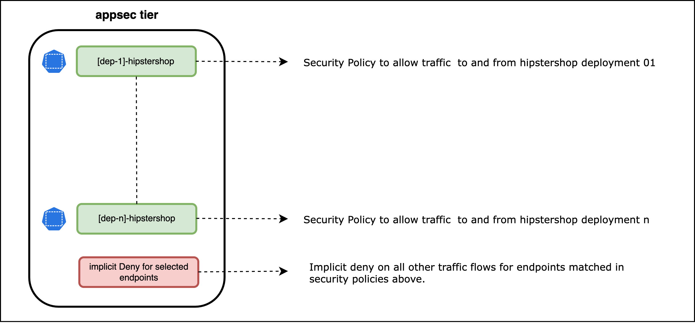

## `frontend` Security Policy

### Policy lable and Namespace Selector

### Ingress Rules

### Egress Rules

### Security Policy - UI View

> `frontend` security policy - UI view

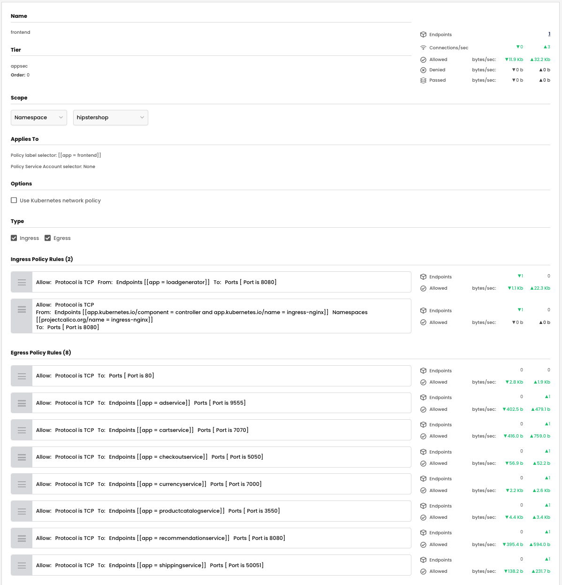

### Security Policy - Manifest

> `frontend` security policy - yaml

```yaml
apiVersion: projectcalico.org/v3
kind: NetworkPolicy
metadata:
  name: appsec.frontend
  namespace: hipstershop
spec:
  tier: appsec
  order: 0
  selector: app == "frontend"
  serviceAccountSelector: ''
  ingress:
    - action: Allow
      protocol: TCP
      source:
        selector: app == "loadgenerator"
      destination:
        ports:
          - '8080'
    - action: Allow
      protocol: TCP
      source:
        selector: >-
          (app.kubernetes.io/component == "controller" && app.kubernetes.io/name
          == "ingress-nginx")
        namespaceSelector: projectcalico.org/name == "ingress-nginx"
      destination:
        ports:
          - '8080'
  egress:
    - action: Allow
      protocol: TCP
      source: {}
      destination:
        ports:
          - '80'
    - action: Allow
      protocol: TCP
      source: {}
      destination:
        selector: app == "adservice"
        ports:
          - '9555'
    - action: Allow
      protocol: TCP
      source: {}
      destination:
        selector: app == "cartservice"
        ports:
          - '7070'
    - action: Allow
      protocol: TCP
      source: {}
      destination:
        selector: app == "checkoutservice"
        ports:
          - '5050'
    - action: Allow
      protocol: TCP
      source: {}
      destination:
        selector: app == "currencyservice"
        ports:
          - '7000'
    - action: Allow
      protocol: TCP
      source: {}
      destination:
        selector: app == "productcatalogservice"
        ports:
          - '3550'
    - action: Allow
      protocol: TCP
      source: {}
      destination:
        selector: app == "recommendationservice"
        ports:
          - '8080'
    - action: Allow
      protocol: TCP
      source: {}
      destination:
        selector: app == "shippingservice"
        ports:
          - '50051'
  types:
    - Ingress
    - Egress
```

### Validate Endpoints

Validate the endpoints selected by the `frontend ` security policy by clicking on the number of endpoints in UI view. The output below shows that the `frontend` workload was selected for the security policy. 

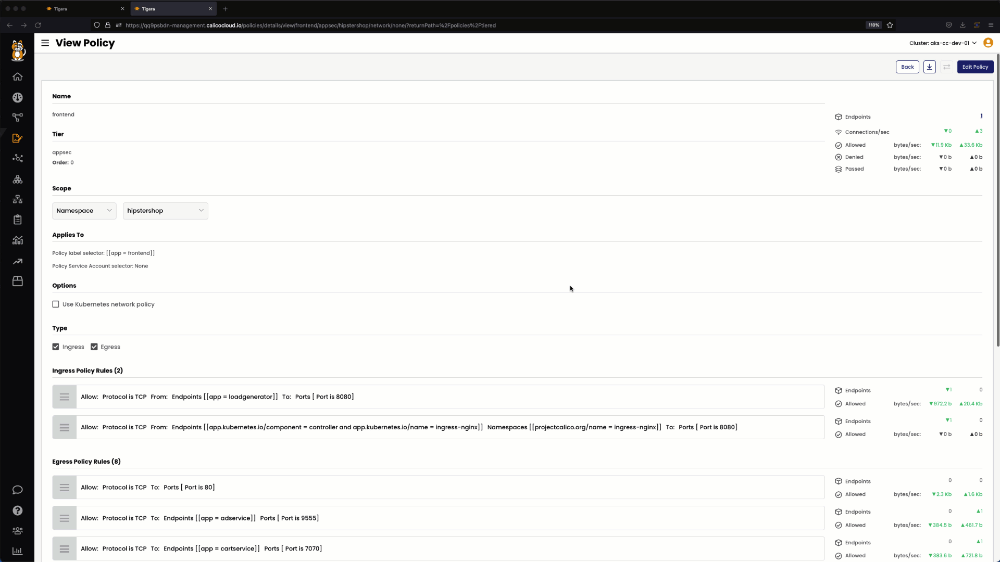

## `adservice` Security Policy

### Policy lable and Namespace Selector

### Ingress Rules

### Egress Rules

### Security Policy - UI View

> `adservice` security policy - UI view

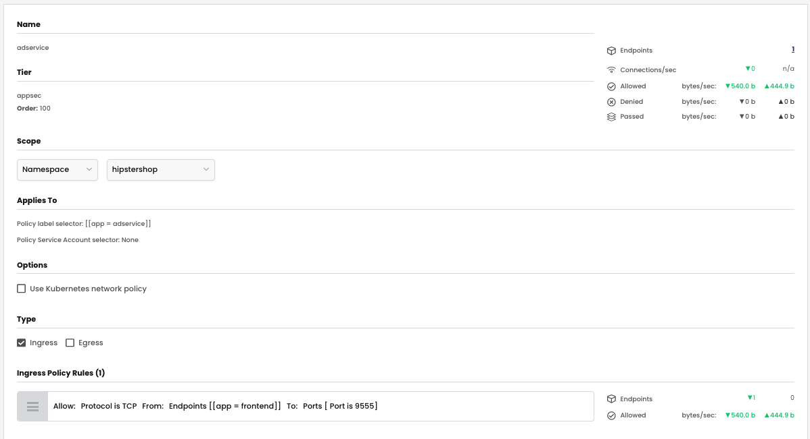

### Security Policy - Manifest

> `adservice` security policy - yaml

```yaml
apiVersion: projectcalico.org/v3
kind: NetworkPolicy
metadata:
  name: appsec.adservice
  namespace: hipstershop
spec:
  tier: appsec
  order: 100
  selector: app == "adservice"
  serviceAccountSelector: ''
  ingress:
    - action: Allow
      protocol: TCP
      source:
        selector: app == "frontend"
      destination:
        ports:
          - '9555'
  types:
    - Ingress
```


### Validate Endpoints


## `cartservice` Security Policy

### Policy lable and Namespace Selector

### Ingress Rules

### Egress Rules

### Security Policy - UI View

> `cartservice` security policy - UI view

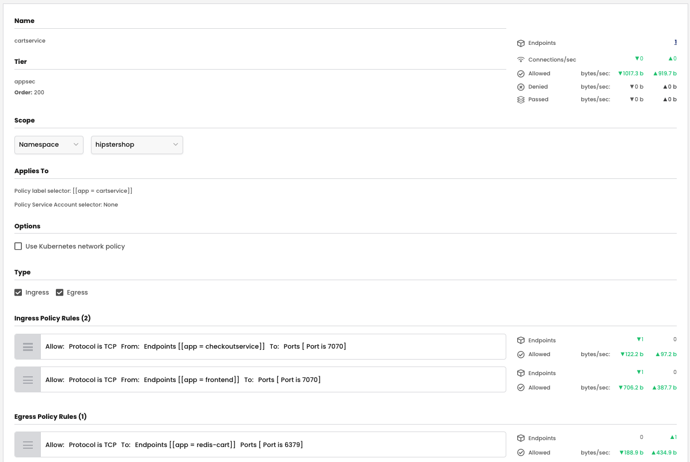

### Security Policy - Manifest

> `cartservice` security policy - yaml

```yaml
apiVersion: projectcalico.org/v3
kind: NetworkPolicy
metadata:
  name: appsec.cartservice
  namespace: hipstershop
spec:
  tier: appsec
  order: 200
  selector: app == "cartservice"
  serviceAccountSelector: ''
  ingress:
    - action: Allow
      protocol: TCP
      source:
        selector: app == "checkoutservice"
      destination:
        ports:
          - '7070'
    - action: Allow
      protocol: TCP
      source:
        selector: app == "frontend"
      destination:
        ports:
          - '7070'
  egress:
    - action: Allow
      protocol: TCP
      source: {}
      destination:
        selector: app == "redis-cart"
        ports:
          - '6379'
  types:
    - Ingress
    - Egress
```

### Validate Endpoints

## `checkoutservice` Security Policy

### Policy lable and Namespace Selector

### Ingress Rules

### Egress Rules

### Security Policy - UI View

> `checkoutservice` security policy - UI view

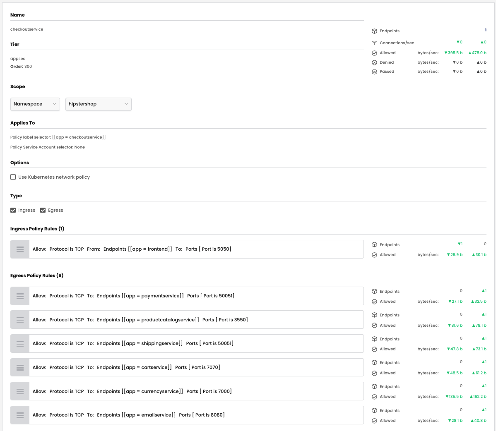

### Security Policy - Manifest

> `checkout` security policy - yaml

```yaml
apiVersion: projectcalico.org/v3
kind: NetworkPolicy
metadata:
  name: appsec.checkoutservice
  namespace: hipstershop
spec:
  tier: appsec
  order: 300
  selector: app == "checkoutservice"
  serviceAccountSelector: ''
  ingress:
    - action: Allow
      protocol: TCP
      source:
        selector: app == "frontend"
      destination:
        ports:
          - '5050'
  egress:
    - action: Allow
      protocol: TCP
      source: {}
      destination:
        selector: app == "paymentservice"
        ports:
          - '50051'
    - action: Allow
      protocol: TCP
      source: {}
      destination:
        selector: app == "productcatalogservice"
        ports:
          - '3550'
    - action: Allow
      protocol: TCP
      source: {}
      destination:
        selector: app == "shippingservice"
        ports:
          - '50051'
    - action: Allow
      protocol: TCP
      source: {}
      destination:
        selector: app == "cartservice"
        ports:
          - '7070'
    - action: Allow
      protocol: TCP
      source: {}
      destination:
        selector: app == "currencyservice"
        ports:
          - '7000'
    - action: Allow
      protocol: TCP
      source: {}
      destination:
        selector: app == "emailservice"
        ports:
          - '8080'
  types:
    - Ingress
    - Egress
```

### Validate Endpoints

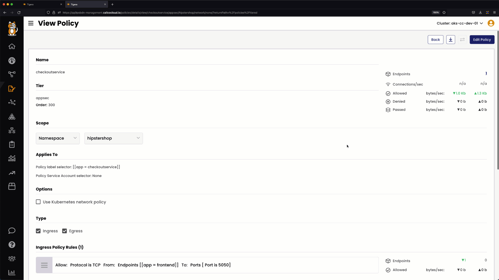

## `currencyservice` Security Policy

### Policy lable and Namespace Selector

### Ingress Rules

### Egress Rules

### Security Policy - UI View

> `currencyservice` security policy - UI view

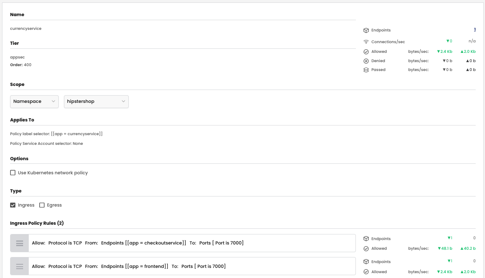

### Security Policy - Manifest

> `currencyservice` security policy - yaml

```yaml
apiVersion: projectcalico.org/v3
kind: NetworkPolicy
metadata:
  name: appsec.currencyservice
  namespace: hipstershop
spec:
  tier: appsec
  order: 400
  selector: app == "currencyservice"
  serviceAccountSelector: ''
  ingress:
    - action: Allow
      protocol: TCP
      source:
        selector: app == "checkoutservice"
      destination:
        ports:
          - '7000'
    - action: Allow
      protocol: TCP
      source:
        selector: app == "frontend"
      destination:
        ports:
          - '7000'
  types:
    - Ingress
```

### Validate Endpoints


## `emailservice` Security Policy

### Policy lable and Namespace Selector

### Ingress Rules

### Egress Rules

### Security Policy - UI View

> `emailservice` security policy - UI view

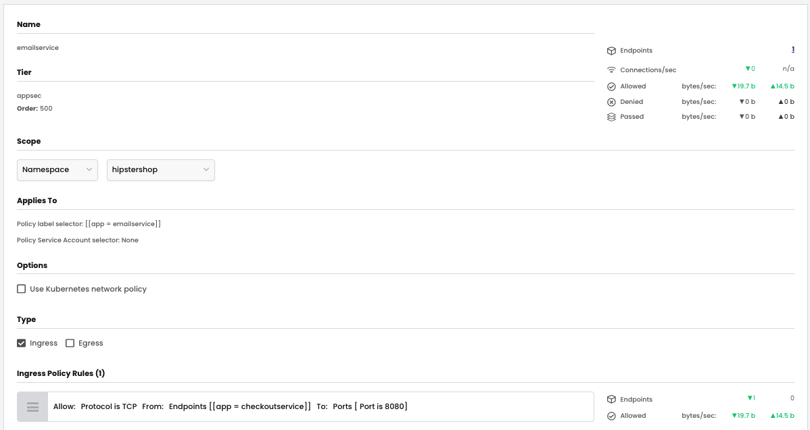

### Security Policy - Manifest

> `emailservice` security policy - yaml

```yaml
apiVersion: projectcalico.org/v3
kind: NetworkPolicy
metadata:
  name: appsec.emailservice
  namespace: hipstershop
spec:
  tier: appsec
  order: 500
  selector: app == "emailservice"
  serviceAccountSelector: ''
  ingress:
    - action: Allow
      protocol: TCP
      source:
        selector: app == "checkoutservice"
      destination:
        ports:
          - '8080'
  types:
    - Ingress

```

### Validate Endpoints

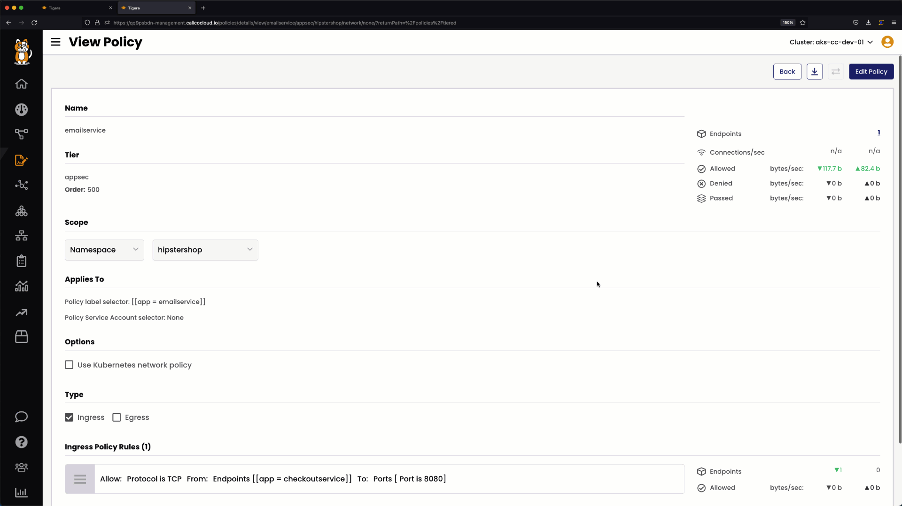

## `paymentservice` Security Policy

### Policy lable and Namespace Selector

### Ingress Rules

### Egress Rules

### Security Policy - UI View

> `paymentservice` security policy - UI view

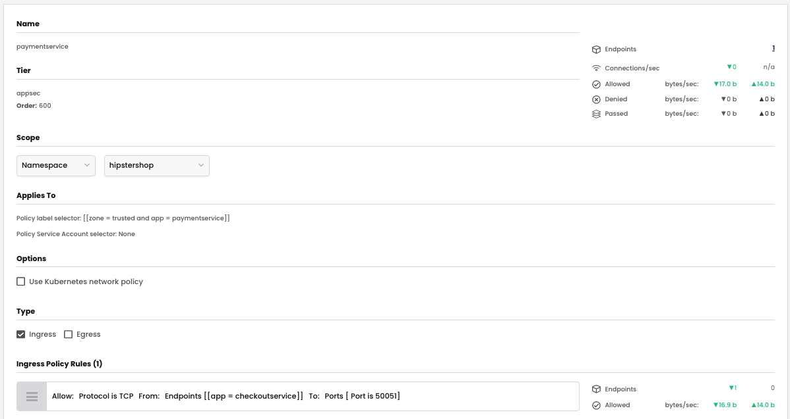

### Security Policy - Manifest

> `paymentservice` security policy - yaml

```yaml
apiVersion: projectcalico.org/v3
kind: NetworkPolicy
metadata:
  name: appsec.paymentservice
  namespace: hipstershop
spec:
  tier: appsec
  order: 600
  selector: (zone == "trusted" && app == "paymentservice")
  serviceAccountSelector: ''
  ingress:
    - action: Allow
      protocol: TCP
      source:
        selector: app == "checkoutservice"
      destination:
        ports:
          - '50051'
  types:
    - Ingress
```

### Validate Endpoints

## `productcatalogservice` Security Policy

### Policy lable and Namespace Selector

### Ingress Rules

### Egress Rules

### Security Policy - UI View

> `productcatalogservice` security policy - UI view

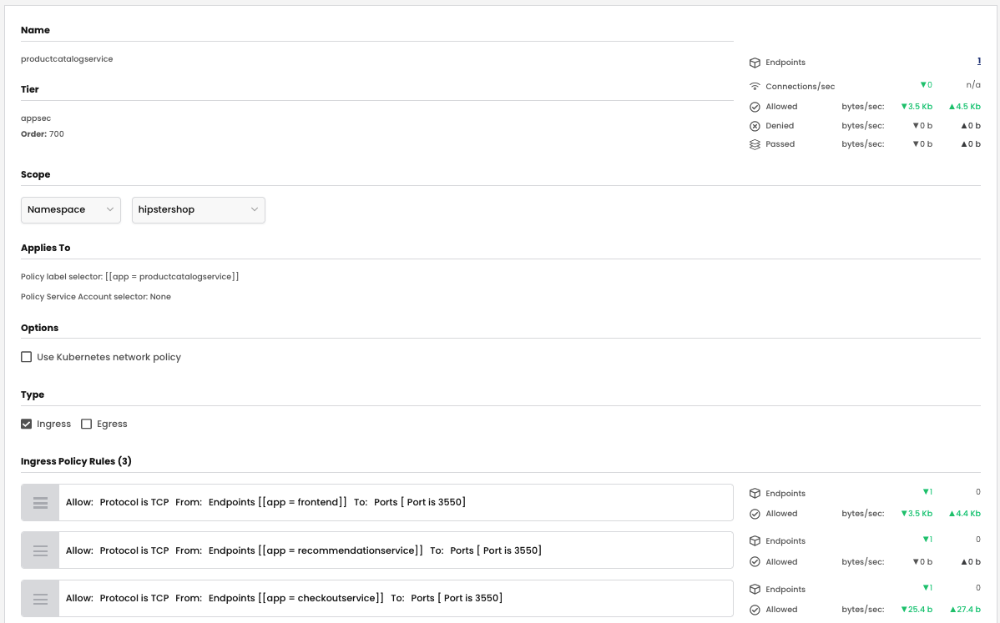

### Security Policy - Manifest

> `productcatalogservice` security policy - yaml

```yaml
apiVersion: projectcalico.org/v3
kind: NetworkPolicy
metadata:
  name: appsec.productcatalogservice
  namespace: hipstershop
spec:
  tier: appsec
  order: 700
  selector: app == "productcatalogservice"
  serviceAccountSelector: ''
  ingress:
    - action: Allow
      protocol: TCP
      source:
        selector: app == "frontend"
      destination:
        ports:
          - '3550'
    - action: Allow
      protocol: TCP
      source:
        selector: app == "recommendationservice"
      destination:
        ports:
          - '3550'
    - action: Allow
      protocol: TCP
      source:
        selector: app == "checkoutservice"
      destination:
        ports:
          - '3550'
  types:
    - Ingress
```

### Validate Endpoints


## `recommendationservice` Security Policy

### Policy lable and Namespace Selector

### Ingress Rules

### Egress Rules

### Security Policy - UI View

> `recommendationservice` security policy - UI view

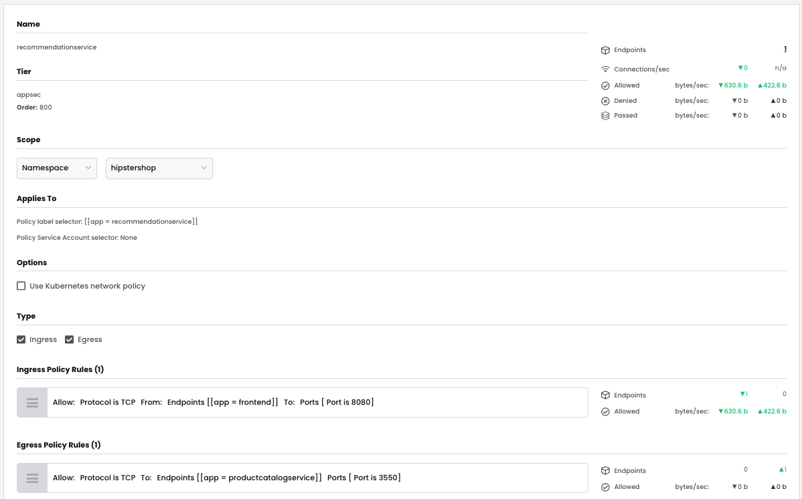

### Security Policy - Manifest

> `recommendationservice` security policy - yaml

```yaml
apiVersion: projectcalico.org/v3
kind: NetworkPolicy
metadata:
  name: appsec.recommendationservice
  namespace: hipstershop
spec:
  tier: appsec
  order: 800
  selector: app == "recommendationservice"
  serviceAccountSelector: ''
  ingress:
    - action: Allow
      protocol: TCP
      source:
        selector: app == "frontend"
      destination:
        ports:
          - '8080'
  egress:
    - action: Allow
      protocol: TCP
      source: {}
      destination:
        selector: app == "productcatalogservice"
        ports:
          - '3550'
  types:
    - Ingress
    - Egress
```

### Validate Endpoints

## `loadgenerator` Security Policy

### Policy lable and Namespace Selector

### Ingress Rules

### Egress Rules

### Security Policy - UI View

> `loadgenerator` security policy - UI view

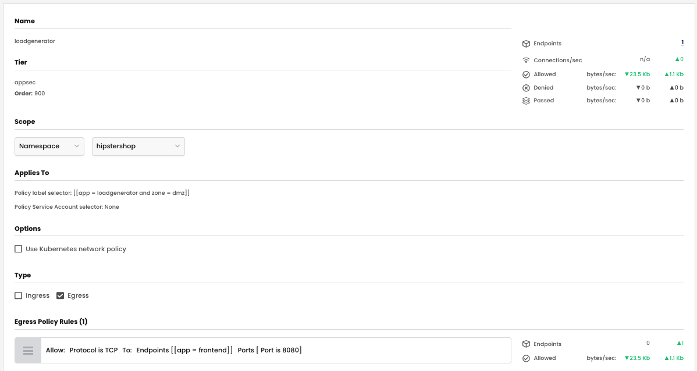

### Security Policy - Manifest

> `loadgenerator` security policy - yaml

### Validate Endpoints

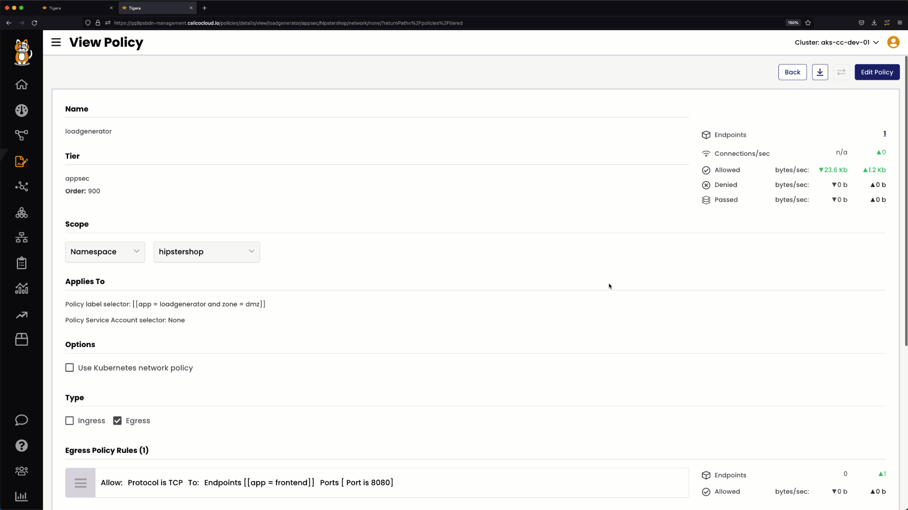

## `redis-cart` Security Policy

### Policy lable and Namespace Selector

### Ingress Rules

### Egress Rules

### Security Policy - UI View

> `redis-cart` security policy - UI view

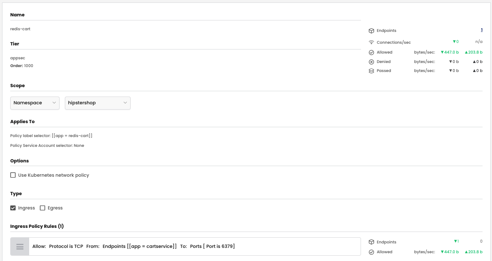

### Security Policy - Manifest

> `redis-cart` security policy - yaml

```yaml
apiVersion: projectcalico.org/v3
kind: NetworkPolicy
metadata:
  name: appsec.redis-cart
  namespace: hipstershop
spec:
  tier: appsec
  order: 1000
  selector: app == "redis-cart"
  serviceAccountSelector: ''
  ingress:
    - action: Allow
      protocol: TCP
      source:
        selector: app == "cartservice"
      destination:
        ports:
          - '6379'
  types:
    - Ingress
```

### Validate Endpoints


## `shippingservice` Security Policy

### Policy lable and Namespace Selector

### Ingress Rules

### Egress Rules

### Security Policy - UI View

> `shippingservice` security policy - UI view


### Security Policy - Manifest

> `shippingservice` security policy - yaml

```yaml
apiVersion: projectcalico.org/v3
kind: NetworkPolicy
metadata:
  name: appsec.shippingservice
  namespace: hipstershop
spec:
  tier: appsec
  order: 1100
  selector: app == "shippingservice"
  serviceAccountSelector: ''
  ingress:
    - action: Allow
      protocol: TCP
      source:
        selector: app == "checkoutservice"
      destination:
        ports:
          - '50051'
    - action: Allow
      protocol: TCP
      source:
        selector: app == "frontend"
      destination:
        ports:
          - '50051'
  types:
    - Ingress
```

### Validate Endpoints

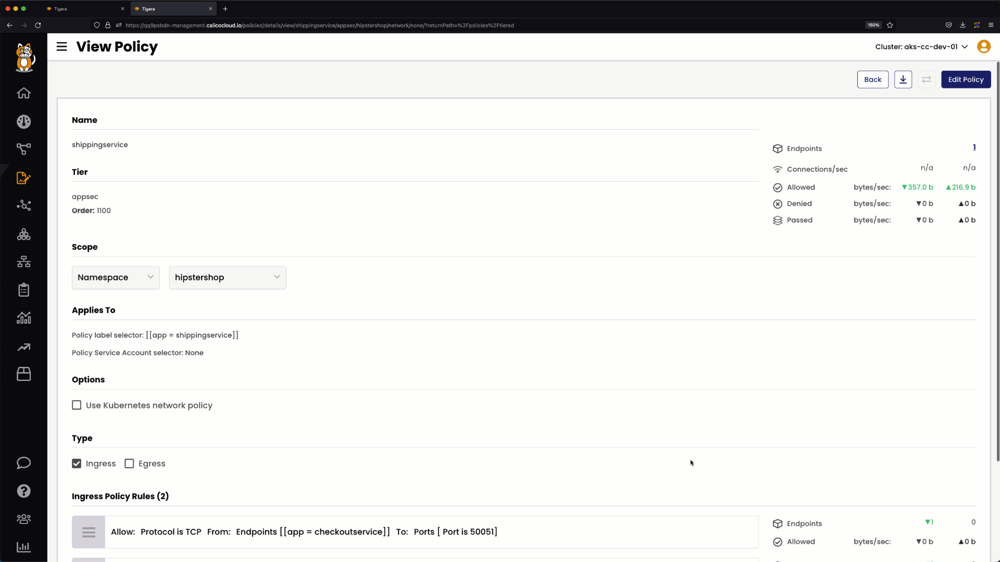