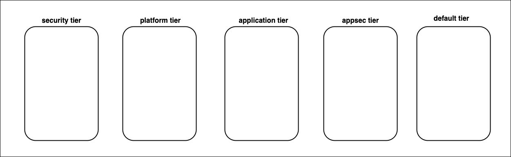

# Security Policy Framework Overview

In this lesson a security policy framework will be developed to secure tenant-1 and tenant-2 namespaces. The framework will leverage Calico `security policy tiers` to establish a hierarchical approach to security for the [security domains](https://github.com/tigera-cs/quickstart-self-service/blob/main/modules/module-3-introduction.md) discussed in the previous lesson. 

## Security Policy Tiers

Tiers are a hierarchical construct used to group security policies. A `tier` is a Kubernetes `custom resource` which can be governed by native Kubernetes Role-based Access Control (RBAC). Security policies in left `tier` take precedence over security policies in the right `tier`. Security policies in the left tiers can be used to enforce high-level guardrails that cannot be circumvented by policies in the right tiers. 

 In this workshop, four tiers in addition to the default tier will be used to develop a security policy framework. 

 > The `security policy tiers`

### Security Tier

The `security tier` will be used to enforce the following controls,

- Security policy to `deny` egress traffic to malicious IPs based on a `threatfeed`
- Tenant-1 isolation from the rest of the cluster workloads
- Tenant-2 isolation from the rest of the cluster workloads

### Platform Tier

The `platform tier` will be used to enforce the following controls,

- Security policy to permit DNS traffic for all cluster workloads
- Security policy to permit `ingress` traffic to tenant-1 and tenant-2 applications

#### 
  [Click Next -> Lesson 2 - The Security Tier](https://github.com/tigera-cs/quickstart-self-service/blob/main/modules/security-tier.md) 
