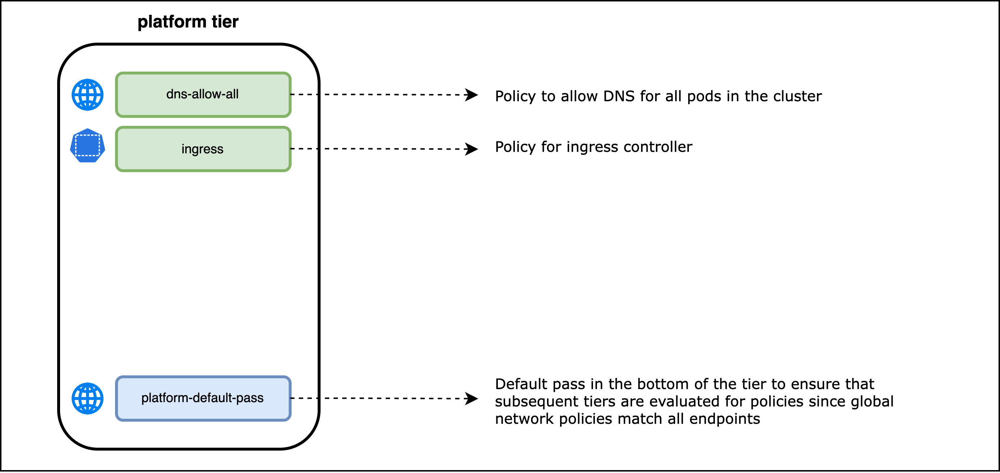
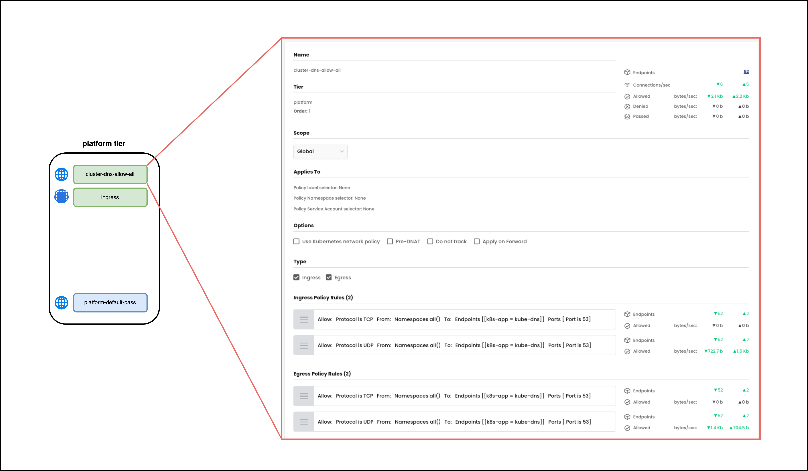

# Platform Tier Security Policies



## `cluster-dns-allow-all` Security Policy

### Policy lable and Namespace Selector

There are no policy label or namespace label selectors in the `cluster-dns-allow-all` security policy. The security policy will match all cluster endpoints. 

### Ingress Rules

The `cluster-dns-allow-all` security policy has the following ingress rules. **Note that `endpoint selector` labels are used in the rules to select the `kube-dns` endpoints**. 

01. **Rule 0** - `kube-dns` endpoints can receive (ingress) traffic from all endpoints in the cluster on TCP port 53. 
01. **Rule 0** - `kube-dns` endpoints can receive (ingress) traffic from all endpoints in the cluster on UDP port 53. 

### Egress Rules

The `cluster-dns-allow-all` security policy has the following egress rules. **Note that `endpoint selector` labels are used in the rules to select the `kube-dns` endpoints**. 

01. **Rule 0** - All endpoints in the cluster can send traffic to `kube-dns` endpoints on TCP port 53.
02. **Rule 1** - All endpoints in the cluster can send traffic to `kube-dns` endpoints on UDP port 53.

### Security Policy - UI View

> `cluster-dns-allow-all` security policy - UI view




### Security Policy - Manifest

> `cluster-dns-allow-all` security policy - yaml

```yaml
apiVersion: projectcalico.org/v3
kind: GlobalNetworkPolicy
metadata:
  name: platform.cluster-dns-allow-all
spec:
  tier: platform
  order: 1
  selector: ''
  namespaceSelector: ''
  serviceAccountSelector: ''
  ingress:
    - action: Allow
      protocol: TCP
      source:
        namespaceSelector: all()
      destination:
        selector: k8s-app == "kube-dns"
        ports:
          - '53'
    - action: Allow
      protocol: UDP
      source:
        namespaceSelector: all()
      destination:
        selector: k8s-app == "kube-dns"
        ports:
          - '53'
  egress:
    - action: Allow
      protocol: TCP
      source:
        namespaceSelector: all()
      destination:
        selector: k8s-app == "kube-dns"
        ports:
          - '53'
    - action: Allow
      protocol: UDP
      source:
        namespaceSelector: all()
      destination:
        selector: k8s-app == "kube-dns"
        ports:
          - '53'
  doNotTrack: false
  applyOnForward: false
  preDNAT: false
  types:
    - Ingress
    - Egress
```

## `ingress` Security Policy
