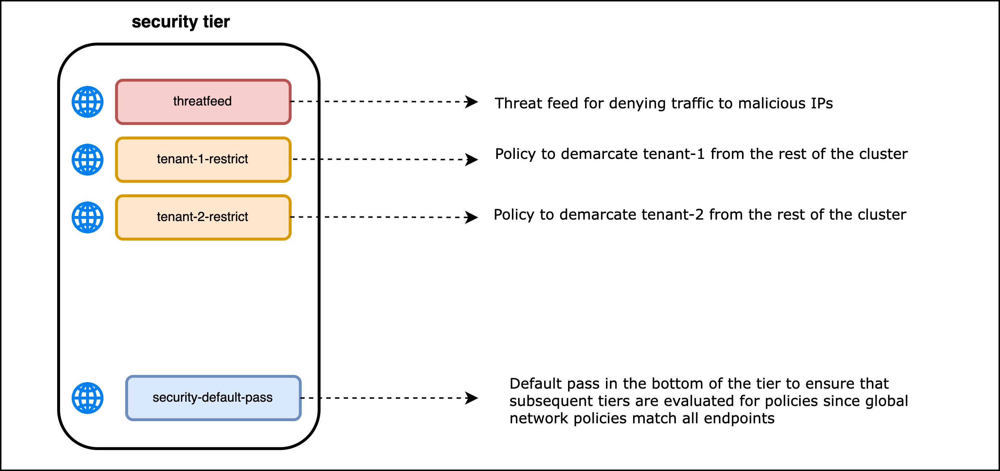
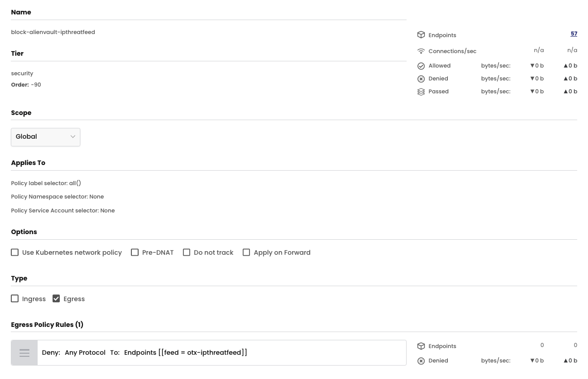
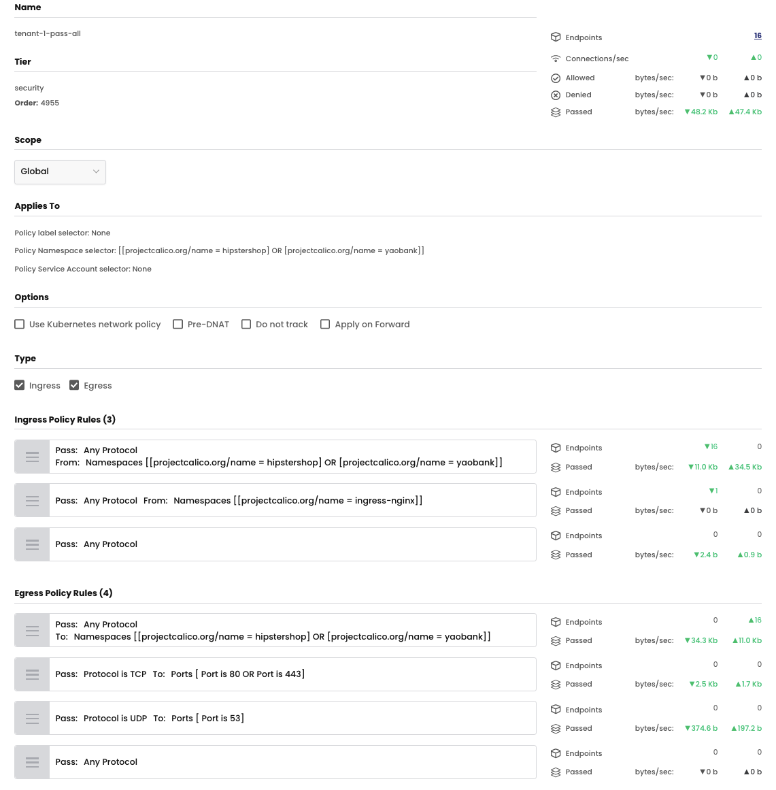
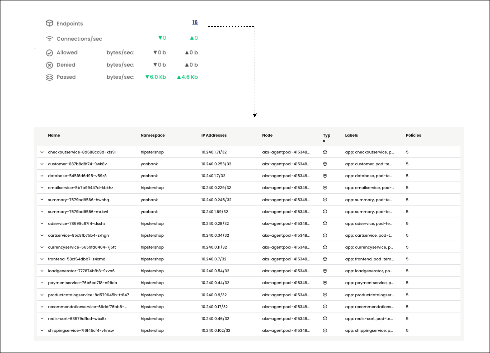
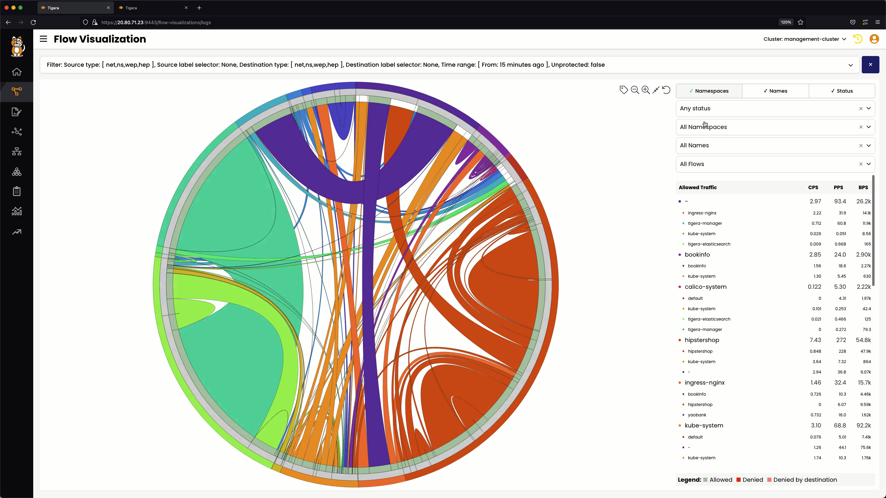
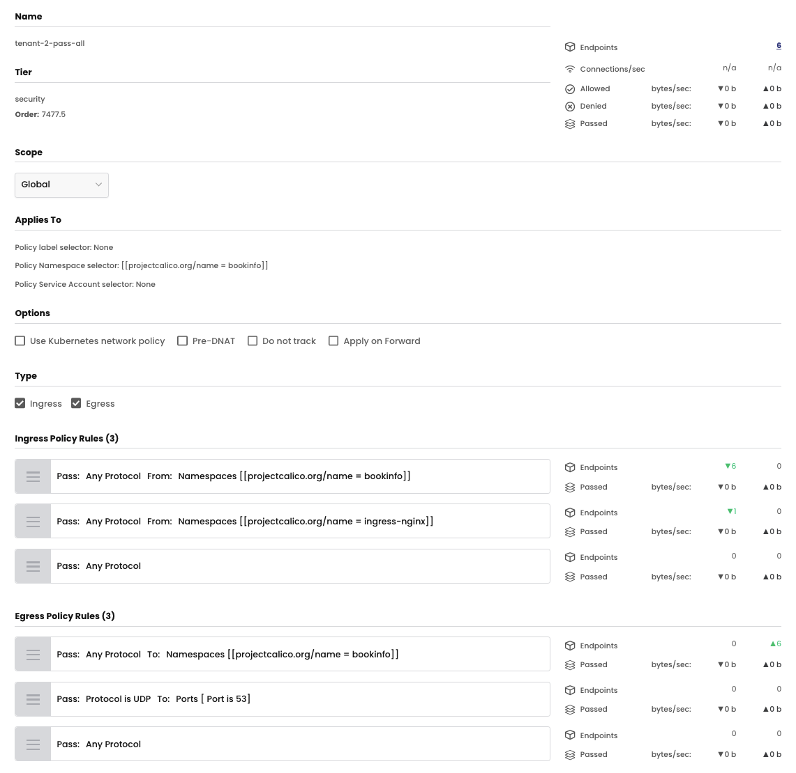
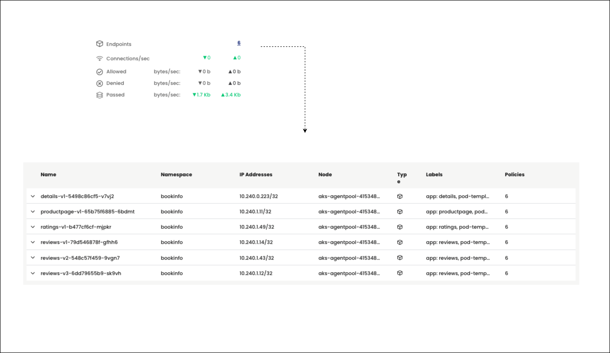
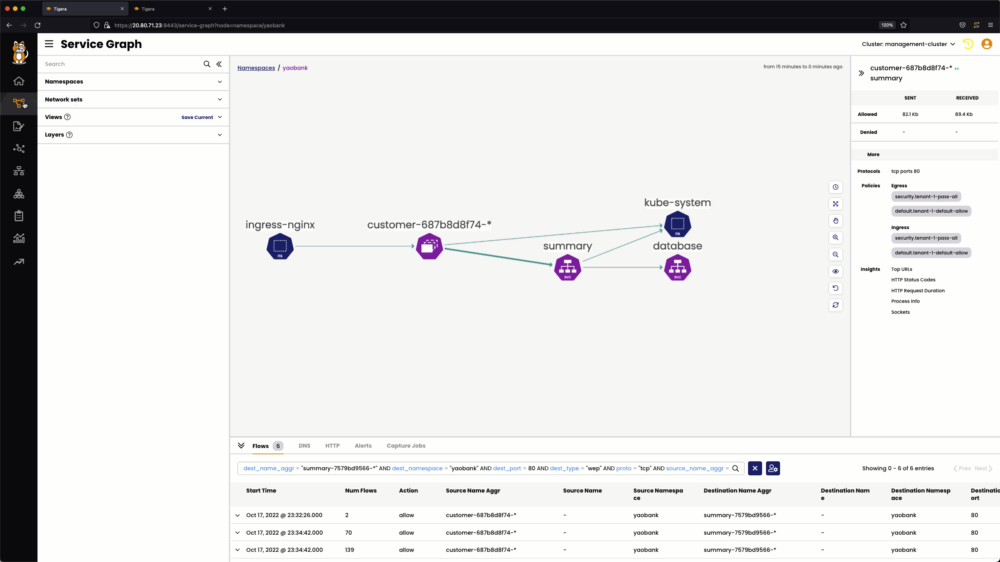
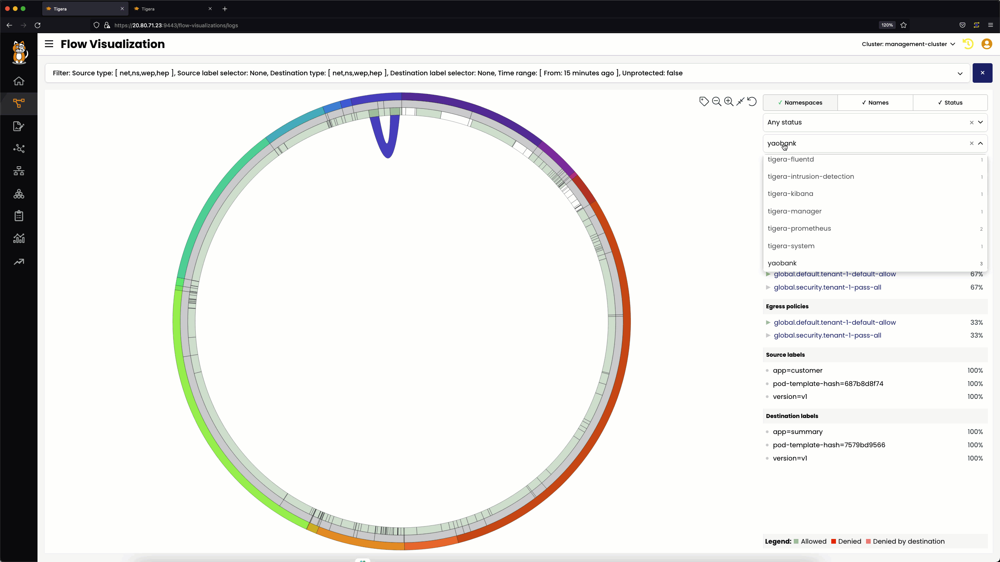
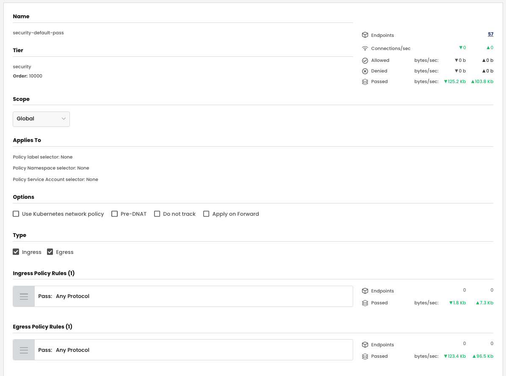

# Security Policies in the Security Tier



## `block-alienvault-ipthreatfeed` Security Policy

### Policy lable and Namespace Selector

There are no policy label or namespace label selectors in the `block-alienvault-ipthreatfeed` security policy. The security policy will match all cluster endpoints and will deny any traffic to IPs specified in the threat feed. 

### Ingress

The `block-alienvault-ipthreatfeed` security policy has no ingress rules. 

### Egress

The `block-alienvault-ipthreatfeed` security policy has the following egress rule

01. **Rule 0** - For all endpoints, deny traffic to IPs specified in the `otx-ipthreatfeed` threatfeed. 

### Security Policy - UI View
> `block-alienvault-ipthreatfeed` security policy - UI view



### Security Policy - Manifest

> `block-alienvault-ipthreatfeed` security policy - yaml

```yaml
apiVersion: projectcalico.org/v3
kind: GlobalNetworkPolicy
metadata:
  name: security.block-alienvault-ipthreatfeed
spec:
  tier: security
  order: -90
  selector: all()
  namespaceSelector: ''
  serviceAccountSelector: ''
  egress:
    - action: Deny
      source: {}
      destination:
        selector: feed == "otx-ipthreatfeed"
  doNotTrack: false
  applyOnForward: false
  preDNAT: false
  types:
    - Egress
```


## `tenant-1-pass-all` Security Policy

### Policy lable and Namespace Selector

There are no policy label selectors for the `tenant-1-pass-all` security policy. Namespace label selectors are used to select all endpoints in the `hipstershop` and `yaobank` namespaces. The [projectcalico.org/name](https://docs.tigera.io/v3.14/reference/resources/globalnetworkpolicy) label is used to select the namespaces.   

### Ingress Rules

The `tenant-1-pass-all` security policy has the following ingress rules.

01. **Rule 0** - For endpoints in tenant-1, pass security policy evaluation to subsequent tiers if traffic is **from** any endpoint in the `hipstershop` or `yaobank` namespaces. 
02. **Rule 1** -  For endpoints in tenant-1, pass security policy evaluation to subsequent tiers if traffic is **from** any endpoint in the `ingress-nginx` namespace. 
03. **Rule 2** - For endpoints in tenant-1, pass all other ingress traffic.  

### Egress Rules

The `tenant-1-pass-all` security policy has the following egress rules.

01. **Rule 0** - For endpoints in tenant-1, pass security policy evaluation to subsequent tiers if traffic is sent **to** any endpoint in the `hipstershop` or `yaobank` namespaces. 
02. **Rule 1** - For endpoints in tenant-1, pass security policy evaluation to subsequent tiers if traffic is sent **to** TCP port 80 or 443.
03. **Rule 2** - For endpoints in tenant-1, pass security policy evaluation to subsequent tiers if traffic is sent **to** UDP port 53.
04. **Rule 3** - For endpoints in tenant-1, pass all other egress traffic.


### Security Policy - UI View
> `tenant-1-pass-all` security policy - UI view




### Security Policy - Manifest
> `tenant-1-pass-all` security policy - yaml

```yaml
apiVersion: projectcalico.org/v3
kind: GlobalNetworkPolicy
metadata:
  name: security.tenant-01-pass-all
spec:
  tier: security
  order: 2
  selector: ''
  namespaceSelector: >-
    projectcalico.org/name == "hipstershop" || projectcalico.org/name ==
    "yaobank"
  serviceAccountSelector: ''
  ingress:
    - action: Pass
      source:
        namespaceSelector: >-
          projectcalico.org/name == "hipstershop" || projectcalico.org/name ==
          "yaobank"
      destination: {}
    - action: Pass
      source:
        namespaceSelector: projectcalico.org/name == "ingress-nginx"
      destination: {}
    - action: Pass
      source: {}
      destination: {}
  egress:
    - action: Pass
      source: {}
      destination:
        namespaceSelector: >-
          projectcalico.org/name == "hipstershop" || projectcalico.org/name ==
          "yaobank"
    - action: Pass
      protocol: TCP
      source: {}
      destination:
        ports:
          - '80'
          - '443'
    - action: Pass
      protocol: UDP
      source: {}
      destination:
        ports:
          - '53'
    - action: Pass
      source: {}
      destination: {}
  doNotTrack: false
  applyOnForward: false
  preDNAT: false
  types:
    - Ingress
    - Egress
```

### Validate Endpoints

Validate the endpoints selected by the `tenant-1-pass-all` security policy by clicking on the number of endpoints in UI view. In the output below, all endpoints belong to the `hipstershop` and `yaobank` namespaces. 



### Validate Service Graph Security Policy Evaluation


### Validate Flow Visualization Security Policy Evaluation



## `tenant-2-pass-all` Security Policy

### Policy lable and Namespace Selector

There are no policy label selectors for the `tenant-2-pass-all` security policy. Namespace label selectors are used to select all endpoints in the `bookinfo` namespace. The [projectcalico.org/name](https://docs.tigera.io/v3.14/reference/resources/globalnetworkpolicy) label is used to select the namespace.   

### Ingress

The `tenant-2-pass-all` security policy has the following ingress rules. 

01. **Rule 0** - For endpoints in tenant-2, pass security policy evaluation to subsequent tiers if traffic is **from** any endpoint in the `bookinfo` namespaces. 
02. **Rule 1** - For endpoints in tenant-2, pass security policy evaluation to subsequent tiers if traffic is **from** any endpoint in the `ingress-nginx` namespace.
03. **Rule 2** - For endpoints in tenant-1, deny all other ingress traffic.

### Egress

The `tenant-2-pass-all` security policy has the following egress rules. 

01. **Rule 0** - For endpoints in tenant-2, pass security policy evaluation to subsequent tiers if traffic is sent **to** any endpoint in the `bookinfo` namespace. 
02. **Rule 1** - For endpoints in tenant-2, pass security policy evaluation to subsequent tiers if traffic is sent **to** UDP port 53.
03. **Rule 2** - For endpoints in tenant-2, pass security policy evaluation to subsequent tiers if traffic is sent **to** TCP port 80 or 443.
04. **Rule 3** - For endpoints in tenant-2, deny all other egress traffic.

### Security Policy - UI View
> `tenant-2-pass-all` security policy - UI view



### Security Policy - Manifest

> `tenant-2-pass-all,` security policy - yaml

```yaml
apiVersion: projectcalico.org/v3
kind: GlobalNetworkPolicy
metadata:
  name: security.tenant-02-pass-all
spec:
  tier: security
  order: 3
  selector: ''
  namespaceSelector: projectcalico.org/name == "bookinfo"
  serviceAccountSelector: ''
  ingress:
    - action: Pass
      source:
        namespaceSelector: projectcalico.org/name == "bookinfo"
      destination: {}
    - action: Pass
      source:
        namespaceSelector: projectcalico.org/name == "ingress-nginx"
      destination: {}
    - action: Pass
      source: {}
      destination: {}
  egress:
    - action: Pass
      source: {}
      destination:
        namespaceSelector: projectcalico.org/name == "bookinfo"
    - action: Pass
      protocol: UDP
      source: {}
      destination:
        ports:
          - '53'
    - action: Pass
      protocol: TCP
      source: {}
      destination:
        ports:
          - '443'
          - '80'
    - action: Pass
      source: {}
      destination: {}
  doNotTrack: false
  applyOnForward: false
  preDNAT: false
  types:
    - Ingress
    - Egress
```

### Validate Endpoints

Validate the endpoints selected by the `tenant-2-pass-all` security policy by clicking on the number of endpoints in UI view. In the output below, all endpoints belong to the `bookinfo` namespace. 



### Validate Service Graph Security Policy Evaluation



### Validate Flow Visualization Security Policy Evaluation



## `security-default-pass` Security Policy

### Policy lable and Namespace Selector

There are no policy label or namespace label selectors in the `security-default-pass` security policy. The security policy will match all cluster endpoints. However, the security policy will not be applicable to tenant-1 and tenant-2 workloads in the `hipstershop` , `yaobank` and `bookinfo` namespaces respectively. For these workloads the `tenant-1-pass-all` and `tenant-2-pass-all` security policies will take a higher precendence and will either pass traffic to subsequent tiers for evaluation or deny traffic. As a result, the `security-default-pass` security policy will never be evaluated for those endpoints. 

*Refer [Module 3, Lesson 2 - The Security Tier](https://github.com/tigera-cs/quickstart-self-service/blob/main/modules/security-tier.md) for more details.*

### Ingress

The `security-default-pass` security policy has the following ingress rules. 

01. **Rule 0** - For all endpoints, pass security policy evaluation to subsequent tiers for all ingress traffic. 

### Egress

The `security-default-pass` security policy has the following egress rules. 

01. **Rule 0** - For all endpoints, pass security policy evaluation to subsequent tiers for all egress traffic. 

### Security Policy - UI View
> `security-default-pass` security policy - UI view



### Security Policy - Manifest
> `security-default-pass` security policy - yaml
```yaml
apiVersion: projectcalico.org/v3
kind: GlobalNetworkPolicy
metadata:
  name: security.security-default-pass
spec:
  tier: security
  order: 10000
  selector: ''
  namespaceSelector: ''
  serviceAccountSelector: ''
  ingress:
    - action: Pass
      source: {}
      destination: {}
  egress:
    - action: Pass
      source: {}
      destination: {}
  doNotTrack: false
  applyOnForward: false
  preDNAT: false
  types:
    - Ingress
    - Egress
```
