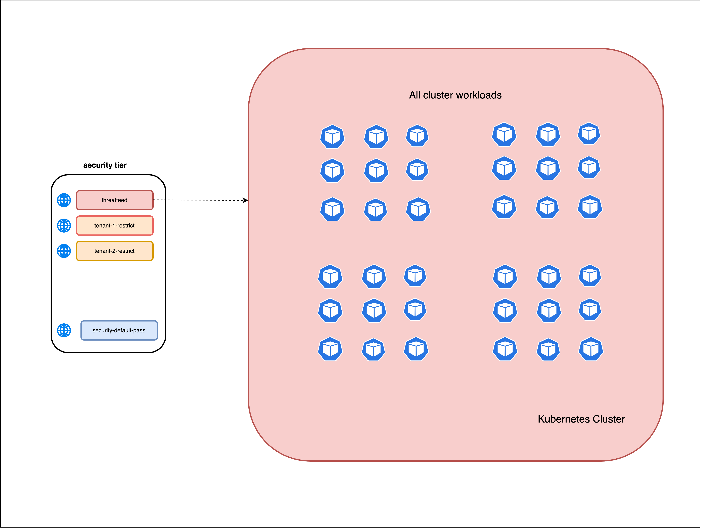
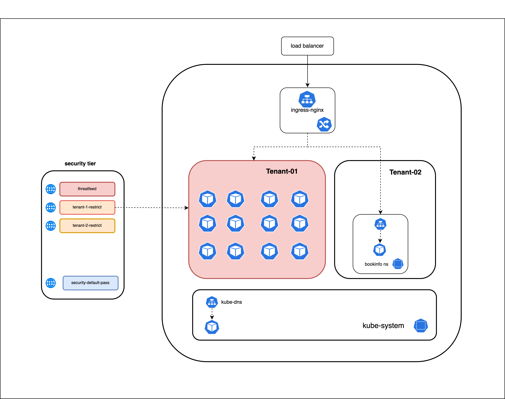
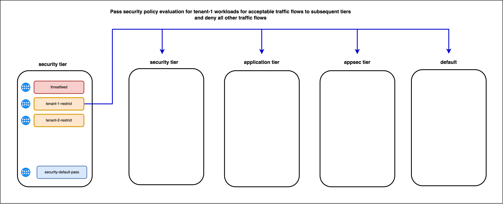
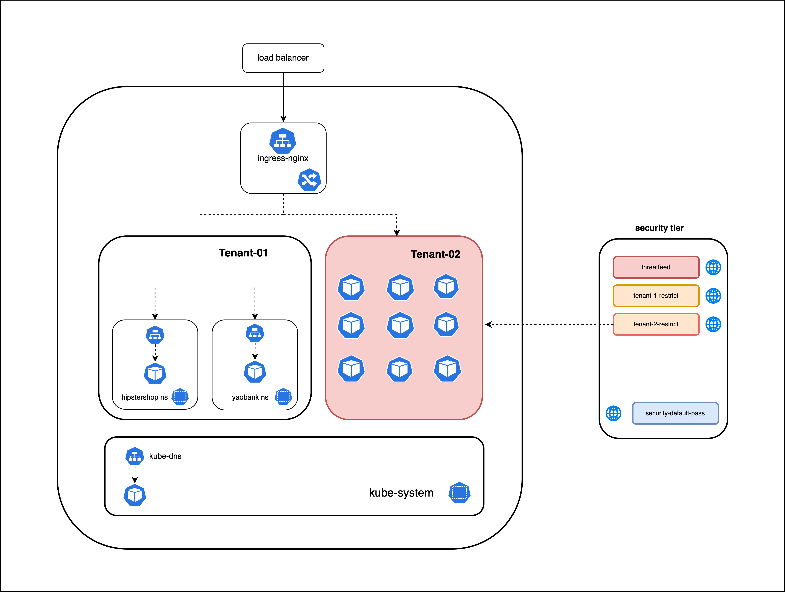
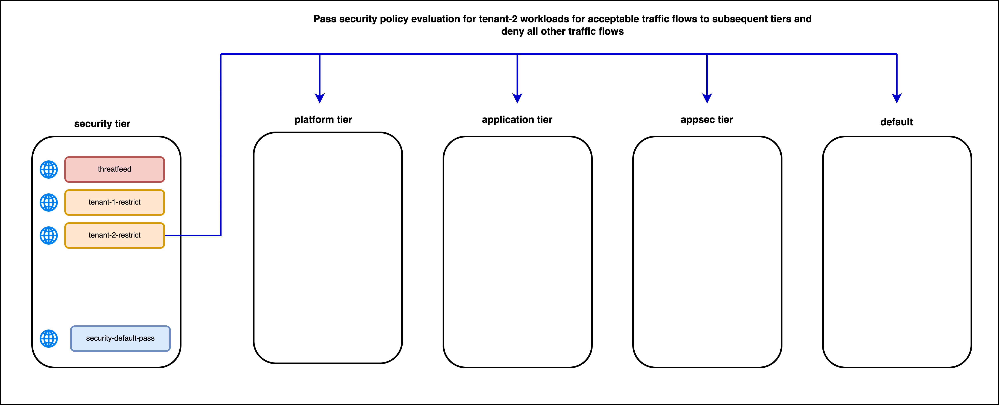
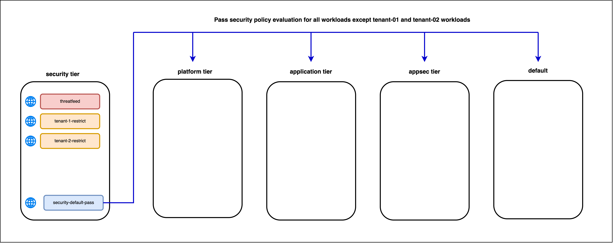

# The Security Tier

## `threatfeed` Security Policy

The `threatfeed` security policy will have a rule that denies egress connectivity to malicious external IPs which are dynamically updated from a threatfeed. The security policy will be a [globalnetworkpolicy](https://docs.tigera.io/reference/resources/globalnetworkpolicy) that applies to all cluster workloads/pods. 

> threatfeed security policy

## `tenant-1-restrict` and `tenant-2-restrict` Security Policies
 
The `tenant-1-restrict` and `tenant-2-restrict` security policies will have ingress and egress rules required to isolate workloads in those tenants from the rest of the cluster workloads. Rules with the `pass` action will be used to defer security policy evaluation to subsequent tiers that match tenant-1 and tenant-2 workloads for flows that are deemed acceptable. All other ingress and egress flows will be explicitly denied using ingress and egress rules with the `deny` action. Note that the `tenant-1-restrict` and `tenant-2-restrict` policies **do not** `allow` traffic flows. The rules with the `pass` action enforce a high-level control for isolating those workloads from the rest of the cluster workloads; however, the specific traffic flows must be permitted by `allow` rules in security policies that match those workloads in subsequent tiers.  The `tenant-1-restrict` and `tenant-2-restrict` security policies will be [globalnetworkpolicy](https://docs.tigera.io/reference/resources/globalnetworkpolicy) that matches respective tenant-01 and tenant-02 namespaces. 

> tenant-1-restrict security policy

> tenant-1-restrict security policy

## `security-default-pass` Security Policy

The `security-default-pass` security policy will have the lowest precedence in the security tier. It is deployed to ensure that traffic flows for all other workloads (except tenant-01 and tenant-02 workloads) will have a `pass` action so that Calico will evaluate subsequent tiers for those workloads for all ingress and egress traffic flows. It is required since the `threatfeed` security policy matched all cluster workloads. Note that if a workload is matched by a security policy in a tier, any traffic flow that **does not** match an `allow` rule for that workload either in that security policy or a subsequent security policy that matches the workloads in the **same tier**, will have an implicit `deny` behavior. This can be circumvented by deploying a security policy that matches the workload and has `pass` rules for all ingress and egress traffic flows. The `security-default-pass` security policy will be a [globalnetworkpolicy](https://docs.tigera.io/reference/resources/globalnetworkpolicy) that applies to all cluster workloads/pods.    

> security-default-pass security policy

