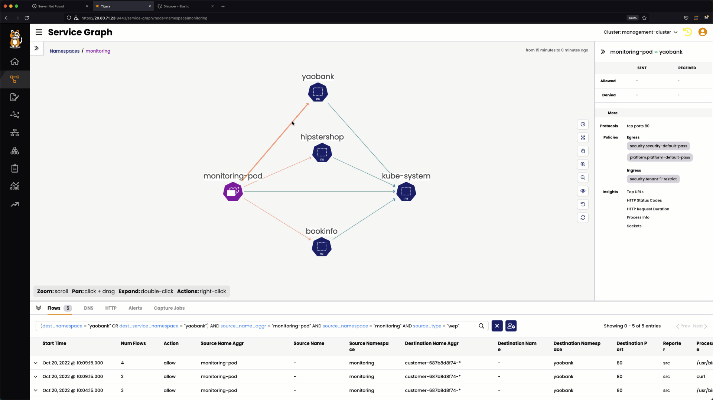
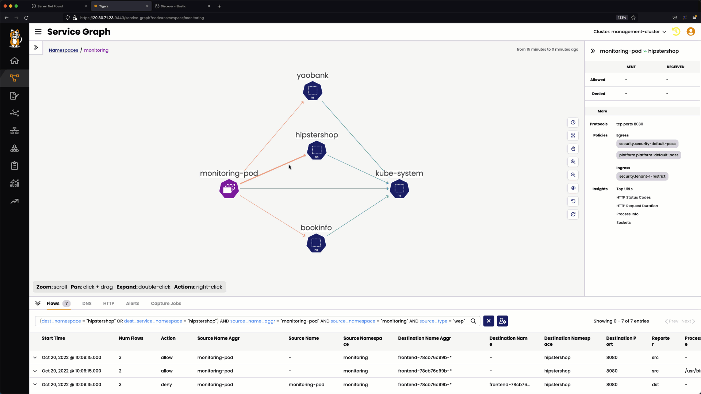
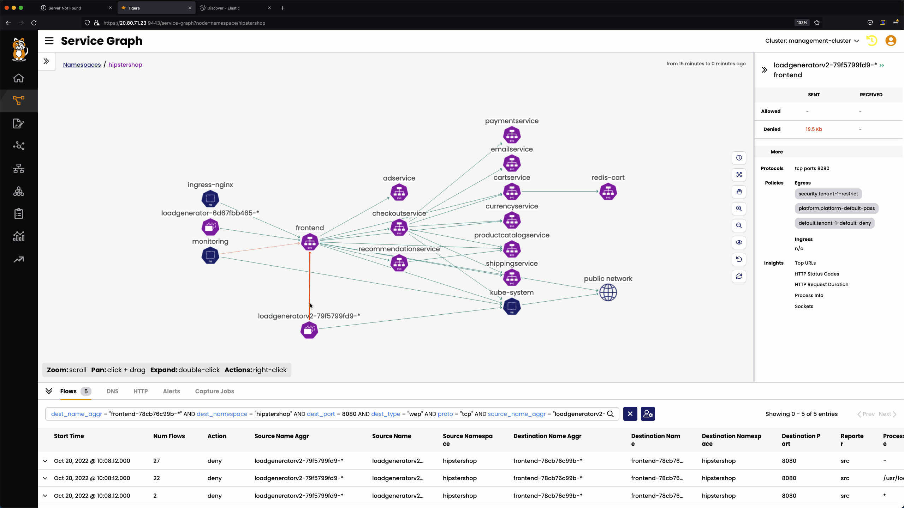
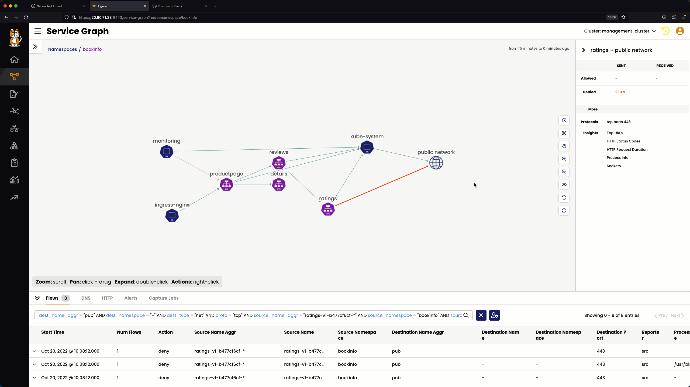

# Using Service Graph to Identify Denied Flows

## Denied flow from `monitoring-pod`

### `monitoring` to `hipstershop`

The `monitoring` to `hipstershop` flow is denied by the below security policy.

### Ingress

- The `tenant-1-restrict` security policy in the `security` tier.

### Service Graph View

> Denied `monitoring` to `hipstershop` Service Graph

### `monitoring` to `yaobank`

The `monitoring` to `yaobank` flow is denied by the below security policy.

### Ingress

- The `tenant-1-restrict` security policy in the `security` tier.

### Service Graph View

> Denied `monitoring` to `yaobank` Service Graph

### `monitoring` to `bookinfo`

The `monitoring` to `bookinfo` flow is denied by the below security policy.

### Ingress

- The `tenant-2-restrict` security policy in the `security` tier.

> Denied `monitoring` to `bookinfo` Service Graph

## Denied flow from `loadgeneratorv2`

The `loadgeneratorv2` to `frontend` flow in the `hipstershop` namespace is denied by the below security policy.

### Egress

- The `tenant-1-default-deny` security policy in the `default` tier. 

> Denied `loadgeneratorv2` to `frontend` Service Graph

## Denied flow from `ratings`

The `ratings` to `www.github.com` flow is denied by the below security.

### Egress

- The `tenant-2-bookinfo-allow` security policy in the `application` tier. 

> Denied `ratings`  to `www.github.com` Service Graph

# Lesson Video

