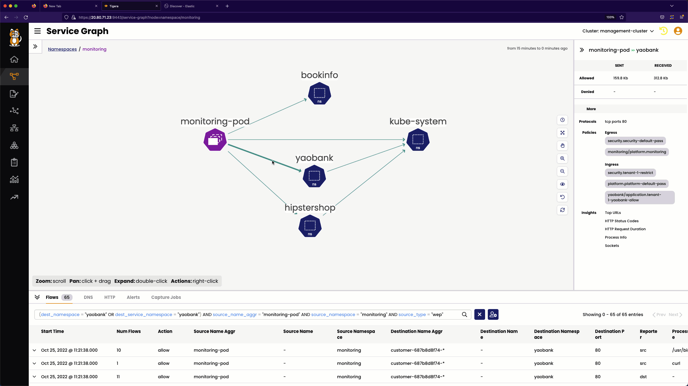
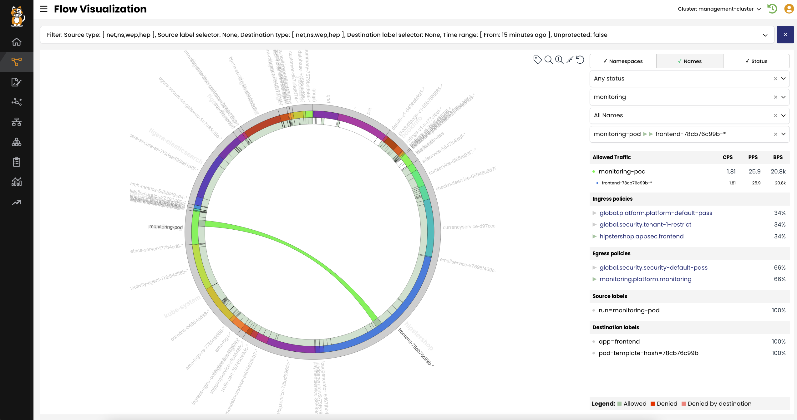
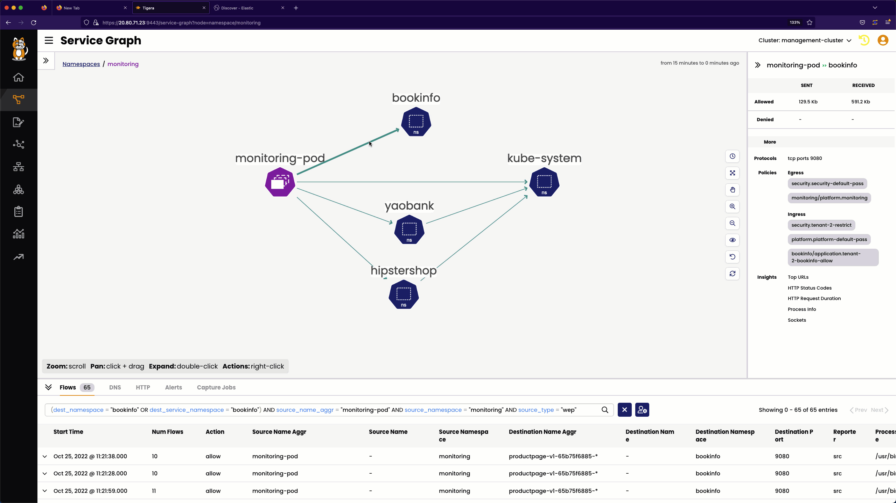
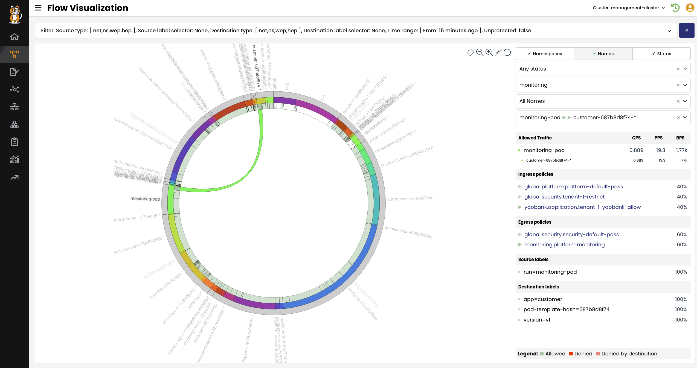
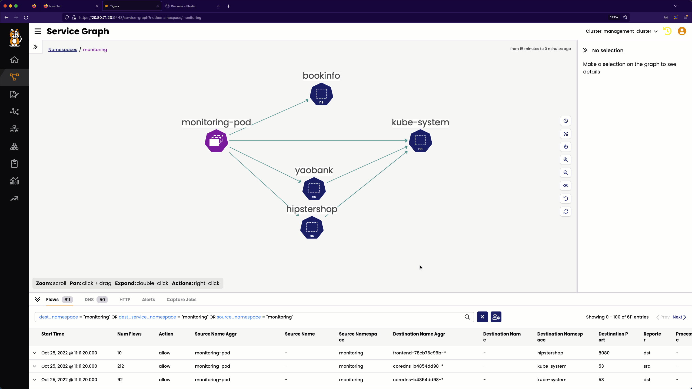
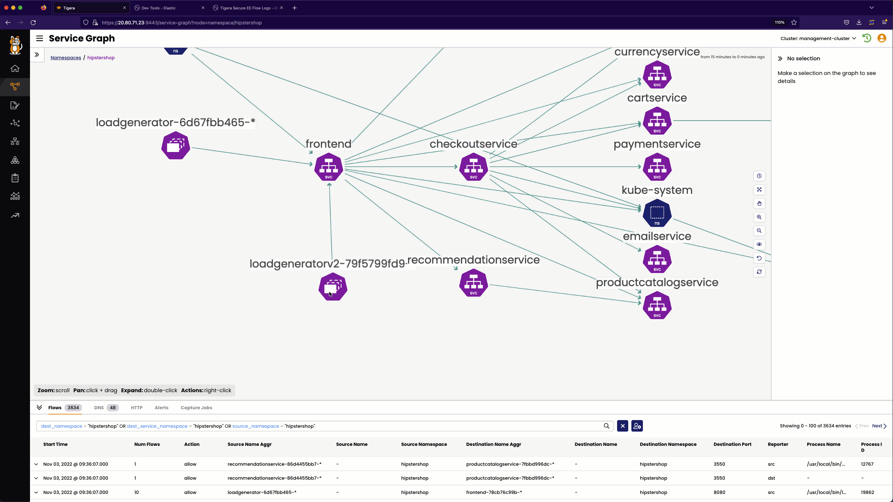
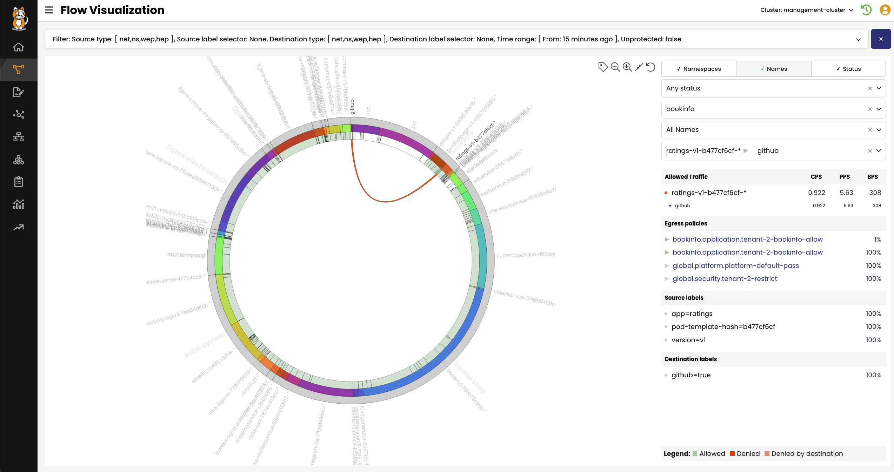

# Validate Remediated Security Policies

## `monitoring` to `hipstershop`

The `monitoring` to `hipstershop` flow is now permitted by the below security policies.

### Egress

- The `monitoring` security policy in the `platform` tier

### Ingress

- The `frontend` security policy in the `appsec` tier

### Service Graph View

> Remediated `monitoring` to `hipstershop` Service Graph view

### Flow Visualization

> Remediated `monitoring` to `hipstershop` Flow Visualization

## `monitoring` to `yaobank`

The `monitoring` to `yaobank` flow is now permitted by the below security policies.

### Egress

- The `monitoring` security policy in the `platform` tier

### Ingress

- The `tenant-1-yaobank-allow` security policy in the `application` tier

### Service Graph View

> Remediated `monitoring` to `yaobank` Service Graph view

### Flow Visualization

> Remediated `monitoring` to `yaobank` Flow Visualization

## `monitoring` to `bookinfo`

The `monitoring` to `bookinfo` flow is now permitted by the below security policies

### Egress

- The `monitoring` security policy in the `platform` tier

### Ingress

- The `tenant-2-bookinfo-allow` security policy in the `application` tier

### Service Graph View

> Remediated `monitoring` to `bookinfo` Service Graph view

### Flow Visualization

> Remediated `monitoring` to `bookinfo` Flow Visualization

## `loadgeneratorv2` to `frontend` in the `hipstershop` namespace

The `loadgeneratorv2` to `frontend` flow in the `hipstershop` namespace is now permitted by the below security policies

### Egress

- The `loadgenerator` security policy in the `appsec` tier

### Ingress

- The `frontend` security policy in the `appsec` tier

### Service Graph View

> Remediated `loadgeneratorv2` to `frontend`  Service Graph view

### Flow Visualization

> Remediated `loadgeneratorv2` to `frontend`  Flow Visualization

## `ratings` to `www.github.com`

The `ratings` to `www.github.com` flow is now permitted by the below security policies

### Egress

- The `tenant-2-bookinfo-allow` security policy in the `application` tier

### Ingress

- **Note** that there is no ingress security policy since the destination is external to the cluster.

### Service Graph View

> Remediated `ratings` to `www.github.com` Service Graph view

### Flow Visualization

> Remediated `ratings` to `www.github.com` Flow Visualization

