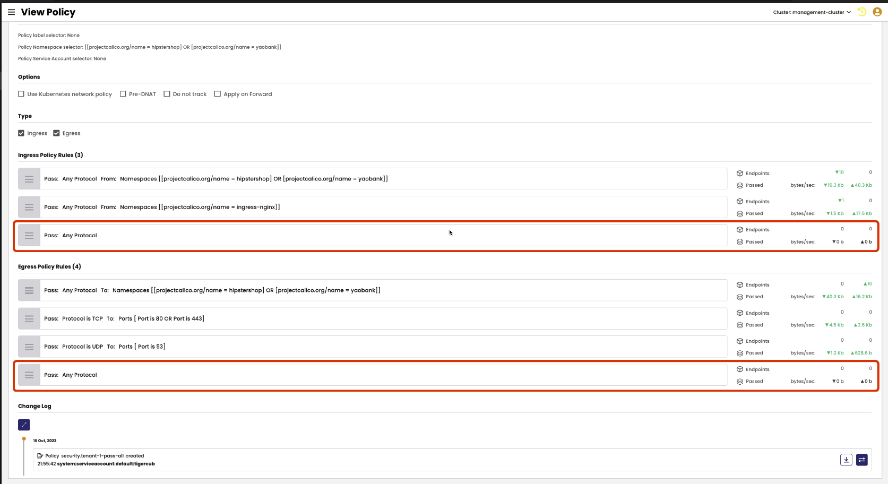
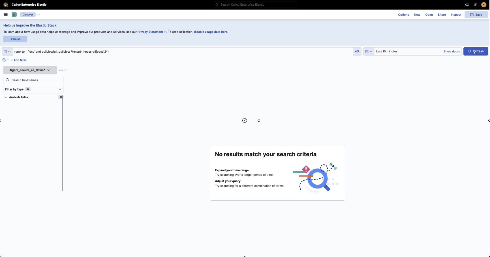
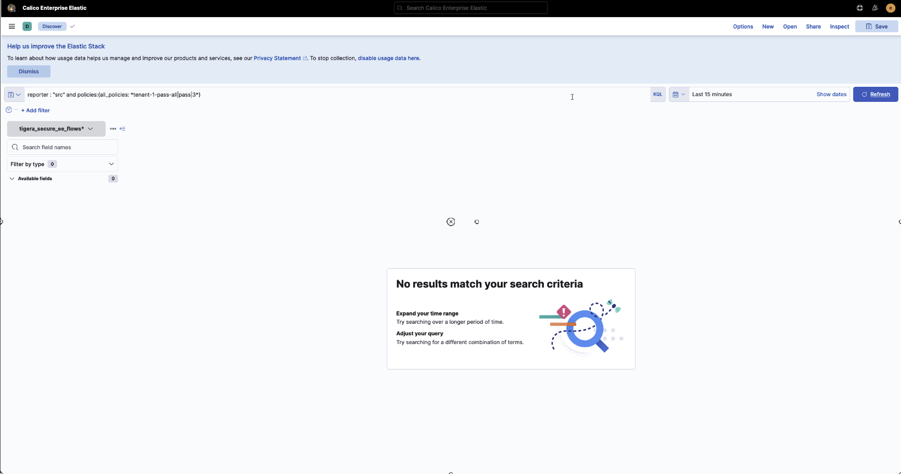
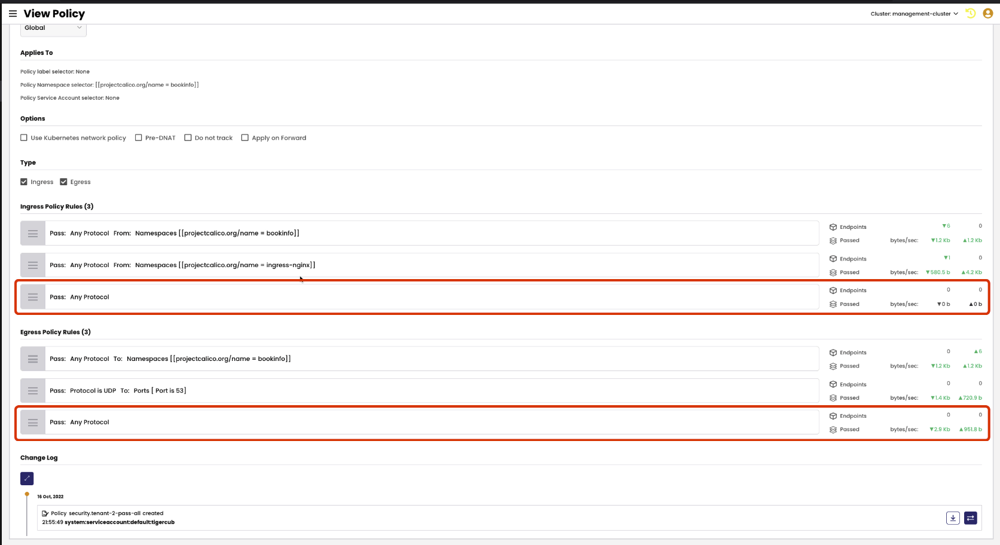
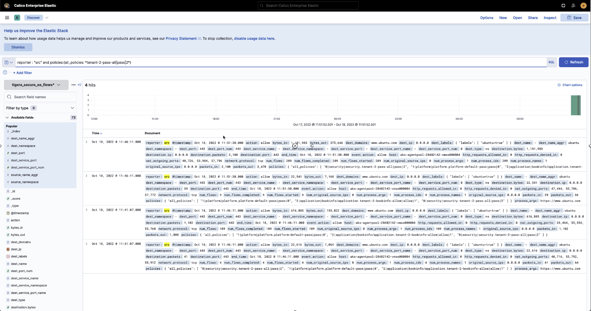
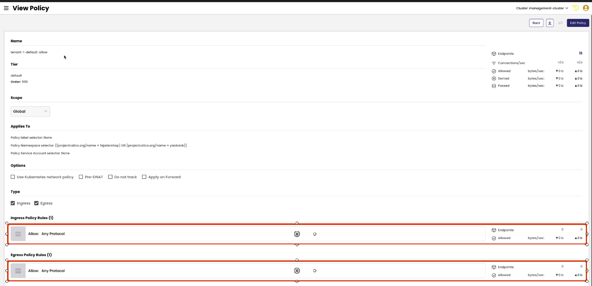
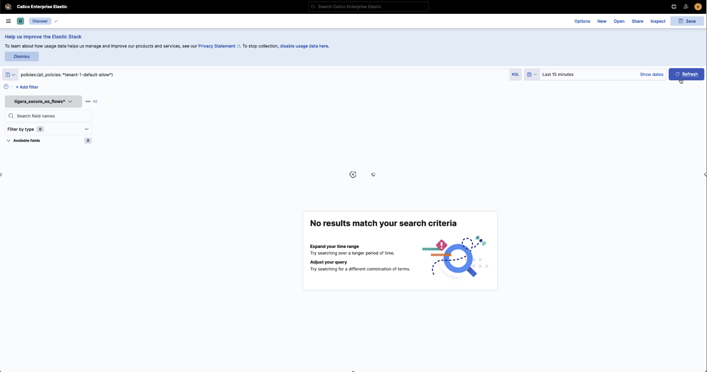
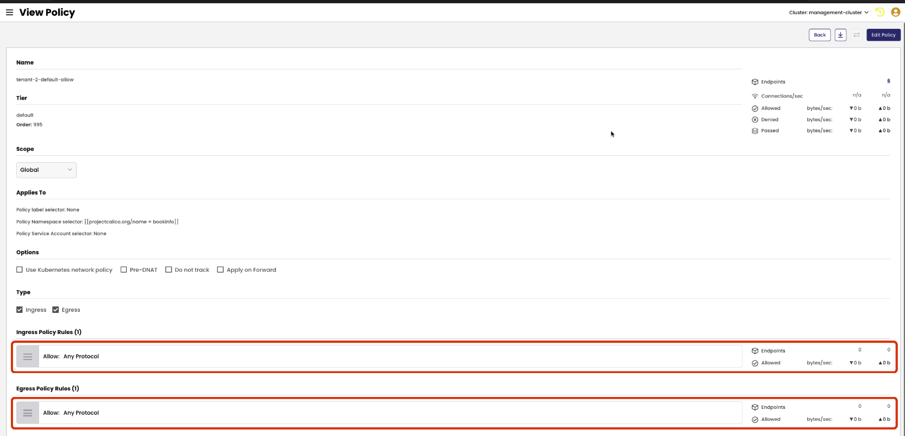

# Evaluate Security Policies

In this lesson, the below mentioned security policies created in the previous lessons will be evaluated prior to enforcing the default deny posture for the application namespaces. The objective is to ensure that all flows are factors in security policy rules thus far created so that enforcing the default deny posture will not disrupt application behavior. Security policy metrics and Kibana will be used to check for flows matching the `Pass: Any Protocol` rule in the `tenant-1-pass-all` and `tenant-2-pass-all` security policy. The same will be used to validate that no flows match the `tenant-1-default-allow` and `tenant-2-default-allow` security policies. If flows are being matched in the rules/security policies above, they must be remediated prior to enforcing the default deny posture. 

> tenant-1-pass-all

> tenant-2-pass-all

> tenant-1-default-allow

> tenant-2-default-allow

## `tenant-1-pass-all` Security Policy

### Evaluate `Pass: Any Protocol` Ingress and Egress Rule Metrics

The `Pass: Any Protocol` ingress and egress rule metrics indicate that there is no traffic matching these rules. Traffic metrics can be seen for all other `pass` rules in the `tenant-1-pass-all` security policy. 

> tenant-1-pass-all security policy

### Evaluate Kibana Flow Logs for `Pass: Any Protocol` Ingress Rule

Apply the below filter to Kibana to filter flows matching the `Pass: Any Protocol` ingress rule. If there are no results, it would indicate that no flows match the rule. 

> `reporter: "dst" and policies:{all_policies:*tenant-1-pass-all|pass|2*}`

### Evaluate Kibana Flow Logs for `Pass: Any Protocol` Egress Rule

Apply the below filter to Kibana to filter flows matching the `Pass: Any Protocol`egress rule. If there are no results, it would indicate that no flows match the rule. 

> `reporter: "src" and policies:{all_policies:*tenant-1-pass-all|pass|3*}`

## `tenant-2-pass-all` Security Policy

### Evaluate `Pass: Any Protocol` Ingress and Egress Rule Metrics

The `Pass: Any Protocol` ingress rule metrics indicate that there is no traffic matching the rule. However, the `Pass: Any Protocol` egress rule metrics indicate that it does match traffic, specific rule/rules must be created before the rule can be migrated to a `Deny` rule.    

Traffic metrics can also be seen for all other `pass` rules in the `tenant-1-pass-all` security policy. 

### Evaluate Kibana Flow Logs for `Pass: Any Protocol` Ingress Rule

Apply the below filter to Kibana to filter flows matching the `Pass: Any Protocol` ingress rule. If there are no results, it would indicate that no flows match the rule.

> `reporter: "dst" and policies:{all_policies:*tenant-2-pass-all|pass|2*}`

### Evaluate Kibana Flow Logs for `Pass: Any Protocol` Egress Rule

Apply the below filter to Kibana to filter flows matching the `Pass: Any Protocol` ingress rule. The presence of flows indicate that traffic does match the rule. 

> `reporter: "src" and policies:{all_policies:*tenant-2-pass-all|pass|2*}`

## `tenant-1-default-allow` Security Policy

### Evaluate Kibana Flow Logs for `tenant-2-default-allow` Security Policy

> `policies:{all_policies:*tenant-1-default-allow*}`

## `tenant-2-default-allow` Security Policy

### Evaluate Kibana Flow Logs for `tenant-2-default-allow` Security Policy

> `policies:{all_policies:*tenant-2-default-allow*}`

#### 
  [Click Next -> Lesson 14 - Enforce Default Deny for Application Namespaces](https://github.com/tigera-cs/quickstart-self-service/blob/main/modules/enforce-default-deny.md) 
