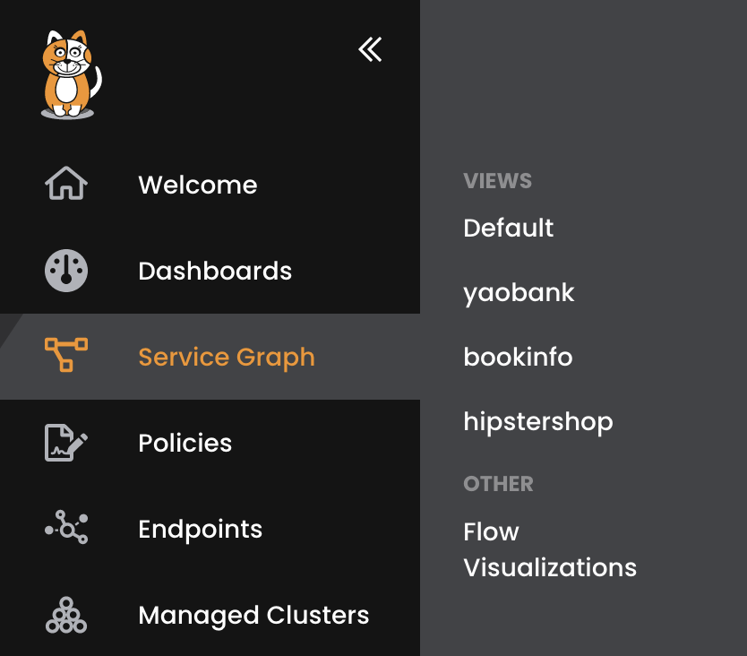
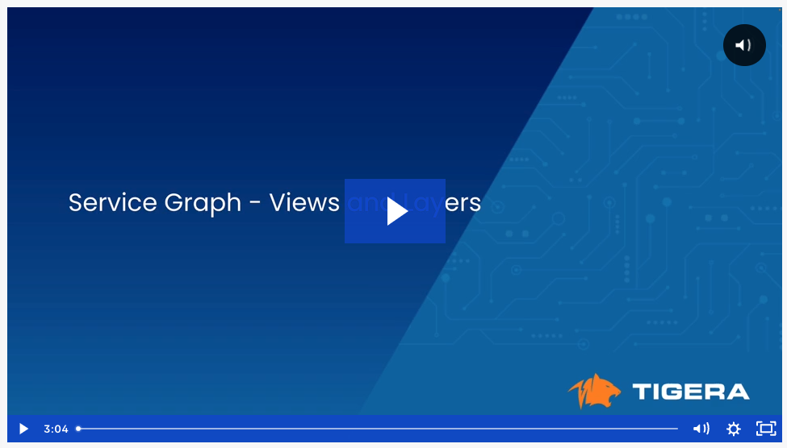

# Service Graph - Views and Layers

Service Graph Views can be created to easily navigate to namespaces. Once created, views are visible in the Service Graph main menu. Layers can be used to group namespaces together which can then be hidden or de-emphasized in the Service Graph. Together, views and layers help seamlessly navigate to and analyze workloads that must be secured in this workshop.  

Create the below views for the application workloads in this workshop.
>  - bookinfo
>  - hipstershop
>  - yaobank

Create a layer called "tigera" and add the below namespaces. 
>  - tigera-system
>  - tigera-compliance
>  - tigera-intrusion-detection
>  - tigera-fluentd
>  - tigera-prometheus
>  - tigera-guardian

---
## Lesson Video

